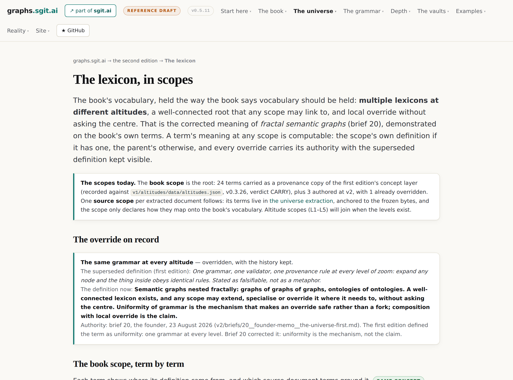

# Anchors, scopes and bridges

After this chapter you will be able to connect two systems that disagree about what their
words mean, without asking either of them to change, and to say exactly how much of the
connection actually holds.

Thirteen concepts. This is the region that answers the question the whole estate exists for:
what happens at a boundary.

## The region, drawn

<!-- gen:map:anchors -->

```
  MERGING ERASES THE DISAGREEMENT
     ──▶ requires         ── the bridge
     ◀── grounds          ── three layers: facts, formulas, bridges
     ◀── extends          ── divergence is the finding

  THE BRIDGE
     ──▶ implements       ── meaning travels by translation, not agreement
     ◀── generalises      ── three layers: facts, formulas, bridges

  THE ANCHOR NODE
     ◀── provides         ── the lexicon
     ◀── requires         ── name clashes are normal

  and the rest of this region's own connections:
     the scope, and its right to override ──licenses──▶ name clashes are normal
     the lexicon ──licenses──▶ the scope, and its right to override
     pin or float, but say which ──extends──▶ the cross-graph edge
     the concept, not the word ──grounds──▶ meaning travels by translation, not agreement
     the concept, not the word ──grounds──▶ divergence is the finding

  and these, which connect only outside this region:
     join at the node layer
```

<!-- /gen:map:anchors -->

## The move: point at it, do not become it

The wrong move at a boundary is to declare conformance. *I am a schema.org Review* is
all-or-nothing, it is usually a lie by the second field, and it makes a third party's
integration into a negotiation.

The right move is smaller and stranger. Draw a granular, honest, disputable edge: *our
document findings step is similar to what schema.org calls reviewBody.* Partial. Traversable.
Arguable. And, crucially, a third party can add that edge without touching either node.

An **anchor node** is what makes this work. It is well connected, well maintained, well
known, and it has no authority at all. It is a meeting point, not a standard. A node that
links to it gains meaning by association and gives up nothing, and a node that does not
link to it remains locally meaningful and globally invisible, which is a consequence the
analysis tools can report rather than a failure they should refuse.

## Scopes, and the right to disagree locally

The **lexicon** is the estate's name for a well-connected reference layer, and its own
source is emphatic that it is *not* a dictionary and *not* a schema registry. It is special
only because it is the most connected graph in the ecosystem, never because its definitions
win.

That licenses the thing that makes local meaning cheap: a scope may extend, specialise or
override an inherited definition, and at no level does a child scope have to register its
vocabulary with a parent. Which guarantees clashes, and clashes are expected. Two scopes
will use the same label for different things, and resolution is structural rather than
nominal: two labels resolve by what they connect to.

<!-- gen:fig:lexicon -->



*Figure. The scoped lexicon. Each term with what it is near but is not, and every override recorded with its authority and the superseded definition kept visible. Taken from `/v2/lexicon/index.html` on this estate at version v0.5.11, 2026-08-26.*

<!-- /gen:fig:lexicon -->

## Bridges, not merges

Given two vocabularies covering the same ground, the instinct is to fold them into one. The
estate's position is that merging is a destructive operation and what it destroys is the
finding. Keep both intact and connect them at declared points: an anchor both reference, an
equivalence between two edge types, or a conditional mapping saying that *our material*
corresponds to *their reportable* under these stated conditions.

The construction has three layers and the separation is the design. Shared facts, owned by
nobody. Per-party formulas, owned by each. Declared bridges, negotiated between them. Which
gives the sentence the region turns on: parties can disagree about meaning while still
agreeing about facts, and that is the only stable basis for working together.

The same shape appears one level down, in words. Once meaning lives in a **concept** and
words are labels attached to it, translation stops being word-to-word. And where two
languages' induced graphs diverge, the divergence has two causes needing opposite responses:
a bad translation, which is a defect, or a genuine lexical gap, which is information.
Forcing an exact correspondence destroys the second one.

## The entries

<!-- gen:entries:anchors -->

### the anchor node {#anchor-node}

`concept` · **A well-connected, well-known reference point other nodes may link to, with no authority to make them. Nodes are nearly free, so some exist only to be one.**

> It is a reference point, not a gatekeeper.
>
> — *Issues-FS Lexicon: The Root Graph of the Ecosystem*, § What Makes a Good Anchor Node

> **Has no special authority** — it does not force conformity; it enables discovery
>
> — *Thinking in Graphs: Meaning Through Connectivity*, § What Anchor Nodes Actually Are — an anchor has no special authority

> with graphs of graphs it costs almost nothing to have more nodes and edges, and sometimes
> you have nodes that only exist to provide anchors for some queries
>
> — *Graph Path Properties: Reading as Language*, § Cheap Nodes, and Anchors for Many Languages — nodes are nearly free

*Also called:* bridge node · a shared landmark

*Near, but not:* a canonical model, which is an anchor that acquired authority

**Out.** This enables [compatibility is computed, not declared](#compatibility-computed). This refuses [declared meaning](#declared-meaning).

**In.** [Compatibility is computed, not declared](#compatibility-computed) requires this. [The lexicon](#lexicon) provides this. [Name clashes are normal](#name-clash) requires this. [The Semantic Web's mistake](#semantic-web-mistake) grounds this.

*Where it shows up:* The move it licenses: link to schema.org, do not become schema.org.

```
            compatibility is computed, not declared · the lexicon
                           name clashes are normal
                              provides, requires
                                      │
                                      ▼
                           ╭─────────────────────╮
                           │   THE ANCHOR NODE   │
                           ╰─────────────────────╯
                                      │
                               enables, refuses
                                      ▼
          compatibility is computed, not declared · declared meaning
```

### the lexicon {#lexicon}

`concept` · **A shared vocabulary held as connected reference nodes, more connected than its children but not more authoritative than them.**

> It is not special because its definitions are authoritative.
>
> — *Issues-FS Lexicon: The Root Graph of the Ecosystem*, § The Lexicon Is the Root, Not the Authority

*Near, but not:* a glossary, which is one flat list with one author and no scopes

**Out.** This provides [the anchor node](#anchor-node). This licenses [the scope, and its right to override](#scope-and-override).

**In.** [Composition with local override](#composition-with-local-override) requires this.

*Where it shows up:* v2/lexicon/: 27 book-scope terms, each with what it is near but is not.

```
                       composition with local override
                                   requires
                                      │
                                      ▼
                             ╭─────────────────╮
                             │   THE LEXICON   │
                             ╰─────────────────╯
                                      │
                              licenses, provides
                                      ▼
            the anchor node · the scope, and its right to override
```

### the scope, and its right to override {#scope-and-override}

`concept` · **Any scope may extend, specialise or override an inherited definition, and it never has to register its vocabulary with the scope above.**

> Each level can link to the level above — or not. The richness of cross-scope connectivity is
> a choice, not a requirement.
>
> — *Issues-FS Lexicon: The Root Graph of the Ecosystem*, § Every Scope Is a Potential Lexicon

> At no level does a child scope need to "register" its vocabulary with a parent scope.
>
> — *Thinking in Graphs: Meaning Through Connectivity*, § Every Scope Defines Its Own Vocabulary — no registration with the parent

*Near, but not:* a namespace, which disambiguates names but carries no definitions

**Out.** This licenses [name clashes are normal](#name-clash).

**In.** [The lexicon](#lexicon) licenses this. [Fractal is a precise claim](#fractal-principle) licenses this.

*Where it shows up:* The lexicon records the authority behind every override and keeps the superseded definition visible.

```
                   the lexicon · fractal is a precise claim
                                   licenses
                                      │
                                      ▼
                 ╭──────────────────────────────────────────╮
                 │   THE SCOPE, AND ITS RIGHT TO OVERRIDE   │
                 ╰──────────────────────────────────────────╯
                                      │
                                   licenses
                                      ▼
                           name clashes are normal
```

### merging erases the disagreement {#dont-merge-vocabularies}

`position` · **Folding two vocabularies into one is the lossy operation, because what it destroys is usually the finding. Make them compatible instead; that is what an ontology of ontologies is for.**

> it erases the disagreement that was the whole point of having two parties.
>
> — *Ontologies of Ontologies: Multiple Definitions, Three Layers, and Bridges*, § Bridges, Not Merges

> I always err on the side of understanding versus a standardized schema.
>
> — *Graph Path Properties: Reading as Language*, § Understanding Over Schema: The Ontology of Ontologies — understanding over a standardised schema

*Also called:* keep both senses

*Near, but not:* translation, which produces one text where there were two positions

**Out.** This requires [the bridge](#bridge).

**In.** [Three layers: facts, formulas, bridges](#three-layers) grounds this. [Divergence is the finding](#divergence-is-the-finding) extends this. [The five Reviews](#five-reviews) demonstrates this.

*Where it shows up:* Applied to translation, to transcription, and to two agents disagreeing about the same repository.

```
      three layers: facts, formulas, bridges · divergence is the finding
                               the five Reviews
                        demonstrates, extends, grounds
                                      │
                                      ▼
                   ╭─────────────────────────────────────╮
                   │   MERGING ERASES THE DISAGREEMENT   │
                   ╰─────────────────────────────────────╯
                                      │
                                   requires
                                      ▼
                                  the bridge
```

### three layers: facts, formulas, bridges {#three-layers}

`concept` · **Shared facts owned by nobody, per-party formulas owned by each, and declared bridges negotiated between them.**

> parties can disagree about meaning while still agreeing about facts, which is the only
> stable basis for working together.
>
> — *Ontologies of Ontologies: Multiple Definitions, Three Layers, and Bridges*, § The Three Layers

**Out.** This grounds [merging erases the disagreement](#dont-merge-vocabularies). This generalises [the bridge](#bridge). This enables [classification is a query, not a judgment](#node-type-formula).

*Where it shows up:* The separation is the design: swap a formula and the shared graph does not move.

```
                ╭────────────────────────────────────────────╮
                │   THREE LAYERS: FACTS, FORMULAS, BRIDGES   │
                ╰────────────────────────────────────────────╯
                                      │
                        enables, generalises, grounds
                                      ▼
                 merging erases the disagreement · the bridge
                  classification is a query, not a judgment
```

### the bridge {#bridge}

`concept` · **An explicit, inspectable, arguable connection between two formulas at a stated point, which may be partial or conditional.**

> A bridge can be an anchor node that both formulas reference, an equivalence between edge
> types in two formulas, or a conditional mapping
>
> — *Ontologies of Ontologies: Multiple Definitions, Three Layers, and Bridges*, § Bridges, Not Merges

**Out.** This implements [meaning travels by translation, not agreement](#meaning-travels-by-translation).

**In.** [Merging erases the disagreement](#dont-merge-vocabularies) requires this. [Three layers: facts, formulas, bridges](#three-layers) generalises this.

*Where it shows up:* Layer 2 of the second edition's universe: authored cross-document edges. Not started.

```
   merging erases the disagreement · three layers: facts, formulas, bridges
                            generalises, requires
                                      │
                                      ▼
                              ╭────────────────╮
                              │   THE BRIDGE   │
                              ╰────────────────╯
                                      │
                                  implements
                                      ▼
                meaning travels by translation, not agreement
```

### meaning travels by translation, not agreement {#meaning-travels-by-translation}

`claim` · **Meaning crosses languages, cultures and agendas by maintaining translations between definitions each side still owns.**

> It does not move by everyone agreeing on one definition; it moves by maintaining
> translations between definitions that each side continues to own.
>
> — *Ontologies of Ontologies: Multiple Definitions, Three Layers, and Bridges*, § How Meaning Travels Across Domains

**In.** [The bridge](#bridge) implements this. [The concept, not the word](#concept-not-word) grounds this. [Senses, and analogies for another world](#senses-and-analogies) implements this. [A path must read as a sentence](#path-reads-as-a-sentence) enables this.

*Where it shows up:* The WCLM's analogies register does this for audiences: sixteen concepts mapped into finance, operations and medicine.

```
                    the bridge · the concept, not the word
                   senses, and analogies for another world
                             grounds, implements
                                      │
                                      ▼
            ╭───────────────────────────────────────────────────╮
            │   MEANING TRAVELS BY TRANSLATION, NOT AGREEMENT   │
            ╰───────────────────────────────────────────────────╯
```

### the cross-graph edge {#cross-graph-edge}

`concept` · **An edge that crosses from one sovereign graph into another and carries meaning between them, without either graph changing inside.**

> Cross-graph edges create interoperability without requiring any graph to change its internal
> structure.
>
> — *Thinking in Graphs: Meaning Through Connectivity*, § Cross-Graph References

**Out.** This enables [compatibility is computed, not declared](#compatibility-computed).

**In.** [Pin or float, but say which](#version-pinning) extends this.

*Where it shows up:* Shipped: typed *.link.json edges between vaults, optionally pinned to a commit in the target's history.

```
                         pin or float, but say which
                                   extends
                                      │
                                      ▼
                         ╭──────────────────────────╮
                         │   THE CROSS-GRAPH EDGE   │
                         ╰──────────────────────────╯
                                      │
                                   enables
                                      ▼
                   compatibility is computed, not declared
```

### pin or float, but say which {#version-pinning}

`concept` · **A cross-graph edge may pin meaning to a version or float with the latest; both are valid and the graph records the choice.**

> If the edge points to `osbot-utils@3.63.4`, then the meaning is pinned to that version's
> definition.
>
> — *Thinking in Graphs: Meaning Through Connectivity*, § Versioning and Temporal Graphs

**Out.** This extends [the cross-graph edge](#cross-graph-edge).

**In.** [Supersede, never delete](#supersede-never-delete) extends this.

*Where it shows up:* The vault link file can pin to a commit, so a cross-graph edge cannot silently follow a moving target.

```
                           supersede, never delete
                                   extends
                                      │
                                      ▼
                     ╭─────────────────────────────────╮
                     │   PIN OR FLOAT, BUT SAY WHICH   │
                     ╰─────────────────────────────────╯
                                      │
                                   extends
                                      ▼
                             the cross-graph edge
```

### name clashes are normal {#name-clash}

`concept` · **Two scopes will use the same label for different things; resolution is by graph identity and traversal path, never by the label.**

> Resolution is structural, not nominal.
>
> — *Thinking in Graphs: Meaning Through Connectivity*, § Name Clashes Are Normal

**Out.** This requires [the anchor node](#anchor-node).

**In.** [The scope, and its right to override](#scope-and-override) licenses this. [Senses, and analogies for another world](#senses-and-analogies) implements this. [The document as its own token universe](#document-tokens) demonstrates this.

*Where it shows up:* The WCLM's senses register is the same problem inside one word: three to five meanings each for graph, node, fractal and task.

```
the scope, and its right to override · senses, and analogies for another world
                    the document as its own token universe
                      demonstrates, implements, licenses
                                      │
                                      ▼
                       ╭─────────────────────────────╮
                       │   NAME CLASHES ARE NORMAL   │
                       ╰─────────────────────────────╯
                                      │
                                   requires
                                      ▼
                               the anchor node
```

### the concept, not the word {#concept-not-word}

`concept` · **The unit of meaning is a concept, language-independent, carrying one preferred label per language; a term is how one language happens to express it.**

> **The distinction that does all the work is concept against term.**
>
> — *Concepts, Not Words*, § The Word Is Concept

**Out.** This grounds [meaning travels by translation, not agreement](#meaning-travels-by-translation). This grounds [divergence is the finding](#divergence-is-the-finding). This grounds [senses, and analogies for another world](#senses-and-analogies).

*Where it shows up:* It caught an English word that was wrong: draft, for something that was never a draft.

```
                      ╭───────────────────────────────╮
                      │   THE CONCEPT, NOT THE WORD   │
                      ╰───────────────────────────────╯
                                      │
                                   grounds
                                      ▼
  meaning travels by translation, not agreement · divergence is the finding
                   senses, and analogies for another world
```

### divergence is the finding {#divergence-is-the-finding}

`position` · **Where two languages' induced graphs differ, that difference is either an error or a real lexical gap, and either way it is output rather than noise.**

> **Divergence should be surfaced, not resolved.**
>
> — *Concepts, Not Words*, § Where The Graphs Diverge Is The Finding

**Out.** This extends [merging erases the disagreement](#dont-merge-vocabularies). This extends [disagreement is the product](#disagreement-is-the-product).

**In.** [The concept, not the word](#concept-not-word) grounds this.

*Where it shows up:* The same conclusion the estate reached about two transcription models disagreeing about a word.

```
                          the concept, not the word
                                   grounds
                                      │
                                      ▼
                      ╭───────────────────────────────╮
                      │   DIVERGENCE IS THE FINDING   │
                      ╰───────────────────────────────╯
                                      │
                                   extends
                                      ▼
        merging erases the disagreement · disagreement is the product
```

### join at the node layer {#junction-rule}

`method` · **To connect two bodies of text, lift both into typed nodes first and join at an intermediate layer; never document to document.**

> To connect two bodies of text, lift **both** into typed nodes first and join at an
> intermediate layer. A document-to-document link is only as good as the sentence somebody
> wrote around it.
>
> — *The lexicon, in scopes*, § junction-rule

*Near, but not:* a citation, which points at a document and stops

**Out.** This implements [meaning through connectivity](#meaning-through-connectivity). This requires [quote-anchored extraction](#quote-anchored-extraction). This demonstrates [every paragraph is a graph](#every-paragraph-is-a-graph).

*Where it shows up:* Demonstrated in the VoiceDebrief vault: two paragraphs joined node to node, neither document citing the other.

```
                        ╭────────────────────────────╮
                        │   JOIN AT THE NODE LAYER   │
                        ╰────────────────────────────╯
                                      │
                      demonstrates, implements, requires
                                      ▼
           meaning through connectivity · quote-anchored extraction
                          every paragraph is a graph
```

<!-- /gen:entries:anchors -->

## Where the estate demonstrates this

The scoped lexicon is running: a root scope with its terms, a scope per source document,
and every override recorded with the authority behind it and the superseded definition kept
visible. One override is already in it, and it is the estate correcting itself: the first
edition defined *fractal* as uniformity, and the founder's memo of 23 August replaced that
with composition and local override. Both definitions are in the file.

The junction rule is demonstrated in the VoiceDebrief vault, where two paragraphs are each
lifted into typed nodes and joined node to node through an intermediate layer, with neither
document citing the other.

The bridge layer itself, layer 2 of the second edition's universe, is **not started**. That
is in *What the atlas found* under the gaps, because the region's most distinctive claim is
also the one with the least running code behind it.
