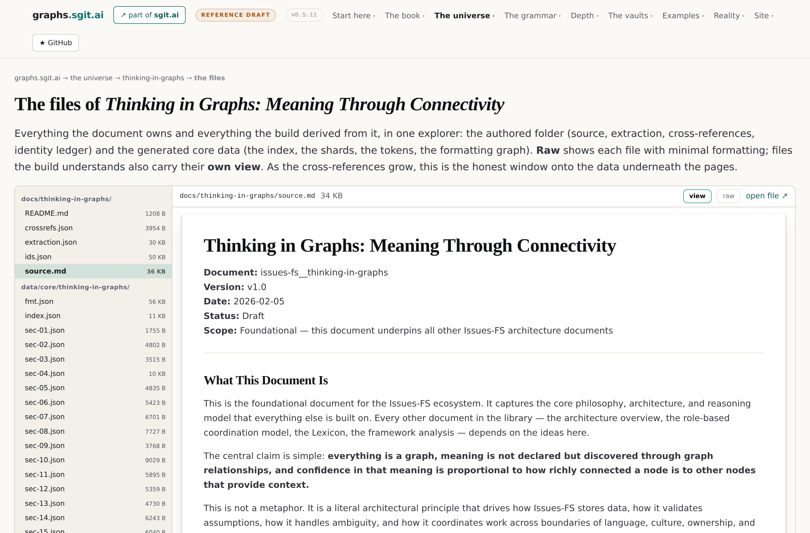

# Provenance, correction and time

After this chapter you will be able to answer a question no document set can answer: how
much of what I believe rests on claims that have since been corrected?

Eight concepts, and one story that makes the case better than any of them.

## The region, drawn

<!-- gen:map:provenance -->

```
  THE 10,000-HOURS CITATION NETWORK
     ──▶ demonstrates     ── propagation is what a graph can do
     ◀── remedies         ── weight by independence, not by count
     ◀── demonstrates     ── is this use of it sound?

  AN INDEX IS NOT A SOURCE
     ──▶ bounds           ── the chain of custody
     ◀── refuses          ── weight by independence, not by count
     ──▶ extends          ── supersede, never delete

  THE CHAIN OF CUSTODY
     ◀── extends          ── is this use of it sound?
     ◀── extends          ── agenda is context, not a verdict

  and the rest of this region's own connections:
     supersede, never delete ──enables──▶ propagation is what a graph can do
```

<!-- /gen:map:provenance -->

## The story

Everyone has heard that expertise takes ten thousand hours. The number comes from a 1993
study of violinists, where it was an average rather than a threshold, and half the top group
had not reached it. The original author spent much of his career correcting the
popularisation, in books, in articles, in an open letter.

None of the corrections ever attached to the claim. By then it had been carried through a
citation network of 242 papers and more than 200,000 supporting citation paths: paths which,
followed to the bottom, lead back to nothing.

That is not a story about academia. It is a structural fact about documents. In a document,
a correction is a new document, and nothing that cited the original knows. In a graph, a
correction is an edge, and everything downstream of the corrected claim is reachable without
anybody remembering it exists.

## The rule, and its two companions

**Supersede, never delete.** A corrected claim is marked from a date and kept, because
removing it destroys the thing you most need: the record that something once rested on it.
And it keeps *what did we believe in March* answerable, which matters to anybody who acted
on it. A decision made on a claim that was later corrected was not a bad decision at the
time, and a system that erases the earlier state makes past reasoning look worse than it
was.

**An index is not a source.** A node either asserts something or points at something, and a
reader must always be able to tell which. If the two are indistinguishable, every claim in
the graph inherits the credibility of the weakest cache in it. This also resolves a real
tension: pointer nodes are the one class safe to prune, because re-running the lookup
recovers them, where an assertion and its correction chain are not.

**Agenda is context, not a verdict.** Every entity has objectives and recording them is
legitimate. The hazard is what a reader does with a recorded motive, because a tool that
makes provenance-based dismissal easy will produce a lot of it. The discipline is the one
academic publishing already uses: disclosure rather than dismissal. A declared interest
attaches to the source, informs weight, and never decides truth. And the estate applies the
lens to itself, which is why every page it publishes carries a participant disclosure.

<!-- gen:fig:universe-files -->



*Figure. The document's folder, raw and viewed: the authored artefacts and the generated core data, every file readable as exact bytes or as a data-driven view. Taken from `/v2/universe/thinking-in-graphs.files.html` on this estate at version v0.5.11, 2026-08-26.*

<!-- /gen:fig:universe-files -->

## The question worth paying for

The last idea in this region is the one with commercial teeth. Existing verification asks
whether a claim is true, which is often easy and usually not the question that matters. The
failure that causes harm is a true finding applied to a conclusion it never supported, and
sometimes to one the original work contradicts.

So the billable question is not *is this true* but *is this use of it sound*, and the person
best placed to answer it is whoever produced the finding. The estate has already built the
small version: the pilot document keeps a usage ledger recording every place it is used,
each use rated against a published maturity model as aligned, stretched, misaligned or
unrated, signed and dated. On day one the model caught the first edition's own definition of
*fractal* as a stretched use of the cornerstone source.

## The entries

<!-- gen:entries:provenance -->

### supersede, never delete {#supersede-never-delete}

`position` · **A corrected claim is marked from a date and kept, because removing it destroys the record of what was resting on it.**

> A corrected claim is **marked superseded from a date**, not deleted.
>
> — *A Fact Does Not Exist In A Vacuum*, § Supersede, Do Not Delete

*Near, but not:* versioning, which keeps the old text without keeping what depended on it

**Out.** This enables [propagation is what a graph can do](#propagation-of-corrections). This extends [pin or float, but say which](#version-pinning).

**In.** [Documents are projections of graphs](#projection) implements this. [An index is not a source](#index-is-not-a-source) extends this. [The identity ledger](#identity-ledger) implements this.

*Where it shows up:* Repealed provisions in the regulation graph are marked repealed_from; the lexicon keeps superseded definitions visible under their replacements.

```
        documents are projections of graphs · an index is not a source
                             the identity ledger
                             extends, implements
                                      │
                                      ▼
                       ╭─────────────────────────────╮
                       │   SUPERSEDE, NEVER DELETE   │
                       ╰─────────────────────────────╯
                                      │
                               enables, extends
                                      ▼
       propagation is what a graph can do · pin or float, but say which
```

### propagation is what a graph can do {#propagation-of-corrections}

`claim` · **In a document a correction is a new document and nothing that cited the original knows. In a graph a correction is an edge, and everything downstream is reachable.**

> In a document, a correction is a new document. Nothing that cited the original knows.
>
> — *A Fact Does Not Exist In A Vacuum*, § Propagation Is What A Graph Can Do And A Document Cannot

**In.** [Supersede, never delete](#supersede-never-delete) enables this. [The 10,000-hours citation network](#ten-thousand-hours) demonstrates this.

*Where it shows up:* The question it makes answerable: how much of what I believe rests on claims that have since been corrected?

```
         supersede, never delete · the 10,000-hours citation network
                            demonstrates, enables
                                      │
                                      ▼
                  ╭────────────────────────────────────────╮
                  │   PROPAGATION IS WHAT A GRAPH CAN DO   │
                  ╰────────────────────────────────────────╯
```

### the 10,000-hours citation network {#ten-thousand-hours}

`example` · **242 papers and more than 200,000 supporting citation paths carried a claim its own author spent a career correcting, and none of the corrections ever reached it.**

> None of the corrections ever attached to the claim
>
> — *The first edition's front page*, § The hook

**Out.** This demonstrates [propagation is what a graph can do](#propagation-of-corrections).

**In.** [Weight by independence, not by count](#weight-by-independence) remedies this. [Is this use of it sound?](#contextual-validation) demonstrates this.

*Where it shows up:* The clearest non-technical case for corrections propagating, and the reason supersede-never-delete is a rule rather than a preference.

```
       weight by independence, not by count · is this use of it sound?
                            demonstrates, remedies
                                      │
                                      ▼
                  ╭───────────────────────────────────────╮
                  │   THE 10,000-HOURS CITATION NETWORK   │
                  ╰───────────────────────────────────────╯
                                      │
                                 demonstrates
                                      ▼
                      propagation is what a graph can do
```

### weight by independence, not by count {#weight-by-independence}

`method` · **Ten citations of one source are one source; a confidence number built on counting measures popularity instead.**

> Ten citations of one source are one source.
>
> — *The full argument*, § Supersede, never delete: corrections must propagate

**Out.** This remedies [the 10,000-hours citation network](#ten-thousand-hours). This bounds [the confidence ladder](#confidence-ladder). This refuses [an index is not a source](#index-is-not-a-source).

*Where it shows up:* The rule the 10,000-hours network violates at scale.

```
                 ╭──────────────────────────────────────────╮
                 │   WEIGHT BY INDEPENDENCE, NOT BY COUNT   │
                 ╰──────────────────────────────────────────╯
                                      │
                          bounds, refuses, remedies
                                      ▼
          the 10,000-hours citation network · the confidence ladder
                           an index is not a source
```

### is this use of it sound? {#contextual-validation}

`position` · **The question worth paying for is not whether a claim is true but whether this use of it is one the source supports.**

> the angle is not just, is this statement correct in itself; the question is, is this correct
> in this context, for this use, for this conclusion, for this kind of set of events.
>
> — *Paying The Fact Creator*, § The Question Is Not Whether It Is True

*Also called:* citation diversion, in reverse

**Out.** This extends [the chain of custody](#provenance-chain). This demonstrates [the 10,000-hours citation network](#ten-thousand-hours). This implements [the author is the only oracle](#author-is-the-oracle).

*Where it shows up:* The pilot's usage ledger is this made concrete: every use of the document rated aligned, stretched, misaligned or unrated, signed and dated.

```
                       ╭──────────────────────────────╮
                       │   IS THIS USE OF IT SOUND?   │
                       ╰──────────────────────────────╯
                                      │
                      demonstrates, extends, implements
                                      ▼
           the chain of custody · the 10,000-hours citation network
                        the author is the only oracle
```

### an index is not a source {#index-is-not-a-source}

`method` · **A node either asserts something or points at something, and a reader must always be able to tell which; pointer nodes are the one class safe to prune.**

> **A node either asserts something or points at something, and a reader must always be able
> to tell which.**
>
> — *An Index Is Not A Source*, § Two Node Classes, Structurally Distinguished

**Out.** This bounds [the chain of custody](#provenance-chain). This extends [supersede, never delete](#supersede-never-delete).

**In.** [Weight by independence, not by count](#weight-by-independence) refuses this.

*Where it shows up:* If the two are indistinguishable, every claim inherits the credibility of the weakest cache in the graph.

```
                     weight by independence, not by count
                                   refuses
                                      │
                                      ▼
                       ╭──────────────────────────────╮
                       │   AN INDEX IS NOT A SOURCE   │
                       ╰──────────────────────────────╯
                                      │
                               bounds, extends
                                      ▼
                the chain of custody · supersede, never delete
```

### agenda is context, not a verdict {#agenda-is-context}

`position` · **Every entity has objectives and recording them is legitimate; the discipline that stops it becoming ad hominem is disclosure rather than dismissal.**

> The discipline that solves this is well established outside this corpus and worth adopting
> explicitly: **disclosure rather than dismissal.**
>
> — *A Fact Does Not Exist In A Vacuum*, § Agenda Is Context, Not A Verdict

**Out.** This extends [the chain of custody](#provenance-chain). This carries [what ships, what is argued](#what-ships-what-is-argued).

*Where it shows up:* Applied to the estate itself: the graph has an agenda too, and every page carries a participant disclosure.

```
                   ╭──────────────────────────────────────╮
                   │   AGENDA IS CONTEXT, NOT A VERDICT   │
                   ╰──────────────────────────────────────╯
                                      │
                               carries, extends
                                      ▼
              the chain of custody · what ships, what is argued
```

### the chain of custody {#provenance-chain}

`concept` · **Claim, graph node, file, commit, official source with the hash of the retrieved bytes: every link walkable by a reader holding nothing privileged.**

> Claim, graph node, file, commit, official source with the hash of the retrieved bytes. Every
> link walkable by a reader who holds nothing privileged.
>
> — *The lexicon, in scopes*, § provenance-chain

*Near, but not:* a citation list, which names sources without making them checkable

**Out.** This grounds [the confidence ladder](#confidence-ladder).

**In.** [Is this use of it sound?](#contextual-validation) extends this. [An index is not a source](#index-is-not-a-source) bounds this. [Agenda is context, not a verdict](#agenda-is-context) extends this. [Quote-anchored extraction](#quote-anchored-extraction) implements this. [The file system is the source of truth](#file-system-is-the-source-of-truth) grounds this. [The identity ledger](#identity-ledger) grounds this.

*Where it shows up:* Running in the regulation graph vault: every element hash-verified to the official Formex XML it was parsed from.

```
             is this use of it sound? · an index is not a source
                       agenda is context, not a verdict
                               bounds, extends
                                      │
                                      ▼
                         ╭──────────────────────────╮
                         │   THE CHAIN OF CUSTODY   │
                         ╰──────────────────────────╯
                                      │
                                   grounds
                                      ▼
                            the confidence ladder
```

<!-- /gen:entries:provenance -->

## Where the estate demonstrates this

The regulation graph vault runs the full chain: every element parsed from official Formex
XML and hash-verified to the bytes it came from, so a citation is to bytes that provably
have not moved.

The lexicon runs supersession on its own vocabulary, with the replaced definition still
visible under its replacement and the authority for the change named.

And the identity ledger is the mechanism that makes any of this survive editing. Byte offsets
break the moment a document changes, so every structural node keeps a short opaque
identifier that is carried forward on every rebuild by matching locator, then content hash,
then fuzzy similarity, and only what matches nothing is newly minted. Whatever the document
no longer has is retired rather than deleted, and identifiers are never reused.

**And the gap.** Time itself is the corpus's largest silence. *Time is an event, things
change* is close to the whole treatment; the corpus repeatedly says the graph moves and
never explains how. It is in *What the atlas found*.
