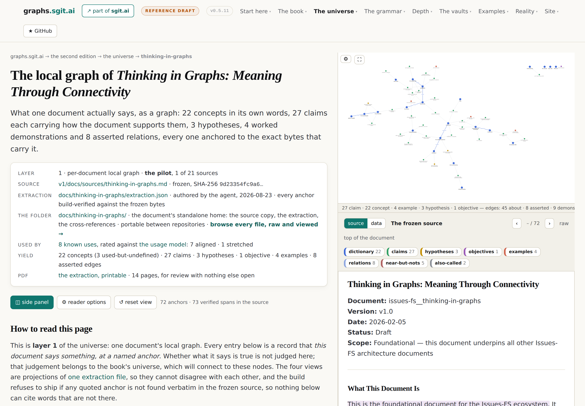
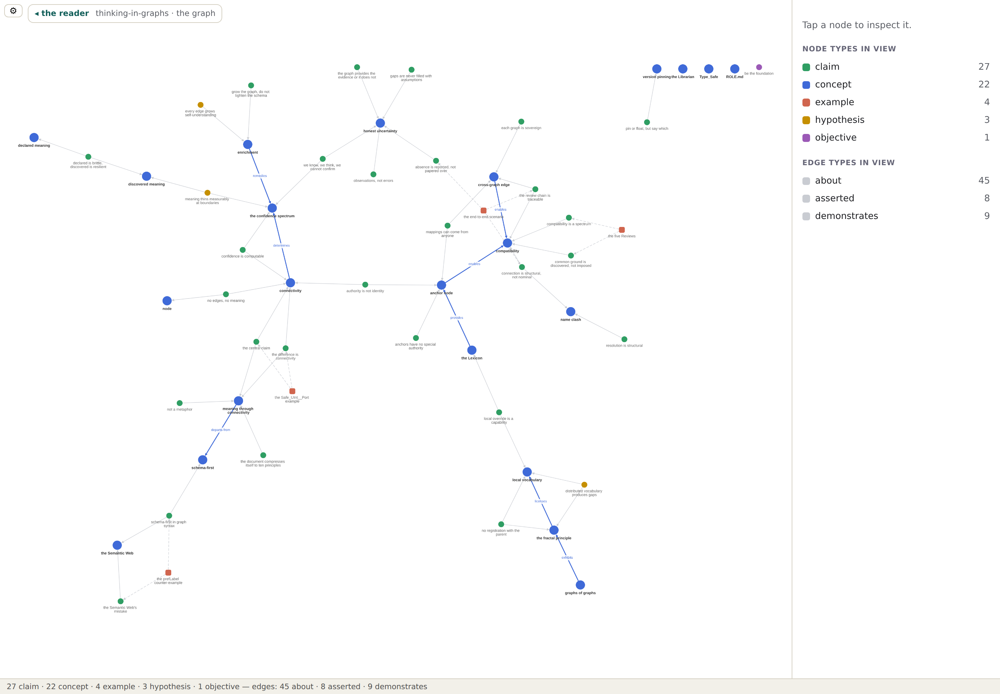
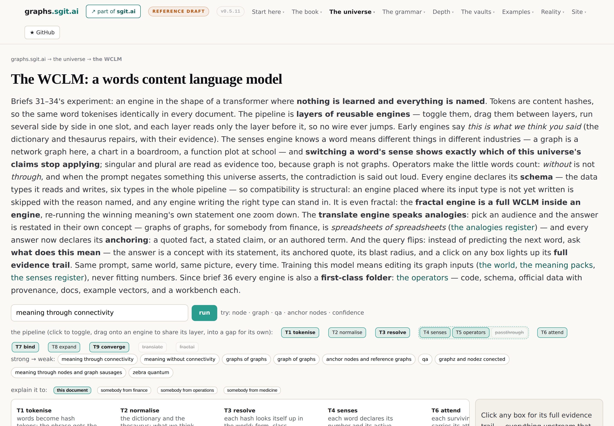
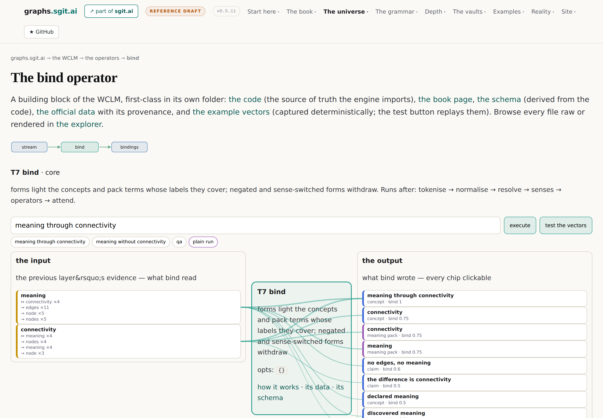

# The machinery

After this chapter you will know what it actually costs to hold a corpus this way: which
parts are built, what each one buys, and which of them you would need first.

Thirteen concepts. Everything so far has been an idea. This region is the workshop, and it
is the part of the estate that changed fastest: most of what follows did not exist a week
before this book was written.

## The region, drawn

<!-- gen:map:machinery -->

```
  THE CORE GRAPH: DOCUMENT TO WORD
     ──▶ grounds          ── quote-anchored extraction
     ◀── remedies         ── the identity ledger
     ◀── measures         ── the document as its own token universe

  QUOTE-ANCHORED EXTRACTION
     ◀── requires         ── one extraction, projected views

  THE DOCUMENT AS ITS OWN TOKEN UNIVERSE
     ──▶ grounds          ── senses, and analogies for another world

  and the rest of this region's own connections:
     every node move costs the reader their mental picture ──enables──▶ price the next hop
     pinned peaks, free field ──implements──▶ every node move costs the reader their mental picture
     the operators, each a first-class folder ──implements──▶ the WCLM, a deterministic transformer

  and these, which connect only outside this region:
     the schema is the graph's own review pack
     the file system is the source of truth
```

<!-- /gen:map:machinery -->

## Three layers of one document

The estate picked one pilot document and transformed it three times, and the three are
worth keeping distinct because they answer different questions.

**The extraction** answers *what does this document say*.
<!-- gen:stat:pilot_nodes -->57<!-- /gen:stat:pilot_nodes --> nodes, each one a
concept, claim, hypothesis, objective or example, each anchored to a verbatim quote at
recorded byte offsets in a frozen copy of the source. The build refuses to ship an anchor
whose quote is not at its bytes, which turns extraction hallucination from a reading problem
into a build error. And coverage is total by construction: every section with prose either
yields nodes or is recorded as deliberately empty with a reason, so silence is impossible.

**The core graph** answers *what is this document*. Every section, block, sentence and word
is a node with an identity: <!-- gen:stat:core_sections -->39<!-- /gen:stat:core_sections -->
sections, <!-- gen:stat:core_blocks -->186<!-- /gen:stat:core_blocks --> blocks,
<!-- gen:stat:core_sentences -->342<!-- /gen:stat:core_sentences --> sentences,
<!-- gen:stat:core_words -->4,221<!-- /gen:stat:core_words --> words. Inline
markup becomes span nodes covering the words they mark. Formatting lives in its own graph,
joined by block identifiers, and the build rebuilds the source markdown from the graph and
fails unless it comes back byte-identical.

**The token universe** answers *what is this document made of*. Every word form is a token
with full identity, classified as padding, verb, content, code or number, with co-occurrence
computed over sentences. Forty-five per cent of the pilot's word use is padding, and 505
forms appear exactly once. The pass was built to answer the first question and volunteered
something better: the two words with the highest different-meanings score are *node* and
*graph*, which are the founder's own examples, arrived at independently by arithmetic.

The gap between the first and the third is two orders of magnitude, and the estate's own
retrospective says the interesting work lives in the joins between them.

<!-- gen:fig:universe-reader -->



*Figure. The anchored reader. The document's extraction on the left, the frozen source and its local graph on the right, with anchor highlights driven by the byte offsets a build gate verifies rather than by re-searching the text. Taken from `/v2/universe/thinking-in-graphs.html` on this estate at version v0.5.11, 2026-08-26.*

<!-- /gen:fig:universe-reader -->

## Identity, which is the part nobody expects to be hard

The extraction and the core graph both point at things. Points break. A byte offset breaks
the moment a paragraph above it changes; a path breaks when a heading is renamed.

The answer is an **identity ledger**, and the insight it turns on is that randomness was
never the missing ingredient. Persistence was. Every document keeps a committed map from
short opaque identifiers to a current structural locator plus a content hash. On every
rebuild the generator carries identities forward: same locator claims its identifier first,
then same content hash so a moved block's identity follows it, then fuzzy similarity for
things renamed and edited. Only what matches nothing is newly minted, and whatever the
document no longer has is retired rather than deleted, so identifiers are never reused.

A gate makes the contract executable: full coverage, unique identifiers, and a second
carry-forward pass over the ledger's own output must change nothing. The free consequence is
the good one: the diff between two versions of the ledger is change detection, sorted into
untouched, edited, moved, new and retired.

<!-- gen:fig:universe-graph -->



*Figure. The same document's graph on its own page, with the pinned summits framing the canvas and the free nodes settled between them. Taken from `/v2/universe/thinking-in-graphs.graph.html` on this estate at version v0.5.11, 2026-08-26.*

<!-- /gen:fig:universe-graph -->

## The instrument

A graph you can look at is not the same as a graph you can think with, and the difference
turned out to be about stability rather than beauty.

The principle is stated plainly: **every node move costs the reader their mental picture.**
So when a view gains or loses elements, what was already on the canvas holds still.
Removals move nothing. Additions freeze everything already placed, seed each newcomer beside
a settled neighbour, settle only the newcomers, then unlock. The viewport never re-fits
unless somebody asked it to. And a handful of structurally important nodes are pinned into
aligned slots around the border, so that position becomes information: a free node's resting
place is the visible sum of the forces on it.

On top of that sits the answer to the blob at interaction time. From a selection, the view
grows one ring at a time, and a stats bar **prices the next hop**: it says which families
and which edge kinds one more degree would bring in, so a reader can read the cost before
paying it.

<!-- gen:fig:wclm -->



*Figure. The deterministic transformer. The layers as columns, attention drawn as weighted arcs between them, and the winning meaning lit with the arithmetic that produced it. Taken from `/v2/wclm/index.html` on this estate at version v0.5.11, 2026-08-26.*

<!-- /gen:fig:wclm -->

## The deterministic transformer

The last artefact in the region is the strangest and the most instructive. The founder's
question was what a language model would look like if it consulted a world model that was
written down rather than learned. The answer, in his coinage, is not a large language model
but a words content language model.

It has the transformer's shape and none of its mystery. Tokens are content hashes, so the
same word tokenises identically in every document with no registry. Layers are pure named
functions: tokenise, resolve, attend, bind, expand, converge, with more added since. Every
weight is a formula written in the world file rather than a number that was fitted, which
means training the model is editing graph inputs and meaning packs. One ranking bug in the
first build was fixed by editing the bind formula, which is the training loop working
exactly as designed.

And the query flips. Not *what is the next word* but *what does this mean*, and the answer
is a concept with its statement, its anchored quote, its blast radius and the visible path
that produced it. An attribution graph by construction, where interpretability research has
to reverse-engineer one.

<!-- gen:fig:wclm-operator -->



*Figure. One engine as a first-class folder: its book page, its generated schema, its provenance-marked data, its replayed example vectors and its workbench. Taken from `/v2/wclm/operators/bind/index.html` on this estate at version v0.5.11, 2026-08-26.*

<!-- /gen:fig:wclm-operator -->

## The entries

<!-- gen:entries:machinery -->

### quote-anchored extraction {#quote-anchored-extraction}

`method` · **Every extracted node carries a verbatim quote at recorded byte offsets in a frozen source, and the build fails if the quote is not at its bytes.**

> Every extracted node carries a verbatim quote at recorded byte offsets in a frozen source;
> the build fails if the quote is not at its bytes, and every section with prose either yields
> nodes or is recorded empty with a reason.
>
> — *The methods register*, § quote-anchored-extraction

**Out.** This implements [the chain of custody](#provenance-chain). This implements [a named absence beats a hidden one](#named-absence).

**In.** [The core graph: document to word](#core-graph) grounds this. [Join at the node layer](#junction-rule) requires this. [Lifting text into a graph is decompilation](#decompilation) requires this. [One extraction, projected views](#one-file-many-views) requires this.

*Where it shows up:* Shipped at v0.4.5. It makes extraction hallucination build-detectable, and silence impossible.

```
          the core graph: document to word · join at the node layer
                  lifting text into a graph is decompilation
                              grounds, requires
                                      │
                                      ▼
                      ╭───────────────────────────────╮
                      │   QUOTE-ANCHORED EXTRACTION   │
                      ╰───────────────────────────────╯
                                      │
                                  implements
                                      ▼
          the chain of custody · a named absence beats a hidden one
```

### one extraction, projected views {#one-file-many-views}

`method` · **The dictionary, taxonomy, thesaurus and ontology of a document are projections of one file, never four authored artefacts, so they cannot disagree.**

> The dictionary, taxonomy, thesaurus and ontology of a document are projections of one
> extraction file, never four authored artefacts, so they cannot disagree with each other.
>
> — *The methods register*, § one-file-many-views

**Out.** This implements [documents are projections of graphs](#projection). This implements [the number nothing was checking](#numbers-not-in-prose). This requires [quote-anchored extraction](#quote-anchored-extraction).

*Where it shows up:* The cure for the glossary-versus-concept-layer duplication the first edition carried.

```
                   ╭─────────────────────────────────────╮
                   │   ONE EXTRACTION, PROJECTED VIEWS   │
                   ╰─────────────────────────────────────╯
                                      │
                             implements, requires
                                      ▼
    documents are projections of graphs · the number nothing was checking
                          quote-anchored extraction
```

### the core graph: document to word {#core-graph}

`artefact` · **Before a graph can carry meaning about a document it must first BE the document: every section, block, sentence and word a node, with the markdown rebuildable from the graph byte for byte.**

> the document transformed into a graph at every level of its own structure — document,
> section, block (paragraph, bullet item, code, quote, table), sentence, word
>
> — *The methods register*, § core-graph

**Out.** This grounds [quote-anchored extraction](#quote-anchored-extraction).

**In.** [The identity ledger](#identity-ledger) remedies this. [The document as its own token universe](#document-tokens) measures this.

*Where it shows up:* The pilot: 39 sections, 186 blocks, 342 sentences, 4,221 words, guarded by six build gates.

```
         the identity ledger · the document as its own token universe
                              measures, remedies
                                      │
                                      ▼
                   ╭──────────────────────────────────────╮
                   │   THE CORE GRAPH: DOCUMENT TO WORD   │
                   ╰──────────────────────────────────────╯
                                      │
                                   grounds
                                      ▼
                          quote-anchored extraction
```

### the identity ledger {#identity-ledger}

`method` · **Identity through change is what offsets and paths can never give: mint a short opaque id once, persist it, and make every rebuild prove it can carry the past forward.**

> the load-bearing insight that randomness was never the missing ingredient — persistence was
>
> — *The methods register*, § identity-ledger

*Also called:* match-then-mint

**Out.** This remedies [the core graph: document to word](#core-graph). This implements [supersede, never delete](#supersede-never-delete). This grounds [the chain of custody](#provenance-chain).

*Where it shows up:* The ledger diff between two versions is change detection for free: untouched, edited, moved, new, retired.

```
                         ╭─────────────────────────╮
                         │   THE IDENTITY LEDGER   │
                         ╰─────────────────────────╯
                                      │
                        grounds, implements, remedies
                                      ▼
          the core graph: document to word · supersede, never delete
                             the chain of custody
```

### the document as its own token universe {#document-tokens}

`method` · **A tokeniser caps its vocabulary to bound the universe; a document needs no cap, so every word form is a token with full identity, and the statistics say where understanding should look first.**

> the pilot: 45% of word use is padding, 505 forms appear once
>
> — *The methods register*, § document-tokens

**Out.** This measures [the core graph: document to word](#core-graph). This demonstrates [name clashes are normal](#name-clash). This grounds [senses, and analogies for another world](#senses-and-analogies).

*Where it shows up:* It volunteered the era's best moment: the two words with the highest different-meanings score are node and graph, the founder's own examples, derived independently by arithmetic.

```
                ╭────────────────────────────────────────────╮
                │   THE DOCUMENT AS ITS OWN TOKEN UNIVERSE   │
                ╰────────────────────────────────────────────╯
                                      │
                       demonstrates, grounds, measures
                                      ▼
          the core graph: document to word · name clashes are normal
                   senses, and analogies for another world
```

### every node move costs the reader their mental picture {#stability-principle}

`position` · **When a view gains or loses elements, what was on the canvas holds still: removals move nothing, additions settle only the newcomers, and the viewport never re-fits uninvited.**

> every node move costs the reader their mental picture, so when the view gains or loses
> elements, what was on canvas holds still
>
> — *The methods register*, § stable-add

**Out.** This enables [price the next hop](#explore-by-degrees). This extends [never render the whole graph](#render-the-query).

**In.** [Pinned peaks, free field](#pinned-peaks) implements this.

*Where it shows up:* The era's deepest design law, and it applies to an agent reading a snapshot exactly as it applies to a person.

```
                           pinned peaks, free field
                                  implements
                                      │
                                      ▼
        ╭───────────────────────────────────────────────────────────╮
        │   EVERY NODE MOVE COSTS THE READER THEIR MENTAL PICTURE   │
        ╰───────────────────────────────────────────────────────────╯
                                      │
                               enables, extends
                                      ▼
              price the next hop · never render the whole graph
```

### pinned peaks, free field {#pinned-peaks}

`method` · **Fix a small set of structurally important nodes and let the force layout settle everything else around them; position then becomes information.**

> spend a few nodes' freedom to buy meaning for every other node's position
>
> — *The methods register*, § pinned-nodes

**Out.** This implements [every node move costs the reader their mental picture](#stability-principle). This implements [direction bounds the result, not the graph](#direction-bounds-fan-out). This requires [never render the whole graph](#render-the-query).

*Where it shows up:* Landmarks are authored, not computed: the human places the few anchors that give the canvas a geography.

```
                       ╭──────────────────────────────╮
                       │   PINNED PEAKS, FREE FIELD   │
                       ╰──────────────────────────────╯
                                      │
                             implements, requires
                                      ▼
            every node move costs the reader their mental picture
  direction bounds the result, not the graph · never render the whole graph
```

### price the next hop {#explore-by-degrees}

`method` · **Grow the view one ring at a time from a selection, and show what one more degree would bring in before it is paid for.**

> also prices the next hop: the families and edges one more degree would bring in, read before
> paying for it
>
> — *The methods register*, § explore-by-degrees

**Out.** This implements [build wide, find the few, flip](#build-wide-find-the-few-flip). This measures [the blast radius](#blast-radius).

**In.** [Every node move costs the reader their mental picture](#stability-principle) enables this. [Altitude is how much, query is which part](#altitude-and-query) grounds this.

*Where it shows up:* The answer to the dot-blob problem every graph visualisation hits as edges multiply.

```
            every node move costs the reader their mental picture
                  altitude is how much, query is which part
                               enables, grounds
                                      │
                                      ▼
                          ╭────────────────────────╮
                          │   PRICE THE NEXT HOP   │
                          ╰────────────────────────╯
                                      │
                             implements, measures
                                      ▼
              build wide, find the few, flip · the blast radius
```

### the schema is the graph's own review pack {#schema-view}

`method` · **One node per node type with its member count, one edge per typed relation labelled with its verb: a graph's quality is legible at the type level before it is legible anywhere else.**

> A graph's quality is legible at the type level before it is legible anywhere else; the
> schema is the graph's own review pack.
>
> — *The methods register*, § schema-view

**Out.** This measures [every edge is a verb](#edge-is-a-verb). This implements [never render the whole graph](#render-the-query). This measures [the fifteen established edges](#the-fifteen-edges).

*Where it shows up:* Day one on the pilot it showed claims reaching concepts through one relation used forty times, while concept-to-concept ran through seven verbs used once or twice each.

```
              ╭───────────────────────────────────────────────╮
              │   THE SCHEMA IS THE GRAPH'S OWN REVIEW PACK   │
              ╰───────────────────────────────────────────────╯
                                      │
                             implements, measures
                                      ▼
             every edge is a verb · never render the whole graph
                        the fifteen established edges
```

### the file system is the source of truth {#file-system-is-the-source-of-truth}

`position` · **No database means the durable store is a versioned file system, not that there are no databases: query engines are loaded on demand and thrown away, and an engine with no state of its own cannot drift.**

> when I say we do not use databases, we use a file system as a database, it does not mean the
> system has no databases, it just means the source of data is the file system that gets
> loaded.
>
> — *The Browser Is The Database*, § No Database Means The File System Is The Source Of Truth

*Also called:* the browser is the database · ephemeral engines

*Near, but not:* no databases at all: the corrected claim is narrower and stronger

**Out.** This grounds [the chain of custody](#provenance-chain). This enables [the published vaults](#published-vaults). This refuses [not a graph database pitch](#not-a-graph-database-pitch).

*Where it shows up:* Running: the vault commit DAG, and a read-only query API over it exposed to untrusted sandboxed apps.

```
                ╭────────────────────────────────────────────╮
                │   THE FILE SYSTEM IS THE SOURCE OF TRUTH   │
                ╰────────────────────────────────────────────╯
                                      │
                          enables, grounds, refuses
                                      ▼
   the chain of custody · the published vaults · not a graph database pitch
```

### the WCLM, a deterministic transformer {#wclm}

`artefact` · **An engine in the shape of a transformer where nothing is learned and everything is named: tokens are content hashes, layers are pure functions, and every weight is a formula written in the world file.**

> not a large language model but a words content language model
>
> — *The methods register*, § wclm

> training this model is editing graph inputs and meaning packs, never fitting numbers
>
> — *The methods register*, § wclm — what training means here

*The corpus also says it like this:* “a words content language model”

**Out.** This implements [the model proposes, the engine executes](#model-proposes-engine-executes). This implements [the confidence ladder](#confidence-ladder). This demonstrates [graphs of graphs, ontologies of ontologies](#graphs-of-graphs). This implements [discovered meaning](#discovered-meaning).

**In.** [The operators, each a first-class folder](#twelve-operators) implements this.

*Where it shows up:* The query flips from predict-the-next-word to what-does-this-mean, and the answer arrives with an attribution graph by construction.

```
                   the operators, each a first-class folder
                                  implements
                                      │
                                      ▼
                ╭───────────────────────────────────────────╮
                │   THE WCLM, A DETERMINISTIC TRANSFORMER   │
                ╰───────────────────────────────────────────╯
                                      │
                           demonstrates, implements
                                      ▼
       the model proposes, the engine executes · the confidence ladder
                  graphs of graphs, ontologies of ontologies
```

### the operators, each a first-class folder {#twelve-operators}

`artefact` · **Twelve engines, each one a folder holding its code, its generated schema, its provenance-marked data, its replayed example vectors, its book page and its workbench.**

> Great, now I would like to work and fine tune each of those operators individually
>
> — *Brief 36: operators as first-class folders*, § The memo, verbatim

**Out.** This implements [the WCLM, a deterministic transformer](#wclm). This implements [the projection chain, gated](#projection-chain-with-gates). This demonstrates [fractal is a precise claim](#fractal-principle).

*Where it shows up:* Four are core and fixed; the engine runs any legal subset, and an engine placed where its input type is unwritten is skipped with the type named.

```
               ╭──────────────────────────────────────────────╮
               │   THE OPERATORS, EACH A FIRST-CLASS FOLDER   │
               ╰──────────────────────────────────────────────╯
                                      │
                           demonstrates, implements
                                      ▼
     the WCLM, a deterministic transformer · the projection chain, gated
                          fractal is a precise claim
```

### senses, and analogies for another world {#senses-and-analogies}

`artefact` · **Words have several meanings and audiences have their own concepts: the senses register splits a word by domain, and the analogies register restates a meaning in the listener's world with the reason carried.**

> spreadsheets of spreadsheets, right? Because actually, in the financial world, we do have
> spreadsheets of spreadsheets of spreadsheets of spreadsheets
>
> — *Brief 35: the fractal nature of the WCLM*, § The memo, verbatim

**Out.** This implements [name clashes are normal](#name-clash). This implements [meaning travels by translation, not agreement](#meaning-travels-by-translation).

**In.** [The concept, not the word](#concept-not-word) grounds this. [The document as its own token universe](#document-tokens) grounds this.

*Where it shows up:* Switch graph to a chart of data and the engine names the claims that stop applying, including the fractal one.

```
      the concept, not the word · the document as its own token universe
                                   grounds
                                      │
                                      ▼
               ╭─────────────────────────────────────────────╮
               │   SENSES, AND ANALOGIES FOR ANOTHER WORLD   │
               ╰─────────────────────────────────────────────╯
                                      │
                                  implements
                                      ▼
   name clashes are normal · meaning travels by translation, not agreement
```

<!-- /gen:entries:machinery -->

## Where the estate demonstrates this

All of it is running and all of it is gated. The extraction anchors are re-verified on every
build. The core graph round-trips to byte-identical markdown. The ledger's carry-forward is
proved idempotent. The transformer's twelve engines each ship replayed example vectors that
a gate re-runs on every release, and each engine's schema is generated from its own code and
checked against it, so the file cannot drift from the thing it describes.

What is not demonstrated is scale. One document is extracted; twenty wait. Every mechanism
here was designed to fan out without redesign, and the fan-out has not happened yet. That is
the largest of this atlas's named absences, and it is in *What the atlas found*.
