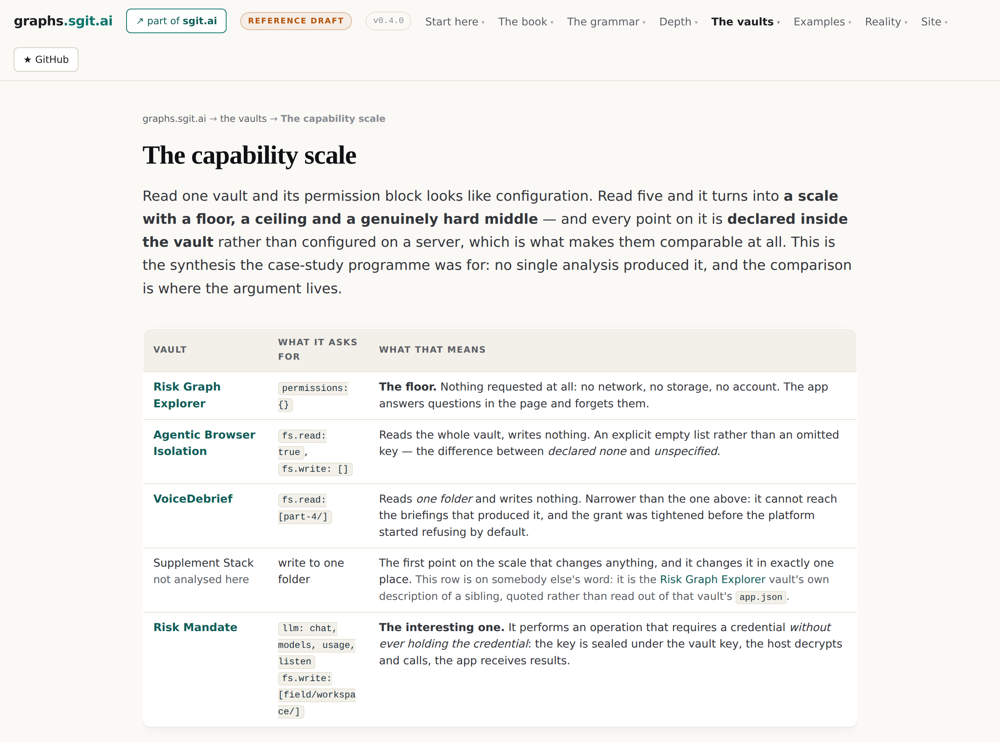
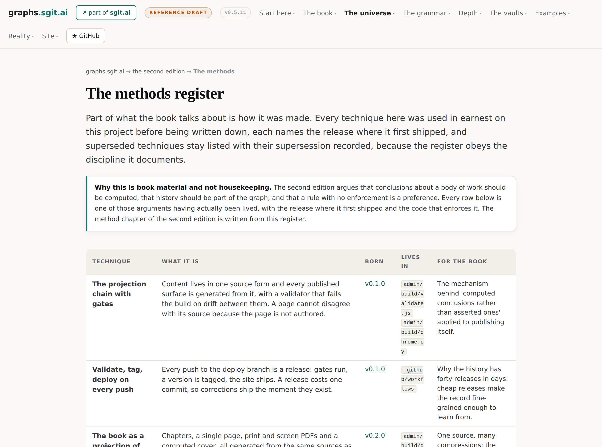

# The estate, the vaults and the network

After this chapter you will be able to tell, for any claim in this book, whether it is
running or only argued, and to check which without asking anyone.

Seven concepts. The shortest region, and the one the estate says should be read first by
anybody deciding whether to trust the rest.

## The region, drawn

<!-- gen:map:estate -->

```
  THE PUBLISHED VAULTS
     ──▶ demonstrates     ── what ships, what is argued
     ──▶ computes         ── the capability scale
     ──▶ demonstrates     ── the capability scale

  WHAT SHIPS, WHAT IS ARGUED
     ◀── carries          ── the network of sibling sites

  and the rest of this region's own connections:
     the number nothing was checking ──implements──▶ the projection chain, gated

  and these, which connect only outside this region:
     the voice memo loop
```

<!-- /gen:map:estate -->

## The honesty chapter, and why it is not optional

The estate's own position is blunt: its subject matter is almost entirely design. It ships a
hand-written content-addressed object graph in the browser, it does not use a graph
database, and it says so in its own architecture notes.

The reason that chapter exists at all is worth carrying: without it the work over-claims,
and an over-claiming publication about provenance discipline is self-refuting.

So the estate keeps three lists rather than one. **Ships and is verifiable by reading code**:
the vault commit history as a real directed acyclic graph with multi-parent commits and a
computed merge base, typed cross-vault edges optionally pinned to a commit, a read-only query
interface handed to untrusted sandboxed applications, and one live typed property graph of
repository data. **Argued and published as argument**: node type formulas, the grounding
ladder, ontologies of ontologies, a graph at every boundary, twins as endpoints, the path
query language, decompilation. Nearly everything in this book. **Does not exist anywhere**:
no graph database, no query language of the RDF or property-graph worlds in the code, no RDF
layer, no executing path query language, and a commit signature field that is written on
every commit and only ever set to null.

That third list is the cheapest credibility in the estate and the hardest to write.

## What exists that you can open

<!-- gen:stat:published_vaults -->19<!-- /gen:stat:published_vaults --> vaults have had their
read key deliberately published, which means anyone can open them and count for themselves.
Three of them are the graph exhibits: a European regulation
parsed into 1,523 nodes and 1,944 edges with every element hash-verified to the official
source bytes; a browser-isolation analysis written seven times over, once per stakeholder,
none of them a summary of another; and a risk explorer that requests no capability at all and
draws its unanswered questions instead of omitting them.

Read across five of them and something appears that no single one contains. Every vault
declares, inside itself, what it may do. Line the declarations up and they form a scale with
a floor (nothing requested), a hard middle (read one folder, write one folder) and a ceiling
(an operation that requires a credential, performed without ever holding the credential). The
middle is hard for a modelling reason rather than a security one: saying *this app may
perform the operation and may never hold the key* requires two nameable things and an edge
between them, and most permission systems model only one thing, which is who has the
credential.

That is this book's thesis, arriving in a security register with no philosophy attached: two
apps with identical code and different permission blocks are different things, and the
difference is not in the code, it is in what each one can reach.

<!-- gen:fig:capability-scale -->



*Figure. The capability scale. Five vaults' permission blocks lined up into a floor, a hard middle and a ceiling, which is this book's thesis in a security register. Taken from `/v1/vaults/capability-scale.html` on this estate at version v0.5.11, 2026-08-26.*

<!-- /gen:fig:capability-scale -->

## The network

Around the estate sit nineteen focused sites, eighteen live and one with the repository in
place and nothing published yet, each taking one question further than a section could. They
share a discipline, and they publish their arguments before the things they describe exist,
so the commitments stay checkable afterwards.

Three of the bridges are more than thematic. A public key is the purest example of a node
that means nothing on its own: it is a number, and everything that makes it useful is an
edge somebody asserted and somebody else has to check. The identity work runs the reciprocal:
an edge is an assertion by somebody, so a graph whose edges have no identities is a graph
deriving meaning from claims of unknown origin. And the runtime work turns the path argument
into a security one: the universe of what is possible is determined by the current state, so
an attack that lives in a sequence cannot be found by inspecting one request.

Neither project can close its own argument alone, which is the most graph-shaped thing about
the family.

<!-- gen:fig:methods -->



*Figure. The methods register. Every technique used in earnest before being written down, each naming the release where it first shipped. Taken from `/v2/methods/index.html` on this estate at version v0.5.11, 2026-08-26.*

<!-- /gen:fig:methods -->

## The entries

<!-- gen:entries:estate -->

### what ships, what is argued {#what-ships-what-is-argued}

`position` · **This estate's subject matter is almost entirely design, and saying so is the reason the rest is worth reading.**

> We ship a hand-written content-addressed object graph in the browser. We do not use a graph
> database, and we say so in our own architecture notes.
>
> — *What ships, what is argued*, § What ships, what is argued

**Out.** This bounds [a graph at every boundary](#graph-at-every-boundary). This carries [a named absence beats a hidden one](#named-absence).

**In.** [Agenda is context, not a verdict](#agenda-is-context) carries this. [The published vaults](#published-vaults) demonstrates this. [Not a graph database pitch](#not-a-graph-database-pitch) carries this. [The network of sibling sites](#the-network) carries this.

*Where it shows up:* The shipped layer: the commit DAG, typed cross-vault edges, a read-only query API, and a 71-node, 141-edge issue graph. Everything else is proposed.

```
           agenda is context, not a verdict · the published vaults
                          not a graph database pitch
                            carries, demonstrates
                                      │
                                      ▼
                      ╭────────────────────────────────╮
                      │   WHAT SHIPS, WHAT IS ARGUED   │
                      ╰────────────────────────────────╯
                                      │
                               bounds, carries
                                      ▼
        a graph at every boundary · a named absence beats a hidden one
```

### the published vaults {#published-vaults}

`artefact` · **Nineteen vaults whose read key has been deliberately published, each one auditable by anyone who opens the key.**

> Every vault whose read key this site has deliberately published
>
> — *Published vaults*, § Published vaults

**Out.** This demonstrates [what ships, what is argued](#what-ships-what-is-argued). This computes [the capability scale](#capability-scale). This demonstrates [the capability scale](#capability-scale).

**In.** [The file system is the source of truth](#file-system-is-the-source-of-truth) enables this.

*Where it shows up:* Fetched 26 August 2026. Among them the EU AI Act regulation graph (207 files, 14.9 MB), Agentic Browser Isolation (104 files, 17 app entries) and the Risk Graph Explorer (33 files).

```
                    the file system is the source of truth
                                   enables
                                      │
                                      ▼
                         ╭──────────────────────────╮
                         │   THE PUBLISHED VAULTS   │
                         ╰──────────────────────────╯
                                      │
                            computes, demonstrates
                                      ▼
   what ships, what is argued · the capability scale · the capability scale
```

### the capability scale {#capability-scale}

`artefact` · **Five vaults' permission blocks line up into a scale with a floor, a hard middle and a ceiling, and the middle is hard for a modelling reason rather than a security one.**

> two apps with identical code and different permission blocks are different things
>
> — *The capability scale*, § What a component is, is what it can reach

**Out.** This demonstrates [the same value, differently connected](#the-difference-is-connectivity). This extends [classification is a query, not a judgment](#node-type-formula).

**In.** [The published vaults](#published-vaults) computes this. [The published vaults](#published-vaults) demonstrates this. [Untrusted input is data, never instruction](#untrusted-input-is-data) demonstrates this.

*Where it shows up:* The clearest non-abstract statement of the thesis the estate contains, and it came from the comparison, not from any single vault.

```
                 the published vaults · the published vaults
                  untrusted input is data, never instruction
                            computes, demonstrates
                                      │
                                      ▼
                         ╭──────────────────────────╮
                         │   THE CAPABILITY SCALE   │
                         ╰──────────────────────────╯
                                      │
                            demonstrates, extends
                                      ▼
                    the same value, differently connected
                  classification is a query, not a judgment
```

### the network of sibling sites {#the-network}

`artefact` · **Nineteen focused sites on the same domain, each taking one question further than a section could, sharing one discipline and publishing arguments before the things they describe exist.**

> each taking one question further than a section here could
>
> — *The sgit.ai network*, § The sgit.ai network

> 18 live, 1 with the repository and subdomain in place but nothing published yet
>
> — *The sgit.ai network*, § The sgit.ai network — the count, on the day this was fetched

**Out.** This carries [meaning through connectivity](#meaning-through-connectivity). This demonstrates [graphs of graphs, ontologies of ontologies](#graphs-of-graphs). This carries [what ships, what is argued](#what-ships-what-is-argued).

*Where it shows up:* Fetched 26 August 2026. graphs.sgit.ai is the one that holds this argument; nhi, pki and sentinel each need it and are needed by it.

```
                     ╭──────────────────────────────────╮
                     │   THE NETWORK OF SIBLING SITES   │
                     ╰──────────────────────────────────╯
                                      │
                            carries, demonstrates
                                      ▼
  meaning through connectivity · graphs of graphs, ontologies of ontologies
                          what ships, what is argued
```

### the projection chain, gated {#projection-chain-with-gates}

`method` · **Content lives in one source form and every published surface is generated from it, with a validator that fails the build on drift.**

> A page cannot disagree with its source because the page is not authored.
>
> — *The methods register*, § projection-chain

**Out.** This implements [documents are projections of graphs](#projection).

**In.** [The number nothing was checking](#numbers-not-in-prose) implements this. [The operators, each a first-class folder](#twelve-operators) implements this.

*Where it shows up:* Documents are projections of graphs, applied to publishing itself. This volume obeys it too.

```
  the number nothing was checking · the operators, each a first-class folder
                                  implements
                                      │
                                      ▼
                     ╭─────────────────────────────────╮
                     │   THE PROJECTION CHAIN, GATED   │
                     ╰─────────────────────────────────╯
                                      │
                                  implements
                                      ▼
                     documents are projections of graphs
```

### the number nothing was checking {#numbers-not-in-prose}

`method` · **The single most repeated failure of the whole run: a count or a date written into prose that no gate covers, drifting silently. The standing answer is that prose does not quote computed numbers.**

> the standing answer is that prose does not quote computed numbers
>
> — *The methods register*, § numbers-not-in-prose

**Out.** This implements [the projection chain, gated](#projection-chain-with-gates). This measures [documents are projections of graphs](#projection).

**In.** [One extraction, projected views](#one-file-many-views) implements this.

*Where it shows up:* Every instance found became a gate. This volume's counts are computed at build and printed from the data.

```
                       one extraction, projected views
                                  implements
                                      │
                                      ▼
                   ╭─────────────────────────────────────╮
                   │   THE NUMBER NOTHING WAS CHECKING   │
                   ╰─────────────────────────────────────╯
                                      │
                             implements, measures
                                      ▼
      the projection chain, gated · documents are projections of graphs
```

### the voice memo loop {#the-voice-memo-loop}

`method` · **A memo is transcribed verbatim, an agent's numbered reading is published beside it, the build follows, and the release row narrates what happened.**

> the verbatim capture meant no instruction was ever paraphrased into something easier to
> build
>
> — *The v0.4 retrospective*, § Conclusions

> Gates buy speed, not caution.
>
> — *The v0.4 retrospective*, § Conclusions — why forty-one releases in four days was possible

**Out.** This implements [the author is the only oracle](#author-is-the-oracle). This demonstrates [disagreement is the product](#disagreement-is-the-product). This enables [the fifteen established edges](#the-fifteen-edges).

*Where it shows up:* Nineteen founder memos are carried verbatim in the second edition, transcription artefacts and all.

```
                         ╭─────────────────────────╮
                         │   THE VOICE MEMO LOOP   │
                         ╰─────────────────────────╯
                                      │
                      demonstrates, enables, implements
                                      ▼
         the author is the only oracle · disagreement is the product
                        the fifteen established edges
```

<!-- /gen:entries:estate -->

## Where the estate demonstrates this

The projection chain is the estate practising on itself what this book argues about
documents: content lives in one source form, every published surface is generated from it,
and a validator fails the build on drift. A page cannot disagree with its source because the
page is not authored. This volume obeys the same rule, which is why every count in it is
generated rather than typed.

The most repeated lesson of the whole run is smaller and more embarrassing than any of the
architecture: a count or a date written into prose that no gate covers will drift silently.
Every instance found became a gate, and the standing answer is that prose does not quote
computed numbers.

And the loop that produced the material is itself a demonstration. A voice memo is
transcribed verbatim, the agent's numbered reading is published beside it and marked as the
agent's, the build follows, and the release row narrates what happened. Nineteen memos are
carried that way, transcription artefacts and all. Forty-one releases landed in four days,
and the retrospective's judgement on why is worth quoting to anybody who thinks gates slow
things down: gates buy speed, not caution.
