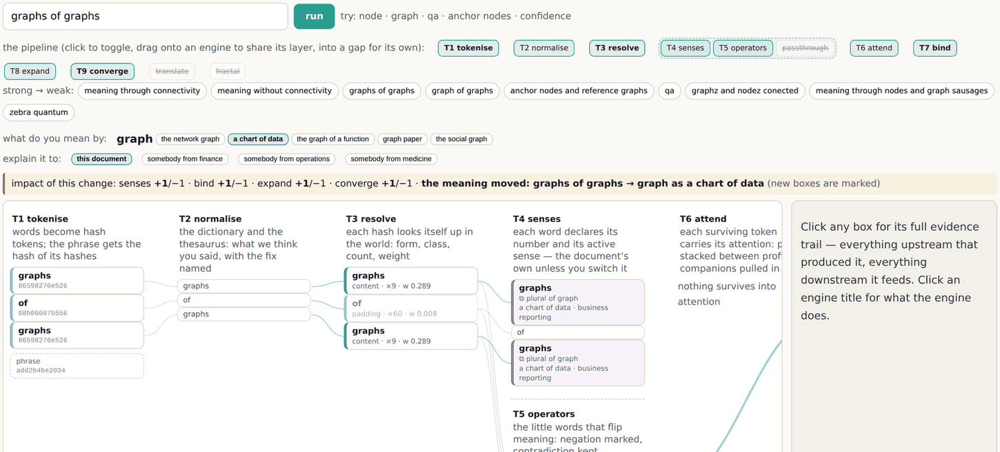

# 1 · A node is just a node

*After this chapter you will be able to state the book's central claim in your own words,
and you will have a test for it that costs nothing: take any label in a system you know,
trace what it reaches, and see whether the meaning you assumed survives the trace.*

---

Draw a box. Write **Review** inside it. What have you got?

You have a box with a word in it. You do not have a Review. You have a node that
somebody labelled "Review", and that label is a claim by whoever drew the box, not a fact
about the world. Nothing inside the box tells you whether that Review took two minutes or
two weeks, whether a human did it, whether a regulator would accept it, or whether it is
the same kind of thing as the Review your colleague drew in a different box yesterday.

<div class="claim">

A node connected to nothing is meaningless. Literally, not rhetorically: there is nothing
there to be right or wrong about.

</div>

This sounds like a philosophical point. It is an engineering one, and it has an immediate
practical consequence. **If you try to make the box mean something by putting more words
inside it, you are solving the wrong problem.** Adding `type: "security-review"` and
`duration: "2 weeks"` gives you a bigger box with more words in it. Somebody else's box
will use different words for the same thing, and the same words for a different thing,
and you will discover which at the boundary, in production, when it is expensive.

## The two 8080s

Here is the version that makes it concrete, and it is real shipped code rather than a
metaphor.

Two variables in a Python program. Both hold the number `8080`.

```
[port = 8080] -typed_as-> [int]

    Traced outwards, it reaches int, and stops. That is the whole graph.


[port = Safe_UInt__Port(8080)] -typed_as-> [Safe_UInt__Port]
                               -extends->  [Safe_UInt]
                               -part_of->  [osbot-utils@3.63.4]

    Traced outwards, it reaches a type that carries a range constraint,
    which belongs to a library, at a pinned version, which has its own
    graph of tests, a source repository, a licence, a maintainer.
```

**The difference is not in the value.** Both scenarios hold `8080`. The meaning is
identical in the developer's head. It is radically different in the graph, and the graph
is the thing another system, another team, or an agent has to work from.

Notice what is doing the work in the second case. It is not that somebody wrote a longer
description. It is that a chain of edges exists, and each hop constrains what the value
can be. The range constraint is not a comment; it is a property of a type that something
else in the system enforces. The version pin is not documentation; it resolves to a
specific artefact with its own graph. Meaning here is not asserted anywhere. It is
*reachable*.

Which gives the sentence this whole book is built on, taken from the foundational essay
of the corpus, `library/concepts/v0_4_0__thinking-in-graphs.md`, dated 5 February 2026,
and quoted here in its own words:

<div class="claim">

**everything is a graph, meaning is not declared but discovered through graph
relationships, and confidence in that meaning is proportional to how richly connected a
node is to other nodes that provide context.**

</div>

And note what follows immediately, because everything else in this book is a consequence
of it: **meaning stops being something you assert and becomes something you can compute.**

The first edition of this argument made that claim and then, honestly, had nothing that
computed it. Part four of this book is the answer to that. But the claim has to stand on
its own first, because an engine that computes the wrong thing is worse than no engine.

## Five teams, five processes, one word

This is the best on-ramp in the material and the one to try on a sceptical colleague.

Five organisations each have a thing they call a **Review**.

| Who | What their "Review" actually is |
|---|---|
| **A**, a team in Tokyo | Two engineers, a checklist, roughly forty minutes, recorded in a ticket |
| **B**, an open-source project | Whoever shows up comments on a pull request; merged when someone with commit rights is satisfied |
| **C**, a bank in Frankfurt | A three-week formal process with named approvers, an audit trail, and a regulator who may ask for it |
| **D**, a startup in Lagos | The chief technology officer reads it on the way to a meeting and says yes |
| **E**, a research group in São Paulo | Two anonymous peers, a written response, a revision cycle |

The schema-first instinct is to define a Review. So ask the question that instinct never
survives: **which of these five gets to be the definition?**

Whichever you pick, four organisations now have to either lie about their process or
exclude themselves from your system. That is not a modelling problem. It is a political
one, and it does not have a technical solution. Every schema you have ever seen that
covers more than one organisation has this problem, and most of them resolve it by
having the largest party win.

**The graph does not ask anybody to agree.** Each organisation keeps its own node with
its own edges: who performed it, what was produced, how long it took, what it referenced,
what it authorised. Then you ask a specific question, and the answer is a computation
over the overlap.

- **"Did somebody other than the author look at this?"** A, B, C and E overlap. D does
  not.
- **"Is there a record a third party could inspect?"** A, B, C and E. D does not.
- **"Would BaFin accept this?"** C, and possibly nobody else. (BaFin is Germany's
  federal financial regulator.)

Three properties of those answers are worth naming, because each is something a schema
cannot do.

**They are not binary.** Compatibility is a degree of overlap, not a yes or a no. The
schema's answer is always yes or no, which is why so much of the work with a schema is
arguing about where to put the line.

**They are not symmetric.** C's review satisfies B's question. B's does not satisfy C's.
A schema has one direction of conformance and therefore cannot express this without
inventing a hierarchy that somebody has to defend.

**They are purpose-relative.** The same two processes are compatible for one question and
incompatible for the next. There is no global answer, and asking for one is the mistake.

<div class="claim">

Nobody had to agree on anything, change their process, or adopt a shared vocabulary, and
the system still told you exactly where they overlap and where they do not.

</div>

## What happens when you change what a word means

The five Reviews argument is old, in the sense that a philosopher would recognise it. The
new part is that you can now watch it happen, mechanically, in a running engine, and
count what changes.

The estate holds a small deterministic engine (chapter eleven builds it up properly)
whose job is to answer *what does this phrase mean* against one document's world. Ask it
about "graphs of graphs" and it answers with a concept, its statement, the quoted
sentence in the source that carries it, and the arithmetic behind the score.

Now change one thing. The engine knows that the word "graph" means different things in
different worlds: a network graph here, a chart of data in a boardroom, the plot of a
function at school, the ruled paper you draw on, the social graph of a platform. Switch
the active sense of "graph" from *the network graph* to *a chart of data*, and the engine
does not merely give a different answer. It reports which of this document's claims stop
applying, computed from the concept labels rather than authored by anybody, and it
reports that nothing survives into the attention layer at all.



*Figure 1.1 · The WCLM at graphs.sgit.ai/v2/wclm/, site version v0.5.11. The prompt is
"graphs of graphs". The active sense of the word "graph" has been switched from "the
network graph" to "a chart of data". The banner above the layers reports the movement:
senses +1/−1 · bind +1/−1 · expand +1/−1 · converge +1/−1 · the meaning moved: graphs of
graphs → graph as a chart of data. The attention layer reports "nothing survives into
attention". Changing what one word means emptied the rest of the computation.*

That is the five Reviews, run as arithmetic on one word. The founder predicted the result
before it was built, in a voice memo of 26 August 2026: *"if I go on graphs or graphs and
I change my definition of a graph is to, for example, to be a diagram, right, a line
diagram or something else, well, then the fractal element will not apply."* It does not.
The engine now says so, and says which claims it takes with it.

The lesson is not about the engine. It is that **the disagreement is data**. Two people
using the word "graph" differently are not making an error to be corrected by a
definition; they are holding two positions whose consequences can be computed and
compared. Merging them into one shared definition would erase the finding. Chapter four
is about why you should never do that.

## "We cannot confirm Z" is a better answer than a guess

If meaning comes from connectivity, then **how well connected something is** is a measure
of how much weight it will bear. That gives a ladder, and every assertion in every system
you own sits somewhere on it.

```
  5 · rich multi-hop connectivity
      many INDEPENDENT paths lead to the same conclusion
      (independence, not count: ten citations of one source are one source)

  4 · edges to external references
      a published standard, a legal instrument, a versioned library,
      a URL a third party can fetch and check

  3 · edges to anchor nodes
      well-known, well-maintained reference points that others also
      connect to, so two systems can compare notes without merging

  2 · edges to typed definitions
      something else in the system constrains what this can be:
      the port that reaches a type that carries a range

  1 · a few local edges
      connected to things in the same document or system.
      internally coherent; means nothing outside it

  0 · no edges
      a word in a box. nothing can be checked, so nothing
      should be relied on
```

*Figure 1.2 · The confidence ladder. Each rung is a claim about connectivity, not about
effort or intention.*

So the honest output of such a system is not a score. It is three sentences: **we know X,
we think Y, we cannot confirm Z**, each with a reason you can trace.

And the remedy for low confidence follows directly from the diagnosis. It is
**enrichment, not enforcement**: you add edges, you do not add validation rules. The
graph grows; it does not constrain. That distinction is easy to state and hard to hold on
to, and it is what separates this from every schema-validation system you have used. When
your instinct says "we should require that field", the graph's answer is "connect it to
something that already knows".

There is a cost to this and it is worth stating in the chapter that introduces it rather
than burying it later. Enrichment does not stop anybody doing anything. If your
requirement is that a field must never be null, a validator does that and a graph does
not. Chapter fourteen carries the full list of situations where this approach is the
wrong one, and this is one of them.

## Three of ten pieces of evidence *is* information

Most systems list what they have. An honest one also lists what it lacks.

If you need ten pieces of evidence to support a conclusion and you hold three, that is not
a failure state to be hidden behind a progress bar. It is a fact with three uses. It
quantifies your confidence. It tells you precisely which seven things to go and get. And
it makes the business case for connecting them, because now the missing dots have names.

A register has empty cells, which look like nothing at all. A graph has **unanswered
question nodes and unevidenced facts**, which can be counted, queried, assigned to a
person and given a date.

The sharpest instance in the corpus is a worked mapping of one EU AI Act provision
(Article 26(5), on the deployer's obligations for a high-risk system) onto one concrete
deployment. It produced nine question nodes. Five of them were unanswered, and the source
brief calls those five *"the actual output of the exercise"*. Chapter thirteen walks that
example. The habit it teaches is the one to steal first: when you cannot determine
something, emit an explicit node saying so, rather than a plausible value.

<div class="claim">

A named absence beats a hidden one. In a graph an absence is a node with a name, an owner
and a date, which means it can be counted, argued about, and funded.

</div>

The same rule holds one level up, in how a graph is drawn. Every rendered graph in this
estate uses three states: green for assurance, amber for exposure, and **ghosted for
unanswered**. The third one is the point. An unanswered question is drawn, not omitted.
That is not a stylistic preference; it is the visual form of the claim above.

## Five ideas, and what they cost

That is the whole of part one's first chapter, and it is deliberately short of jargon: you
have not yet met the words *ontology* or *semantic*, because you do not need them.

1. A node alone means nothing.
2. The same value, differently connected, means different things.
3. Nobody has to agree for the overlap to be computable.
4. Confidence is a function of connectivity, and of the independence of the paths.
5. A named absence beats a hidden one.

Every one of these has a price. Ideas one and two mean you have to do the connecting, and
edges are work somebody has to perform. Idea three means you give up the comfort of a
single agreed definition, which is exactly the comfort most governance processes are
built to provide. Idea four means your system will tell you it is not sure, out loud, in
front of people who wanted a number. Idea five means your dashboards get worse before they
get better, because absences that were invisible become visible and countable.

If those prices sound acceptable, the next chapter is the one that explains what kind of
graph this is, because the word is used for at least three different things and only one
of them is this book's subject.

<div class="note">

**Where the live estate demonstrates this.** The sense switch in figure 1.1 runs at
`graphs.sgit.ai/v2/wclm/`, and the switch is reversible in one click. The confidence
ladder governs the rendering of every graph in the estate: open the Risk Graph Explorer
at `sgit.ai/demos/vaults/risk-graph-explorer/` and the ghosted edges are the unanswered
ones, drawn rather than omitted. The five Reviews come from
`library/concepts/v0_4_0__thinking-in-graphs.md`, whose full text is published, frozen and
hash-verified at `graphs.sgit.ai/v1/docs/sources/thinking-in-graphs.md`.

</div>
