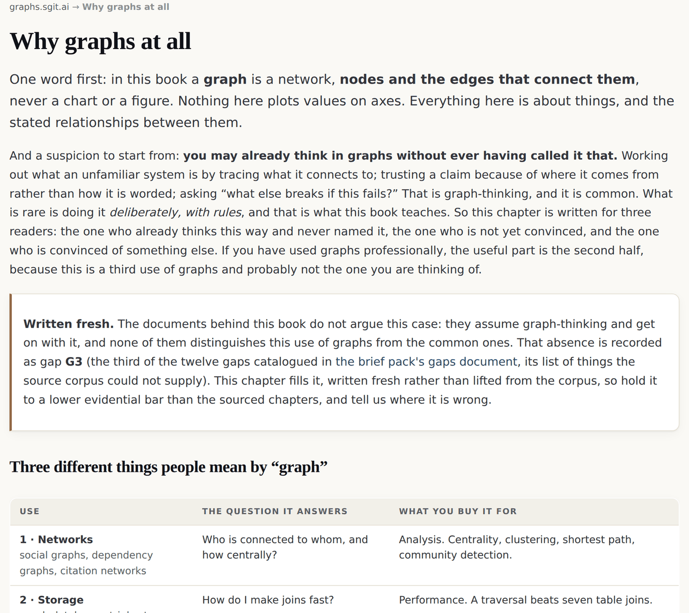

# 2 · Why graphs at all

*After this chapter you will be able to place this argument precisely against the three
things people mean by the word "graph", against retrieval-augmented generation over
graphs, against the Semantic Web, and against property graphs, and you will know the four
situations in which this book's argument is the wrong one.*

---

One word first. In this book a **graph** is a network: nodes and the edges that connect
them. Never a chart, never a figure. Nothing here plots values on axes. Everything here is
about things, and the stated relationships between them.

And a suspicion to start from: **you may already think in graphs without ever having
called it that.** Working out what an unfamiliar system is by tracing what it connects to.
Trusting a claim because of where it came from rather than how it is worded. Asking "what
else breaks if this fails?" That is graph-thinking, and it is common. What is rare is
doing it deliberately, with rules, and that is what this book teaches.

So this chapter is written for three readers: the one who already thinks this way and
never named it, the one who is not yet convinced, and the one who is convinced of
something else. If you have used graphs professionally, the useful half is the second,
because this is a third use of graphs and probably not the one you are thinking of.

## Three different things people mean by "graph"

| Use | The question it answers | What you buy it for |
|---|---|---|
| **1 · Networks**<br>social graphs, dependency graphs, citation networks | Who is connected to whom, and how centrally? | Analysis. Centrality, clustering, shortest path, community detection. |
| **2 · Storage**<br>graph databases, triple stores | How do I make joins fast? | Performance. A traversal beats seven table joins. |
| **3 · Semantics**<br>this book | **What does this thing mean, and how sure can I be?** | Meaning that survives a boundary: a different team, project, culture, language, or system. |

Uses one and two are well served and well understood. This book is about use three, which
is why the disclaimer goes at the front and stays there: **not a graph database pitch.**
The claim is that one grammar is the interface at every boundary, not that things are
stored in a graph. Nothing in this argument depends on which store you use. The work
behind this book does not use a graph database at all, and says so in its own architecture
notes.

That is worth dwelling on for a moment, because it is the single most common
misclassification of this material. A reader who takes it as a storage argument will
reasonably ask why not use an established triple store, will find the answer unconvincing,
and will stop reading. The answer is that storage is not the subject. The subject is what
crosses the seam between two systems that were not designed together.

## The argument, in four steps

```
  1 · declared meaning is brittle and local
      a schema works perfectly inside the system that defined it.
      cross a boundary (another team, project, culture, language)
      and it either forces conformity or breaks.
                                                    |
                                                    v
  2 · the boundary is not an edge case; it is where all the work is
      integration, compliance, procurement, supply chain, regulation,
      multi-team delivery, agents calling other systems: every one of
      these IS a boundary problem.
                                                    |
                                                    v
  3 · connectivity survives the boundary because it needs no agreement
      two parties do not need a shared vocabulary to compare notes.
      they need to have connected their own nodes to enough context
      that the overlap can be computed.
                                                    |
                                                    v
  4 · and once meaning is computed, it can be checked and versioned
      a judgment in somebody's head cannot be reviewed. a judgment
      expressed as a required path-pattern can be read, disputed,
      versioned and tested against the data.
```

*Figure 2.1 · The four-step case. Step one comes from the corpus's foundational essay;
steps two to four are this book's reading of it.*

Step four is the one that changes what a system is *for*. Judgment does not disappear
when you move it into a graph. Somebody still decides that a vulnerability requires an
upward path to a risk. What changes is where the decision lives: out of the classifier's
head, into a formula that is visible, versioned and arguable. You can now disagree with a
classification by pointing at a line, which you could not do before. Chapter five makes
that precise.

## "What I am describing is not complexity, it is reality"

The most common objection is that this is over-engineering, and that a table would do.
Sometimes a table would do. The reply worth quoting is the founder's, from 18 June 2026:

> "what I am describing is not complexity, it is reality. This is the reality of business,
> the reality of the complex applications we have."

The test is not whether the graph is simpler than a table. It is whether **the question
you need answered is expressible in a table**. Three that are not:

**Reach.** A table lists the permissions an account has. Only a transitive closure over
assume-role, pass-role and wildcard edges tells you what those permissions actually
*reach*. In the identity and access management worked example, that closure is a node
type in its own right, called the agentic union, and for an agent it is the rating floor
rather than the nominal grant.

**Bidirectionality.** "What does this browser extension reach?" and "how could my email be
attacked?" are two different tables. They are one graph, walked in two directions. Nobody
maintains the second table, which is why nobody can answer the second question.

**Propagation of a correction.** Mark a claim superseded, then ask which conclusions were
resting on it. There is no table shape that answers that. The clearest case is the
ten-thousand-hours literature: **242 papers and more than 200,000 supporting citation
paths, traced back to a claim that corrections never reached**, because in a pile of
documents there is nothing for a correction to attach to. Chapter five turns that into a
rule.

## Where this sits next to GraphRAG, RDF and property graphs

<div class="warn">

**More contested than the rest of the book, and written fresh.** The corpus behind this
argument has zero occurrences of "GraphRAG" and zero of "hypergraph". It holds a strong
implicit position and never engages the named field. That absence is recorded in the
estate's own gap catalogue as gap G11 (the eleventh of the twelve gaps the brief pack
listed as things the source corpus could not supply). What follows is a position stated so
that it can be argued with, not a claim that somebody already worked it out.

</div>

### GraphRAG

GraphRAG, meaning graph-based retrieval-augmented generation, shares a real premise with
this book: retrieval over structure beats retrieval over a pile of chunks. The difference
is what the structure is *for*.

GraphRAG, in its common form, builds a graph in order to retrieve better context to put in
a prompt. The graph is scaffolding for a generation step, and the model remains the thing
that decides. The position here is stronger and narrower: **knowledge is traversed, not
guessed.** Retrieval is a traversal from an intent node to grounded facts with provenance
attached, rather than a similarity search returning plausible chunks. The model sits at
the edge and *proposes* a graph; a deterministic validator decides whether that proposal
is admissible.

That is a genuine disagreement and it has a cost worth stating plainly: **it requires the
edges to exist.** Similarity search works on an unstructured corpus today. Traversal does
not. Where the graph is thin, this approach has nothing to say, and pretending otherwise
would be the exact dishonesty this book stands against.

### RDF, OWL and the Semantic Web

RDF (the Resource Description Framework) and OWL (the Web Ontology Language) are the
Semantic Web's core standards, and the disagreement here is with a practice, not a goal.
It is a respectful disagreement, because that community identified the right problem two
decades early: meaning has to travel between systems that were not designed together.
That was correct and it is still correct.

The disagreement, in the corpus's own words:

> "They ended up attaching meaning **to nodes** rather than deriving meaning **from
> edges**. … The node becomes a little document that describes itself. **This is
> schema-first thinking dressed in graph syntax.**"

Be precise about how narrow that is. It is not a disagreement with RDF as a
serialisation. It is not a disagreement with URIs as identifiers, or with shared
vocabularies as reference points, since anchor nodes (chapter four) are exactly that. It
is with the practice of making a node self-describing, because a self-describing node has
smuggled the schema back in.

And note what the position is **not**. It is not anti-RDF at the serialisation layer. The
live EU AI Act regulation graph in this family exports RDF/Turtle as a published artefact.
The honest statement is **both, at different layers**: RDF is a fine way to hand a graph
to somebody else; it is a poor place to put the meaning.

### Property graphs

An awkward one to answer honestly, because this book's core rule is that properties do not
carry meaning, and the one graph in this project that is *actually running* is a typed
property graph: the issue tracker's own configuration, with 12 node types, 10 verb and
inverse edge types carrying domain and range constraints, and **71 nodes and 141 edges**
across 107 issue files, stored bidirectionally.

The resolution is a distinction: properties are allowed to carry **data**; they are not
allowed to carry **meaning**. A property may hold a timestamp. It may not hold the answer
to "what kind of thing is this?", because that answer is a query. Chapter five is where
that becomes precise, and the shipped issue graph is the smallest working demonstration
of it in the estate.

### Vector search and embeddings

Worth a paragraph because it is the comparison a reader arrives with in 2026, and because
part four of this book builds an engine that deliberately looks like a transformer and
deliberately is not one.

An embedding places a token in a space where distance approximates similarity. It is
extremely good at finding things that are *like* other things, on corpora nobody has
structured, which is most corpora. Its weakness is that the space is learned and opaque:
you cannot ask why two things are near each other and get an answer you can check, and
you cannot correct a single relationship without retraining or bolting on a rule.

The graph position is the mirror image. It is worse where nobody has done the connecting
work, and it is better exactly where you need an answer that somebody can be accountable
for, because every relationship is a claim somebody made, with a name and a date on it.
Chapter eleven shows what a small engine looks like when every weight is a stated formula
over graph inputs rather than a fitted number, and chapter twelve shows what you get in
exchange for that restriction. The exchange is real and it goes both ways.

### Hypergraphs

No position. The corpus does not contain the word, and this book will not manufacture one
to look complete. If you have a case where a binary edge with a named inverse loses
something a hyperedge keeps, the estate's public comms board is where to put it.



*Figure 2.4 · The positioning as published at graphs.sgit.ai/v1/why-graphs/, site version
v0.5.11. The warning box above the table is the point of the page as much as the table is:
the sections written fresh say so, and name which gap in the estate's own catalogue they
fill, so a reader knows which paragraphs to hold to a lower evidential bar.*

## Where this approach loses

Four situations where the argument of this book is the wrong one. If you are in one of
them, do something else. They are carried here from the estate's participant disclosure
rather than softened, and they belong in chapter two rather than in an appendix, because a
reader deciding whether to keep reading deserves them early.

```
  1 · everyone already agrees, and always will
      inside one team, one codebase, one jurisdiction, with a stable
      vocabulary and no external party: a schema is simpler, faster,
      and it will catch mistakes this approach lets through.
      no boundary, no benefit.

  2 · you need the answer to be enforced, not computed
      enrichment rather than enforcement is a real cost. if your
      requirement is "this field must never be null", a validator does
      that and a graph does not. some systems need a gate, and a gate
      is a schema.

  3 · the graph would be empty
      this approach needs edges, and edges are work somebody has to do.
      where nobody has done that work, traversal has nothing to say and
      similarity search will beat it outright.

  4 · you want to buy it rather than build it
      the honest state of the semantic layer is DESIGNED, NOT SHIPPED.
      if you need something running next quarter, this book is a set of
      arguments you can use, not a product you can procure.
```

*Figure 2.2 · The four losses, from the estate's participant disclosure at
graphs.sgit.ai/v1/about/participant.html.*

## A network of nineteen, as a first piece of evidence

There is one piece of evidence available at the start of the book that costs the reader
nothing to check, and it is worth putting here rather than saving for part five.

If the claim is that one grammar survives a boundary, then a family of independent
projects, each with its own vocabulary and its own argument, ought to be able to link to
each other without merging. As of the fetch made while writing this chapter, the sgit.ai
network index lists **nineteen focused sites, eighteen live and one with the repository
and subdomain in place but nothing published yet.** Each takes one question further than a
section of another site could.

Several of them are this book's own arguments, running in somebody else's domain
vocabulary:

| Site | Its own one-line claim |
|---|---|
| `standards.sgit.ai` | Point at the provision, or you are asserting. |
| `risks.sgit.ai` | You cannot deny a risk. You can only say how long you accept it. |
| `newsroom.sgit.ai` | The story is a graph. The article is a projection. |
| `issues-fs.sgit.ai` | The issues are files. The files are a graph. |
| `twins.sgit.ai` | A digital twin is an interface to reality, not a simulation of it. |
| `wardley-maps.sgit.ai` | Maps are claims, not pictures. |
| `pki.sgit.ai` | Good public key repositories existed, and were destroyed. |

*Figure 2.3 · Seven of the nineteen sites in the sgit.ai network, quoted from
sgit.ai/network/index.html as fetched on 26 August 2026. Each line is that site's own
statement of its argument, not this book's paraphrase.*

None of these sites adopted a shared schema. They share a grammar and a discipline, and
they connect through named links. That is the claim of chapter four, arriving early and
in public. Chapter thirteen returns to what the network demonstrates and what it does
not.

<div class="note">

**Where the live estate demonstrates this.** The three uses of "graph" and the positions
above are argued at `graphs.sgit.ai/v1/why-graphs/`, which also carries the gap markers
for the parts written fresh. The four losses are at
`graphs.sgit.ai/v1/about/participant.html`. The network index is at
`sgit.ai/network/index.html`, and the published vault list, with a file count, a size and a
commit count for each, is at `sgit.ai/demos/vaults/index.html`.

</div>
