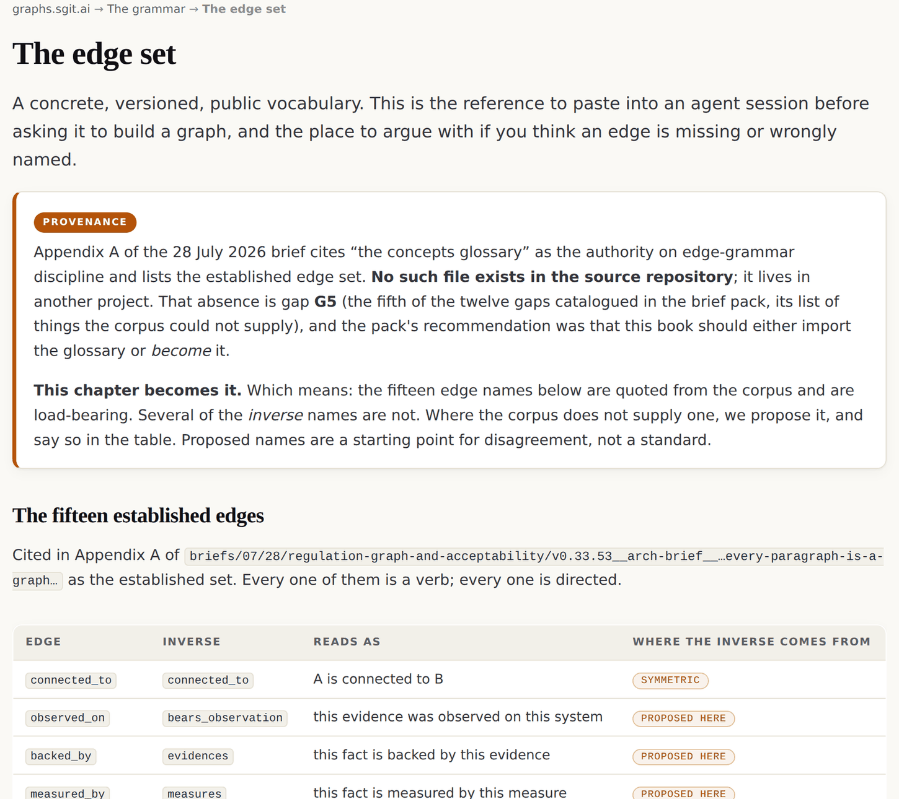

# 3 · Every edge is a verb

*After this chapter you will have five rules you can apply to your own graph tomorrow, a
concrete vocabulary of fifteen verbs to start from, one edge name you will never use
again, and a quality check that costs nothing: read your paths aloud.*

---

An edge is not a line. It is a claim, and a claim needs a verb.

This chapter is short on purpose. It is the one to keep open while you are actually
drawing a graph, and the one to hand an agent before you ask it to emit one. If a rule
here contradicts something you were taught about graph modelling, that is deliberate, and
rule four in particular.

<div class="note">

**The one-screen version.** Every edge is a verb. Every verb has a distinct inverse. The
generic association edge is banned. If the path does not read as a sentence, the edges are
wrong. Rich nodes are good: solve the picture at query time, never by removing
relationships. And never render the whole graph: render the result of a query.

</div>

## 1 · Every edge is a verb, stated in both directions

| Edge | Its inverse | Reads as |
|---|---|---|
| `owned_by` | `owns` | this system is owned by this team · this team owns this system |
| `gives_rise_to` | `arises_from` | this vulnerability gives rise to this risk · this risk arises from this vulnerability |
| `backed_by` | `evidences` | this fact is backed by this evidence · this evidence evidences this fact |
| `grants` | `granted_by` | this role grants this permission · this permission is granted by this role |

Both directions get written down, and both get a name worth saying out loud. The test is
not "is this technically the reverse?" It is **"would a person in this business say this
sentence?"**

### And the generic association edge is banned

From a voice memo of 10 June 2026, verbatim:

> "the way I create graphs, they are always a two-way relationship and always to do with
> verbs. … **You can never have relates-to, because relates-to is meaningless, two things
> always relate to each other. The more granular the edge, the better the query you can
> write.**"

The reason is not aesthetic. An edge with no verb carries no constraint, so it cannot
narrow a traversal, which means it costs you fan-out and buys you nothing. Every generic
edge you add makes every query worse, including the queries you have not written yet.
**The granularity of the verb is the precision of the query.**

<div class="warn">

**And the project breaks its own rule.** The live issue-tracker configuration in the
source repository ships a generic association pair in `link-types.json`, and one edge
instance uses it. It is named here rather than quietly fixed, because it is a better
teaching moment than the rule is: **the generic edge is what you reach for when you have
not yet decided what you mean, and it survives because nothing forces the decision.**

</div>

## 2 · The inverse is not the same edge walked backwards

This is the rule that surprises people, and it is the one that makes traversal tractable
at scale.

`owned_by` and `owns` describe the same fact, but they are **different relationships with
different fan-out**. A system has one owner. An owner has forty systems. Walking outward
from the system is a step; walking outward from the owner is an explosion.

<div class="claim">

The inverse of an edge is not the same edge walked backwards; it is a different,
meaningful relationship, and that asymmetry is what guarantees monotonic progress toward
a peak.

</div>

Because each hop filters on edge type *and* direction, fan-out collapses at every step
rather than compounding. Traversals converge on natural peaks: a board, an owner, a
regulation, a register. The practical consequence is the one that matters when your graph
gets big: **seed a query in a thousand places and the paths converge on a handful of
peaks. Result size is bounded by the number of peaks, not by the fan-out.**

### Making the rule machine-checkable

The first edition stated this rule. The second edition enforces it, and the story of how
is worth two paragraphs because it is the shape of every good rule in this estate.

In a memo of 24 August 2026 the founder looked at a graph that had exploded and suspected
the cause: the graph was going both ways under one name. The agent proposed enforcing the
rule at the build gate immediately. The founder's answer, verbatim from the chat:

> "i think it will better to have a first go at creating those inverse verbs , and then we
> use our new visualisations (like the schema one) to improve them"

So the register came first and the enforcement came with it. `v2/universe/verbs.json`
carries every verb the estate's extraction may assert together with its declared inverse:
**seven asserted verbs** (`departs-from ⇄ departed-from-by`, `determines ⇄
determined-by`, `provides ⇄ provided-by`, `enables ⇄ enabled-by`, `remedies ⇄
remedied-by`, `licenses ⇄ licensed-by`, `exhibits ⇄ exhibited-by`), **three structural
relations** (`about ⇄ subject-of`, `demonstrates ⇄ demonstrated-by`, `contains ⇄
part-of`), and **one symmetric relation** (`derived`), marked as symmetric on purpose so
that the exception is visible rather than accidental.

The build then fails on three things: a verb the register does not carry, two verbs
sharing an inverse, and an undeclared self-inverse. And the file itself states the rule it
enforces: *"every relation is stored one way and declares its unique inverse, so the
reverse reading is always derivable and never stored."*

That is the difference between a rule in a style guide and a rule in a system. One is
advice. The other cannot be broken without the release stopping.

## 3 · If the path does not read as a sentence, the edges are wrong

A well-built path is legible without a key:

```
[Risk] <-arises_from- [Vulnerability] -impacts-> [System] -owned_by-> [Entity]
       -has_stakeholder-> [Role] -reports_to-> [Board]

    "This risk arises from this vulnerability, which impacts this system,
     which belongs to this entity, which has this stakeholder, who reports
     to the board."

    Nobody needs the legend. The query is almost like a story.
```

The rule has a second half that is easy to skip: the sentence should read **in the
reader's own language and business context**, not in yours. A path that reads beautifully
to an architect and means nothing to a regulator is a path with the wrong verbs on it *for
that reader*. The remedy is not to rename the edges. It is to add the ones that reader's
question needs. From the same 10 June memo:

> "the path should read in English, or not even in English, it should read in the language
> and the culture and the business context we are talking about"

so that

> "the graph explains itself to whoever is reading it, in their own terms."

This is also the cheapest quality check available to you. **Read your paths aloud.** The
bad edges announce themselves, in the same way that a badly named function announces
itself when you try to say what it does in one sentence.

## 4 · Rich nodes are good. Build wide, find the few, then flip

Everyone who has done this has produced the blob: the hairball diagram that shows
everything and therefore nothing. The usual response is to prune: fewer relationships,
cleaner picture.

> "I see a lot of people get into semantic graphs, get excited, and **arrive at the big
> blob**… The weird problem is **a race to the bottom, where you start not wanting a lot of
> relationships because they make the graph more complicated.**"

countered, in the same memo, by:

> "**the more rich a node is, the more connections it has, the better.**"

The blob is a **rendering** failure being mistaken for a **modelling** failure. Pruning
solves the picture by destroying the asset. Solve it at query time instead:

```
  1 · GO WIDE
      a first pass captures the universe around your subject.
      do not economise. nodes and edges are close to free, and some
      nodes exist only to give a later query something to anchor on.
                          |
                          v
  2 · FIND THE FEW
      run the question. out of the universe, a handful of nodes are
      relevant to it.
                          |
                          v
  3 · FLIP
      re-root the query at those few and walk out again.
      this is the move that makes big graphs usable, and it is why
      the graph being large is not a problem to be managed but the
      condition that makes the flip worth doing.
```

*Figure 3.1 · Build wide, find the few, flip.*

<div class="claim">

Never render the whole graph. Render the result of a query.

</div>

Two ceilings are worth carrying in your head, because they decide which tool you reach
for.

| Ceiling | Number | What it means in practice |
|---|---|---|
| Mermaid readability | **~50 nodes** | Mermaid (a text-to-diagram language) is the *print* step: text, diffable, committable, reviewable in a pull request. Past fifty it is unreadable. |
| Visualisation legibility | **~300 to 400 nodes** | An interactive canvas is the *exploration* step. Past this, a human is looking at texture, not information. |

"A diagram of everything is rarely useful; one node with its neighbours is always
readable." That rule governs this book's own figures, which is why you will not find a
hairball in it.

## 5 · Link to schema.org; do not become schema.org

An **anchor node** is well-connected, well-maintained, well-known, and has **no special
authority**. It is a meeting point, not a standard.

The wrong move is to declare `I am a schema:Review`. That is a conformance claim, it is
all-or-nothing, and it is usually a lie by the second field. The right move is a granular,
honest, disputable edge:

```
[our document_findings step] -similar_to-> [schema:reviewBody]

    "Our document_findings step is similar to what schema.org calls
     reviewBody."

    Partial. Traversable. Arguable. And the part that matters: a third party can
    add this edge without touching either node.
```

Four properties fall out, and the fourth is the one that matters organisationally: **the
mapping is a first-class object that somebody else can own.** You do not need the
vocabulary's permission, and the vocabulary does not need yours. Chapter four is entirely
about the consequences of that.

## The edge set

A concrete, versioned, public vocabulary to start from. Fifteen verbs, cited in the
appendix of the 28 July 2026 architecture brief as the established set.

| Edge | Inverse | Reads as | Where the inverse comes from |
|---|---|---|---|
| `connected_to` | `connected_to` | A is connected to B | symmetric |
| `observed_on` | `bears_observation` | this evidence was observed on this system | proposed |
| `backed_by` | `evidences` | this fact is backed by this evidence | proposed |
| `measured_by` | `measures` | this fact is measured by this measure | proposed |
| `grants` | `granted_by` | this role grants this capability | proposed |
| `reaches` | `reachable_from` | this grant reaches this asset | proposed |
| `enables` | `enabled_by` | this capability enables this action | proposed |
| `exposes` | `exposed_by` | this fact exposes this blast radius | proposed |
| `gives_rise_to` | `arises_from` | this vulnerability gives rise to this risk | in the corpus |
| `protected_by` | `protects` | this asset is protected by this control | proposed |
| `conditional_on` | `conditions` | this control is conditional on this fact | proposed |
| `defeated_by` | `defeats` | this control is defeated by this attack | proposed |
| `owned_by` | `owns` | this system is owned by this role | in the corpus |
| `accepted_by` | `accepted` | this risk is accepted by this role | proposed |
| `underwritten_by` | `underwrites` | this acceptance is underwritten by this role | proposed |

<div class="warn">

**Read the last column.** The fifteen edge names are quoted from the corpus and are
load-bearing. Several of the *inverse* names are not: where the corpus does not supply
one, this book proposes it and marks it. Proposed names are a starting point for
disagreement, not a standard. If this book becomes the place people cite for that
vocabulary, the distinction between quoted and proposed has to survive, or we will have
done the thing we are warning about.

</div>



*Figure 3.2 · The edge set as published at graphs.sgit.ai/v1/grammar/edge-set.html, site
version v0.5.11. Every row marks whether its inverse is quoted from the corpus or proposed
by the book, which is the same provenance discipline the book asks of its readers.*

<div class="warn">

**One row is in tension with this chapter's own rule.** `connected_to` is the only
symmetric edge in the set, and a symmetric edge with a broad verb sits uncomfortably close
to the one that is banned. It survives because in the graphs that use it, it means
something specific (physically or logically attached) rather than "associated somehow".
Treat it as a last resort: wherever you can name what kind of connection it is, name it,
and the query gets better.

</div>

### Also used, and deliberately not folded in

Two more appear in the worked graphs and are listed separately rather than folded into the
fifteen, because folding them in would quietly enlarge a set somebody else cited:
`impairs ⇄ impaired_by` (this risk impairs this asset) and `emits ⇄ emitted_by` (this
control emits this detection signal).

## Rules for extending the set

1. **A new edge needs a sentence.** If you cannot write "A ⟨verb⟩ B" and have a person in
   that business say it out loud, it is not an edge yet.
2. **And its inverse needs a different sentence.** If the inverse is just the same sentence
   read backwards, you have one relationship where you thought you had two. Check whether
   the direction you chose is the one with lower fan-out.
3. **Domain and range, stated.** Which node types may sit at each end. This is what makes
   a malformed graph detectable rather than merely wrong.
4. **No generic association edge, ever.** Not even temporarily. Temporarily is how the one
   in `link-types.json` got there.
5. **Prefer adding an edge to adding a validation rule.** Enrichment, not enforcement.

<div class="note">

**Where the live estate demonstrates this.** The edge set is published at
`graphs.sgit.ai/v1/grammar/edge-set.html` and the five rules at
`graphs.sgit.ai/v1/grammar/`. The machine-checked verb register is
`v2/universe/verbs.json`, and the schema view that was built to improve it (one node per
family, one edge per typed relation, both directions labelled with their counts) is a
toggle on the graph page at `graphs.sgit.ai/v2/universe/thinking-in-graphs.graph.html`.
On first look at the pilot document that view showed nine node types and twenty-four typed
relations, with `about ⇄ subject-of` used forty times while the seven asserted verbs are
used once or twice each, which is a finding about the extraction rather than about the
viewer.

</div>
