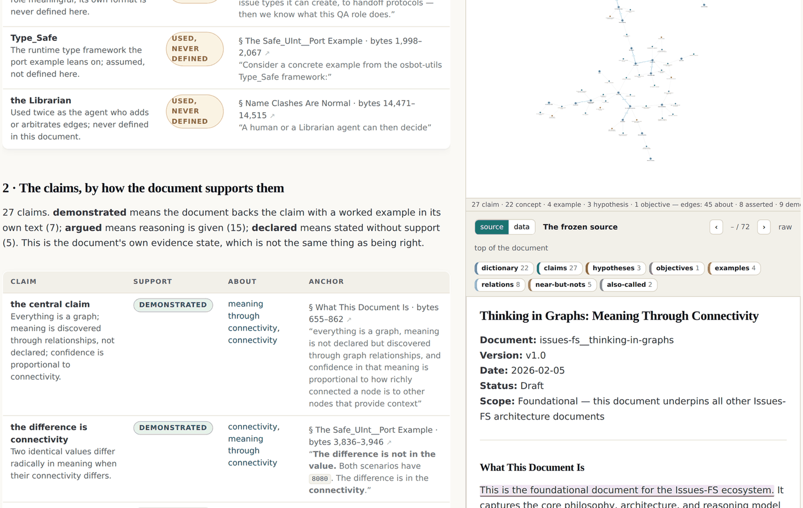

# 5 · A type is a path, not a label

*After this chapter you will be able to replace the sentence "somebody classified this as
a vulnerability" with a formula that can be read, versioned and disagreed with, and you
will know why a superseded claim must never be deleted.*

---

Here is the strongest single sentence in this material for a technical audience.

<div class="claim">

The content of the node does not decide its type; its paths do. Two nodes with identical
text can be different types because their edges differ.

</div>

A node type stops being a label somebody applied and becomes a **required pattern of
typed, directed paths** that a node either matches or does not. Written out:

```
[Fact] := a node with a downward -backed_by-> [Evidence]

    A claim with nothing under it is not a fact. It is an assertion:
    a different node type, and one worth being able to count.


[Vulnerability] := a [Fact] that also has an upward -gives_rise_to-> [Risk]

    The same public bucket is a Fact on Monday and a Vulnerability on
    Tuesday, not because anything about the bucket changed, but because
    somebody connected it to a risk.
```

Every security practitioner recognises the problem this dissolves. A scanner asserts a
finding. The finding is a label. The label is wrong for this deployment. You triage it by
hand. The triage lives in somebody's head and is lost when they leave. Here **the triage
is the formula**, and the formula is versioned.

**Judgment does not disappear.** That is the usual objection and it deserves a direct
answer. Somebody still decides that a vulnerability requires an upward path to a risk.
What changes is where that decision lives: out of the classifier's head, into a formula
that is visible, versioned, inspectable and arguable. You can now disagree with a
classification by pointing at a line, which you could not do before.

The worked instance in the corpus runs six layers, roughly thirty-one node types, twenty
edge types with named inverses (forty readings) and seven formulas, over cloud identity
and access management configuration. Its standout type is `AuthorizationClosure`: the
transitive union of every grant reachable over assume-role, pass-role and wildcard edges,
called *the agentic union*. For an agent, that closure is the rating floor, not the
nominal grant. It is a node type that only exists because the graph can compute it, which
is the clearest possible demonstration that a type can be a computation.

## The grounding ladder

One worked formula set, and the most reusable thing in this chapter.

```
                    UPWARD IMPLIES
        what does it mean, and why does it matter?
        each step up is an interpretation somebody is accountable for

              [Risk]
                 ^
                 | gives_rise_to
              [Vulnerability]
                 ^
                 | gives_rise_to
              [Fact]  <----- you are here
                 |
                 | backed_by
                 v
              [Evidence]
                 |
                 | measured_by
                 v
              [Measure]

                   DOWNWARD GROUNDS
              is it real? each step down asks for
              something more checkable than the last
```

*Figure 5.1 · The grounding ladder. Downward asks for checkability; upward asks for
consequence. The two directions have different owners and different failure modes.*

Two details in the source brief are easy to miss and are exactly the parts that make it
usable.

**Measure is not the floor.** The true floor is the last node where going deeper would
neither improve observability nor change a decision. That is a judgment, it is stated as
one, and it is the reason the ladder terminates instead of receding forever. Without that
stop rule you get an infinite regress and a project that never ships.

**It is explicitly *one* formula among possible others.** The brief says so. A ladder
presenting itself as *the* ladder would be the schema-first move at one remove, and this
book would have no standing to object to it.

## The support state: what a document says, and how hard it says it

The first edition stopped there. The second edition ships something that the ladder
implies but never quite states: **the evidence state is itself data, recorded per claim,
by the reader who extracted it.**

When a document in this estate is turned into a graph (chapter nine builds the pipeline
properly), every claim node carries a `support` value which is the *document's own*
evidence state, not a truth judgment:

| Support state | What it records |
|---|---|
| `demonstrated` | backed by a worked example inside the text |
| `argued` | reasoning given |
| `declared` | stated without support |

The pilot document, the corpus's own foundational essay, yields **27 claims: 7
demonstrated, 15 argued, 5 declared.** Those five are not an embarrassment. They are a
worklist. Anybody can now ask, of the document that founded this whole argument, which of
its claims it merely asserts, and get a list of five with the quoted sentence beside each.



*Figure 5.3 · The claims table at graphs.sgit.ai/v2/universe/thinking-in-graphs.html, site
version v0.5.11. Every claim carries its support state, the concepts it is about, and the
anchor: a named section, a byte range, and the quoted sentence. Above it, three concepts
marked USED, NEVER DEFINED, which is the named-absence rule applied to a vocabulary.*

The same discipline reached the engine. Every ranked answer the estate's meaning engine
returns now declares its **anchoring**: a quoted fact in a named section of the document,
a stated claim asserted but not quoted, an authored pack term, or a chosen sense. That is
the confidence ladder of chapter one applied to a machine's own output, and it means the
answer carries its own rung.

<div class="claim">

If a system can tell you how strongly its own sources support what it just told you, you
have a different kind of object from one that only tells you the answer. The difference is
not accuracy. It is that you can decide how much weight to put on it.

</div>

## Supersede, never delete

A superseded claim is marked from a date. It is not removed. Removing it destroys the
thing you most need: the record that something once rested on it.

Because the claim is still there and still connected, the graph can answer the question a
pile of documents cannot: **which conclusions were resting on this?**

The case that makes it vivid is the ten-thousand-hours literature: **242 papers, more than
200,000 supporting citation paths**, all leading back to a claim that later corrections
never reached, because in a citation network there is nothing for a correction to attach
to. Every one of those 200,000 paths is still, formally, intact. That is not a failure of
diligence. It is a structural property of a system where the only edge type is "cites".

Three companions to the rule, all from the same body of work.

**Attach, never mutate.** Contributions arrive as subgraphs attached to an
author-confirmed spine. A bad contribution is discarded rather than repaired, which is what
makes *abundance* a feature instead of a risk. You can accept a hundred evidence packs
because accepting one costs nothing you cannot undo. This is worth pausing on: it is the
property that lets a system take contributions from people it does not trust.

**Weight by independence, not by count.** Ten citations of one source are one source. This
is the rule the ten-thousand-hours network violates at scale, and it is the difference
between a confidence number that means something and one that measures popularity.

**An index is not a source.** Pointer nodes and assertion nodes are structurally distinct.
A pointer can be wrong without being dishonest, it is regenerable, it needs no attribution
apparatus, and it is therefore **safe to prune**. That is the one place in this book where
pruning is allowed, and the distinction is worth building into your node types on day one,
because retrofitting it means auditing everything.

## A finding that is arithmetic

The best thing a formula can produce is a finding nobody can argue with, and the cleanest
example in the corpus is three lines long.

```
  fact:      this system retains logs for 30 days
             (backed_by: the configuration export)

  provision: Article 26(6) requires a SIX-MONTH minimum
             (backed_by: the official text, hash-verified)

  ---------------------------------------------------------
  computed:  30 days < 6 months  =>  [Vulnerability]
```

*Figure 5.2 · A breach computed rather than asserted, from the Article 26(5) worked
example. The source brief calls it "the most defensible finding in the graph".*

There is nothing to argue about except the two inputs, and both are checkable. Compare it
with the ordinary shape of a compliance finding, which is an experienced person's opinion
about whether a control is adequate. That opinion may well be better than the arithmetic.
It is not *defensible* in the same way, and when it is challenged the challenge is about
the person.

This is the pay-off of the whole chapter. Once a type is a path and a formula is a file,
a class of finding moves from the most arguable thing in the report to the least.

## What this costs

Three costs, stated because a chapter this pleased with itself should carry them.

**Formulas are code, and code rots.** A formula that made sense when it was written keeps
running after the world changes. The graph does not know that. Somebody has to review
formulas the way somebody reviews code, and this estate has not yet built the loop that
forces it.

**A path-pattern is harder to explain than a label.** "This is a vulnerability" fits in a
report. "This node matches the vulnerability formula because it has a downward edge to
evidence and an upward edge to a risk owned by the chief financial officer" does not fit
in a report, it fits in a rendering. If you cannot render it, people will go back to
labels.

**The upward direction has no natural stop.** Downward terminates at the judgment floor.
Upward, every fact implies a risk which implies a bigger risk, and the discipline that
stops it is entirely social: somebody has to accept the risk, and the acceptance is an
edge with a name on it. Chapter thirteen shows what happens when that acceptance is
missing, which is the sharpest single finding in the corpus.

<div class="note">

**Where the live estate demonstrates this.** Node type formulas and the grounding ladder
are argued at `graphs.sgit.ai/v1/depth/#formulas` and `#ladder`. The support states are
data: open the extraction for the pilot document at
`graphs.sgit.ai/v2/universe/thinking-in-graphs.html`, where the claims table lists all 27
with their support state and the quoted sentence that carries each. The arithmetic finding
is walked at `graphs.sgit.ai/v1/examples/article-26-5.html`.

</div>
