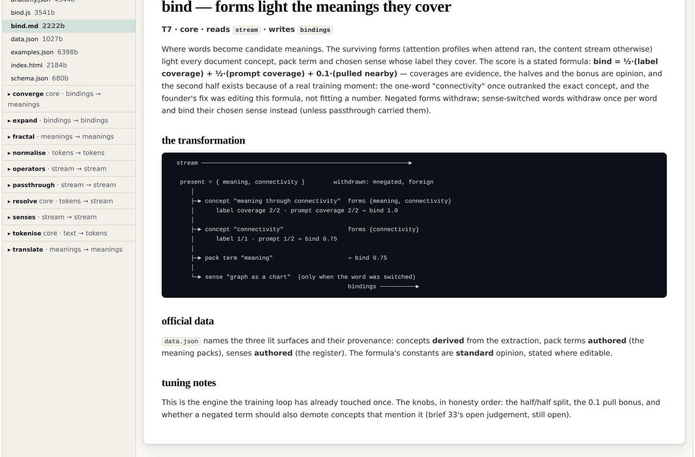

# 6 · Fractal is a testable claim

*After this chapter you will be able to tell a fractal system from a merely hierarchical
one with a test that either passes or fails, and you will have seen the test applied to
this estate's own work, including where it fails.*

---

"Graphs of graphs of graphs" sounds like a flourish. It is meant literally, and it commits
you to four specific things.

| Claim | What it commits you to |
|---|---|
| **Self-similarity** | The same node and edge grammar at every altitude. A property, a paragraph, a person, a national estate: same rules. |
| **Scale invariance** | One validator, one query engine, one provenance rule. Not a family of them per level. |
| **Composition** | Graphs combine into graphs without an adapter layer. Risk registers of risk registers. |
| **Recursion** | Zoom into any node and it expands into a graph obeying identical rules, **with no new format and no special case**. |

That last clause is the falsifiable part, and it is how you check whether a system is
fractal or merely hierarchical.

<div class="claim">

**The zoom test.** Zoom into any node. If the zoom needs a different file format, a
different validator, or a special case, the claim is false. It is a testable property, not
a description of a feeling.

</div>

Almost every system that calls itself hierarchical passes a weaker test: it has levels,
and the levels nest. That is not the same thing. A folder tree has levels. A file inside a
folder is not a folder, and you cannot apply folder operations to it. That is hierarchy.
Fractality is the stronger claim that the operations at one level are the operations at
every level.

What fractality buys you is that the system has **no natural stopping point and no
integration tax**. From the corpus: *"there might be an article that is so meaty that it
requires its own ontology and taxonomy, and that's the power of the fractal element."* The
graph starts wherever the work is (*"it is kind of like a Lego structure where one feeds to
the other"*) and grows outward from there, which is also why it does not matter where you
start.

## Applying the test to this estate

The first edition of this argument stated the four commitments and could not test them,
because nothing in it zoomed. The second edition zooms twice, deliberately, at two
different scales, and the test can now be run. This section runs it and reports what it
returns, including the failures, because a chapter about a falsifiable claim that never
reports a falsification is not doing its job.

### Zoom one: a document, down to the word

The first zoom came from a memo of 26 August 2026:

> "I should be able to start from the document and keep expanding it, like you know, bit by
> bit by bit by bit. Let's say on a tree structure, and I should be able to expand it all
> the way to the paragraph. In fact, all the way to the word, so the way to think about
> this is kind of like an AST, the abstract syntax tree, but you know, for now, very driven
> by the by the content itself."

The build that answered it gives the pilot document a **core graph**, which is a named
ladder of node kinds:

```
   doc  ──contains──▶  sec  ──contains──▶  blk  ──contains──▶  sen  ──contains──▶  wrd
   document            section             block               sentence            word
                                        (para, bullet,
                                         code, quote,
                                         table)
                                             │                                      │
                                             │                                      │
                                          ┌──▼──┐                              ┌────▼────┐
                                          │ mk  │  span: bold, italic,         │    w    │  form:
                                          └─────┘  code, link, covering        └─────────┘  one node per
                                                   the word instances                       distinct word,
                                                   it marks                                 with its count
                                                                                            and every instance
```

*Figure 6.1 · The core graph ladder, seven node kinds, from `v2/universe/data/core/`.*

For the pilot document, that ladder resolves to real numbers, computed by the build:
**39 sections, 186 blocks, 342 sentences, 4,221 word instances, 143 markup spans, and 951
distinct word forms.** Every level has an identifier and every identifier is structural
and deterministic, which is chapter ten's subject.

Two things about that ladder are worth naming as design choices rather than accidents.

**Markup is structure, not formatting.** A bold run is a `span` node that covers the word
instances it marks. The memo asked for exactly this: *"if you have a bold, right? Let's
say, then you need to link. You need to have a node that links that bold, those three
nodes, to a bold, so we can basically understand which one of those are because the bold
has extra meaning."* Emphasis becomes queryable rather than lost.

**A word form is a node, not an attribute.** One node per distinct form, carrying its
count and the identifiers of every instance. Which means the question "where does this word
occur, and what else occurs near it?" is a traversal rather than a search. 951 forms,
505 of which occur exactly once.

### Zoom two: the code itself

The second zoom is a level most systems never attempt, and it arrived as a message sent
minutes after the previous release went live: *"That worked great, let's keep zooming."*

The estate's meaning engine is built from twelve operators. Each operator is a small
JavaScript file. The ask was to apply the same treatment to the source code:

> "can you apply the graphs of graphs approach here, the visualisation of grouping specific
> parts of the code and providing an explanation on a right pane on what it does, what the
> variables do and what are the inputs and outputs of those inner bits of code."

What shipped is an **anatomy** per operator: the code sliced into contiguous segments,
each a node with an identifier, a kind (docs, imports, data, contract, step, export), an
explanation written for somebody who already knows the language, its variables with their
roles, what it reads and writes, and `feeds` edges to the segments it drives.

And the anchoring discipline came with it. Each segment is anchored by the exact text of
its first line, the build resolves those heads to line ranges that must tile the file
completely, and **a gate fails the release the moment the code and the anatomy drift.** So
the code's graph cannot quietly become a lie about the code, which is the failure mode of
every architecture diagram you have ever seen.



*Figure 6.2 · One operator, zoomed: the `bind` engine's own page at
graphs.sgit.ai/v2/wclm/operators/, site version v0.5.11. Left: the twelve operator
folders, each with its code, schema, data, docs, examples and workbench. Right: bind's
contract (reads `stream`, writes `bindings`), its stated formula, an ascii diagram of the
transformation, and the provenance of its official data. The paragraph beginning "the
second half exists because of a real training moment" is chapter eleven's subject.*

### The verdict, honestly

Here is the test applied to the estate's own two zooms, one commitment at a time.

| Commitment | Verdict | The evidence, and the qualification |
|---|---|---|
| **Self-similarity** | **passes at the reading layer** | The document ladder, the extraction's concepts and claims, and the derived layers all render as nodes and typed edges in one canvas with one viewer. The schema view over the pilot shows nine node types and twenty-four typed relations, all in the same grammar. |
| **Scale invariance** | **partial** | One viewer and one query surface across all levels. But not one validator: the extraction has its anchor gate, the core graph has its round-trip gate, the code anatomy has its drift gate. Three gates enforcing one discipline is not the same as one validator, and calling it scale-invariant would be overclaiming. |
| **Composition** | **passes** | The engine's world is assembled from the extraction, the core graph's token analysis, the meaning packs, the senses register and the analogies register, with no adapter layer. Each is a graph; the composition is a graph. |
| **Recursion, no new format** | **fails at the storage layer, passes at the engine layer** | See below. |

The recursion row is the interesting one, so it gets stated in full rather than
summarised.

**Where it fails.** The extraction is stored as node and edge lists. The core graph is
stored as an index plus one shard per section, and a shard is a *nested* structure:
blocks containing sentences containing words. The code anatomy is a third shape again,
segments with feeds edges. Three different serialisations for three levels of the same
zoom. Under the test as this book states it, that is a failure: zooming from a document
into its sections does require a different file format from zooming from a claim into its
concepts.

There is a decent engineering reason (a nested shard is loaded once when a section is
expanded, which is what makes the tree fast), and a decent reason does not make the claim
true. It makes the claim *partly* true, and the honest form of the sentence is: **the
estate is fractal in its grammar and hierarchical in its storage.**

**Where it passes, and passes hard.** The engine has an operator called `fractal` whose
entire job is to be a full instance of the engine, inside the engine. It takes the winning
meaning's own statement and runs it through a complete inner pipeline (tokenise, resolve,
bind, converge), one zoom down, and reports the meaning of the meaning. It reads the type
`meanings` and writes the type `meanings`, exactly like every other operator, so the
pipeline cannot tell it apart from a simple one. It is registered, typed and swappable
like the rest.

That is recursion with no new format and no special case, in the strong sense: **the system
composes with itself, and the composition is invisible to everything around it.** The
inner pipeline contains no fractal operator, so recursion terminates at depth one by
construction, which is a stated limit rather than an accident.

<div class="warn">

**Why report a failing row at all.** Because the value of a falsifiable claim is
destroyed by never falsifying it. A book that stated the zoom test and then reported four
passes would be asking you to take its word for the test as well as the result. The
storage-layer failure is real, it is specific, and it is fixable: the shards could be
node and edge lists at some cost in load time. Nobody has decided whether that cost is
worth paying, and that is the actual state of the question.

</div>

## Name clashes are not a problem

One practical consequence of fractality that saves an enormous amount of argument.

If each graph keeps its own vocabulary, then two graphs may both use the word "node" for
different things, and nothing breaks. The estate has a live instance of this and it is
slightly comic: the meaning engine has an operator literally named `operators` (it handles
the little words that flip meaning, such as *without* and *not*), while the same release
calls all twelve building blocks operators. The agent flagged it rather than renaming
either:

> "The operators word now means two things … The folders adopt the brief's meaning; the T5
> engine keeps its name inside the registry."

Under a global schema that is a collision requiring resolution. Under local vocabularies
with a declared scope it is two words in two namespaces, and the fix is a note. The general
rule: **a name clash between two graphs is only a problem if you were planning to merge
them**, and chapter four is why you are not.

## Where it does not matter that you start

Two smaller notes that follow from the same property.

**It does not matter where you start.** The graph will be deep where the work is and
absent everywhere else. That is not a defect to apologise for. It is the property that
makes the project finite. A graph that had to be complete before it was useful would never
be either.

**A bug is a divergence, not a breakage.** *"A bug is something that we have mapped in the
graph that is not happening in reality."* Which reframes it from "something is broken" to
"reality diverges from the model", and leaves open which of the two is wrong. That
reframing is only available in a system where the model is a first-class artefact rather
than a document about the system.

<div class="note">

**Where the live estate demonstrates this.** The document ladder is browsable at
`graphs.sgit.ai/v2/universe/thinking-in-graphs.files.html`, where the authored folder and
the derived core data sit in one file tree and every file reads raw or rendered. The code
anatomy is at `graphs.sgit.ai/v2/wclm/operators/`, one folder per operator. The fractal
operator is at `graphs.sgit.ai/v2/wclm/operators/fractal/`, and it can be toggled into the
pipeline on the engine page with one click.

</div>
