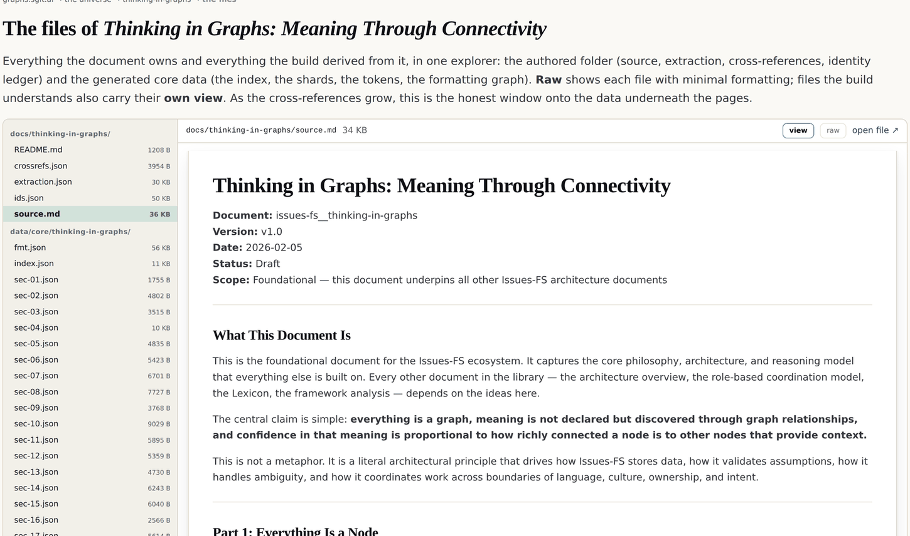

# 8 · Documents are projections

*After this chapter you will stop treating a document as a source and start treating it as
a view, and you will have seen the strongest evidence in this book that the difference is
real: a build gate that rebuilds the document from the graph and fails unless the bytes
match.*

---

The claim: **the graph is the truth; the document is a view of it, generated in the
context of use.**

It appears across the corpus as though already established, and is then applied to skills,
compliance standards and legal texts. It is nowhere argued from first principles, which the
estate records as a gap. This chapter is the synthesis, and then the test.

> "The same way I talk about documents being projections of graphs, **the skill is a
> projection of a graph**… The skills we have today are just **a photograph of what it
> should be**, because it is static."

## Three problems that turn out to be one

```
  1 · A SKILL FILE
      a static description of how to do something, which drifts from
      how it is actually done.
      as a projection: the graph of how the work is done is the truth,
      and the file is rendered from it when needed.

  2 · A COMPLIANCE STANDARD
      a document handed to you whole, from which you strike out what
      does not apply.
      as a projection: nothing is relevant until your facts attach, so
      the standard starts EMPTY and accretes.

  3 · A CONSOLIDATED LEGAL TEXT
      the sharpest version. do not STORE the consolidated text at all.
      hold the base text plus the amendment instructions as data, and
      COMPUTE the consolidated version as a projection.
```

*Figure 8.1 · Three familiar maintenance problems, and the one move that dissolves all
three.*

The third is where the idea pays for itself, and the result is the kind that only shows up
if you take a claim seriously enough to build on it. If a consolidated text is computed
from a base text plus amendments, and a customised standard is computed from a base text
plus your facts, then **consolidation and per-organisation customisation are one
mechanism, not two.** The maintenance burden and the flagship feature share an engine. Nobody
designed that; it fell out.

The same shape appears in the other direction. A document is not one blob but a hierarchy
of paragraphs, points and definitions, each written for a reason and therefore yielding
something extractable. **Every paragraph is a graph.** A document's own definitions are the
first and most valuable node layer, and three kinds of work follow: how they relate,
**where they contradict**, and what the text uses but never defines. The second is the
highest-value output and the one nobody produces. The third is where interpretive risk
concentrates.

## Lifting text into a graph is decompilation

Going from concrete text to abstract structure runs the same direction a decompiler runs,
and it inherits the same property: **it is ambiguous, and it cannot be done reliably
without help.**

The help is the author. The goal is not absolute truth but *the author's own meaning,
confirmed by the author*. Which reframes the most common failure of every extraction
system ever built: a reader saying **"that is not what I meant"** is not a failure of
extraction. It is the elicitation working.

That reframing has a mechanical requirement attached, and this is the part that is usually
skipped. For the correction to be cheap, every node at every altitude must carry a source
map back to the span it came from. If it does not, "that is not what I meant" produces an
argument instead of an edit. Chapter nine is about what it takes to make that anchor
trustworthy.

## The test: rebuild the document from the graph

Here is where the second edition can do something the first could not.

If the document really is a projection of the graph, then the graph must contain
everything the document contains. Not the meaning of it: **the bytes of it.** Otherwise the
graph is a lossy summary wearing the word "projection", and the claim is decoration.

The founder asked for exactly this, and asked for it urgently, in a memo of 26 August
2026:

> "Actually, there's one more important topic that I think I forgot. It's very important
> that we have the ability to rebuild the document from the graph. So it's very important
> that we have a two-way transformation. So let's address that sooner more than later,
> because there's a lot of things that I would like us to do, and you need that, especially
> when you talk about refactoring and making changes and detecting changes."

And the design instruction that came with it:

> "you need to capture those properties, those in a way formatting properties in an what's
> it called in a separate dock in a separate graph connected to the main graph and in
> separate things, so that we have, we can go a two-way transformation back into the
> document"

So there are two graphs, joined by identifiers. The semantic graph holds document,
section, block, sentence, word, span and form. The **formatting graph** holds heading
lines, block markers, the gaps between blocks, and the raw markdown per block, keyed by
the same block identifiers. The semantic graph stays clean. The join is the identifier.

### Seven gates, and two of them are the argument

The generator that builds this runs seven gates. Any failure kills the build. Quoted from
its own header:

```
  1. block byte ranges reassemble each section body exactly
     (gaps whitespace-only)
  2. sentences reassemble each block's clean text
     (whitespace-collapsed equality)
  3. the word-form totals equal the word-instance total
  4. every span covers at least one word unless it marks pure
     punctuation or code
  5. the document rebuilds from the formatting graph BYTE-IDENTICAL
     to the source
  6. the semantic shards re-derive from the formatting graph alone
     (the two graphs cannot disagree, because one provably generates
     the other)
  7. the identity ledger covers every doc, section and block with a
     unique live uid, and a second carry-forward pass over its own
     output changes nothing (identity assignment is deterministic)
```

*Figure 8.2 · The gates in `admin/build/gen_coregraph.py`, quoted from the file. Gate 5 is
the projection claim made falsifiable. Gate 6 is the stronger one.*

**Gate 5 is the projection claim, executable.** The build reassembles the source markdown
from the graph and compares it byte for byte with the frozen original. If a single
character differs, the build stops with the message *"the transform is not two-way"*. There
is no partial credit, no similarity score, no reviewer judgment. It either is a projection
or the release does not happen.

**Gate 6 is the one worth stealing.** It does not merely check that the two graphs agree.
It re-derives the semantic shards from the formatting graph alone, so that the two graphs
**cannot** disagree, because one provably generates the other. That is a structurally
different guarantee from a consistency check. A consistency check tells you when two
things have drifted. This makes drift impossible by removing the second source of truth.

That distinction is the whole discipline of this book in miniature. Enrichment over
enforcement, one source over two, computed over asserted.



*Figure 8.3 · The pilot document's file explorer at
graphs.sgit.ai/v2/universe/thinking-in-graphs.files.html, site version v0.5.11. Left: the
authored folder (source, extraction, cross-references, identity ledger) above the derived
core data (the formatting graph, the index, one shard per section). Right: any file, raw or
in its own data-driven view. The formatting graph at 56 KB is the file gate 5 rebuilds the
document from.*

## What it costs, and what it does not prove

Three honest qualifications, because a gate this satisfying invites overreading.

**It proves losslessness, not understanding.** Rebuilding the document byte for byte proves
the graph contains everything the document contains. It says nothing about whether the
*meaning* was extracted well. The extraction is a separate artefact with a separate
review loop, and chapter nine is about how that one is kept honest, which is a much harder
problem because there is no byte comparison available.

**It works because the source is frozen.** The pilot document is byte-frozen with its
SHA-256 recorded, and the build verifies the copy against it. A living document that
changes under you needs a different discipline, and change detection at the graph level
(which blocks changed between two versions) is named in the same memo as the next step and
has not been built.

**One document, not twenty-one.** The estate carries twenty-one source documents and one
has been through this pipeline. The method is documented so the other twenty can follow.
Until they do, this is a demonstration rather than a system, and chapter fourteen says so
in the list where such things belong.

## Four views, one structure

The practical consequence of taking projection seriously is the one that shows up in
every organisation with more than one audience.

The Article 26(5) worked example produces four stakeholder registers, one per altitude,
each in that reader's own language, from one chain of facts. The brief's own line:
*"nothing is duplicated; each view is a query over one structure."*

Those four registers are not four documents that have to be kept in sync. They are four
queries, and **they cannot drift apart, because there is only one thing there.** Anybody
who has maintained a board pack, a risk register and a regulator submission that are
supposed to say the same thing will recognise the size of that claim.

The same pattern governs this estate's own pages. The universe reader shows four
reviewer-facing views (the dictionary, the taxonomy, the thesaurus with its
near-but-nots, and the ontology) plus the claims table, the drawn graph and the coverage
table, and every one of them is a projection of a single authored file. They are generated,
never separately authored, **so they cannot disagree with each other**.

And this book is the same shape. The markdown chapters are the source of truth. The web
pages render that markdown in the browser, so a page cannot drift from the file it claims
to render. The printed version is generated from the same files. If you find the page and
the print disagreeing, one of them is a bug and the markdown is right.

<div class="note">

**Where the live estate demonstrates this.** The formatting graph is
`v2/universe/data/core/thinking-in-graphs/fmt.json`, 56 KB, readable raw in the file
explorer at `graphs.sgit.ai/v2/universe/thinking-in-graphs.files.html` beside the 39
section shards it keys into. The gates are in `admin/build/gen_coregraph.py`. The four
projected views are on the reader at
`graphs.sgit.ai/v2/universe/thinking-in-graphs.html`, and the customisation inversion runs
in the published regulation graph vault at `sgit.ai/demos/vaults/regulation-graph/`.

</div>
