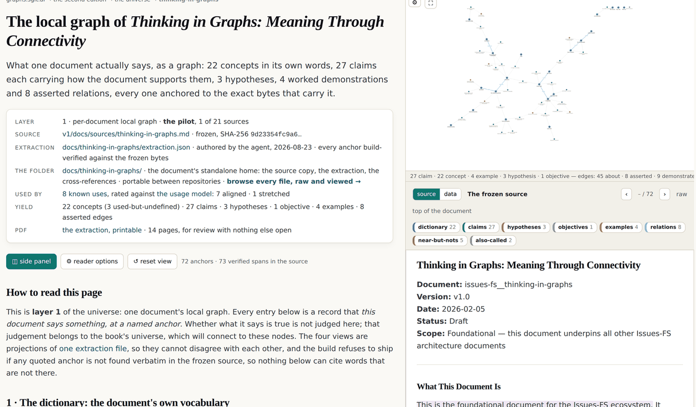
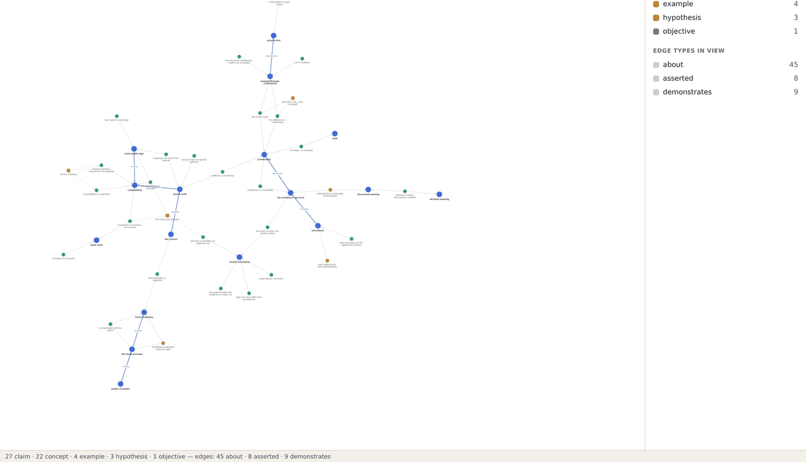

# 9 · The universe method

*After this chapter you will know how a raw document becomes a graph whose every node is
anchored to exact bytes, why the build refuses to ship an extraction that cites words that
are not there, and what it costs to make coverage total by construction rather than by
effort.*

---

Part four is the half the first edition could not write. It argued that meaning is a
computation and had nothing that computed it. What follows is the computation, built from
the bottom.

Bottom means the document. Not a summary of it, not an embedding of it: the bytes.

## The layer model

Agreed on 23 August 2026 and worth stating before anything else, because most confusion
about this kind of work comes from mixing the layers.

| Layer | What it is | State |
|---|---|---|
| **0** | the frozen bytes: the source documents, hash-recorded, held by a build gate | frozen |
| **1** | per-document local graphs, one folder per document | pilot done, 1 of 21 |
| **2** | the bridge layer: cross-document edges, authored with a note | not started |
| **3** | the book's own universe, connecting down into layers 1 and 2 as evidence | not started |

The rule that makes the whole thing tractable sits between layers 1 and 3, and it is one
sentence:

<div class="claim">

**Truth is deferred.** Every layer 1 node is a record of the form *"this document says X,
at this anchor."* Whether X is true is not evaluated at layer 1. That judgment belongs
higher up.

</div>

This is the discipline that most extraction projects lack, and the lack is why they fail.
If your extractor is simultaneously deciding what a document says and whether it is right,
you cannot review either decision, because they arrive fused. Split them and both become
reviewable: one against the bytes, the other against the world.

It also means each document keeps its own vocabulary. Where two documents name the same
idea differently, or disagree outright, layer 2 records that as an **authored bridge**, and
the divergence is preserved as a finding rather than merged away. Chapter four is why.

## The pipeline

```
  0 · THE SOURCE IS ALREADY FROZEN
      v1/docs/sources/<slug>.md, byte-frozen, SHA-256 recorded,
      held by a gate. an anchor into a frozen file is stable forever.
                                  │
                                  ▼
  1 · THE DOCUMENT GETS A STANDALONE FOLDER
      source.md      a byte copy, verified against the recorded hash
      extraction.json the local graph: THE ONLY AUTHORED ARTEFACT
      crossrefs.json  where the document is used, each use rated
      ids.json        the identity ledger (chapter ten)
      README.md       what the folder is, for a reader who finds it
                      outside this repository
                                  │
                                  ▼
  2 · EVERY ITEM IS ANCHORED
      an anchor = a named SECTION + a VERBATIM QUOTE
                  (+ an occurrence index when the quote repeats)
                                  │
                                  ▼
  3 · THE BUILD REFUSES A BAD ANCHOR
      hash the source, refuse if it moved
      verify the folder copy is byte-identical
      find the quote VERBATIM inside its named section
      resolve it to exact byte offsets
                                  │
                                  ▼
  4 · COVERAGE IS TOTAL BY CONSTRUCTION
      every prose-bearing section either yields an anchored item or
      is listed in empty_sections WITH A REASON. the build fails on a
      silent gap AND on a stale entry.
                                  │
                                  ▼
  5 · THE USES ARE RATED
      aligned / stretched / misaligned / unrated, signed and dated
                                  │
                                  ▼
  6 · EVERYTHING A READER SEES IS A PROJECTION OF ONE FILE
```

*Figure 9.1 · The extraction pipeline, from `v2/universe/README.md`.*

## The anchor, and why it is the whole design

An anchor names a section and quotes a sentence. That sounds unremarkable until you
notice what the build does with it.

<div class="claim">

**An extraction that cites words that are not there cannot ship.** A hallucinated quote
fails the build. A misread of a real quote is what review is for. The two failure modes are
separated on purpose, one for the machine, one for the reviewer.

</div>

That separation is the most transferable idea in this chapter, and it is worth restating
in general form. When a machine produces a reading of a text, there are two ways it can be
wrong: it can cite something that does not exist, or it can misunderstand something that
does. **The first is mechanically detectable and should never reach a human.** The second
is a judgment and can only be settled by a human. Systems that treat both as "review the
output" waste the reviewer on the class of error a build could have killed.

For the pilot document, that machinery resolves to **72 anchors and 73 verified spans in
the source**, each one a quote found verbatim inside its named section and resolved to
exact byte offsets, re-verified on every release against a source that still hashes to its
recorded value.



*Figure 9.2 · The pilot document's reader at
graphs.sgit.ai/v2/universe/thinking-in-graphs.html, site version v0.5.11. Left: the layer,
the frozen source with its hash, the folder, the rated uses and the yield. Right: the local
graph above, and below it the frozen source with the anchored spans highlighted in place.
Clicking a node opens both its extraction row and the cited bytes.*

## Coverage is total by construction

The second discipline is the one that makes an extraction trustworthy rather than merely
plausible.

Every section that carries prose either yields at least one anchored item, or is listed in
`empty_sections` **with a reason**. The build fails on a silent gap. It also fails on a
stale entry: a section declared empty that now has anchors.

<div class="claim">

A recorded empty section is a finding. A silent one is a hole.

</div>

This is the third-of-ten-evidence rule from chapter one, applied to the extractor's own
work. It converts the question "did the extraction miss anything?" from an unanswerable
worry into a mechanical property. The pilot document declares two empty sections, each with
its reason, and every other prose-bearing section carries at least one anchored item.

The cost is real and worth naming: it makes an extraction slower to author and impossible
to do casually. You cannot skim a section and move on. You either find something in it or
you write down why there was nothing.

## The yield, in numbers

The pilot is the corpus's own foundational essay, *Thinking in Graphs: Meaning Through
Connectivity*, dated 5 February 2026, extracted 23 August 2026. Its yield, computed from
the extraction file:

| Family | Count | What the family records |
|---|---|---|
| `concept` | **22** (3 used but undefined) | a term the document uses. An undefined-but-used term is recorded, not skipped. |
| `claim` | **27** (7 demonstrated, 15 argued, 5 declared) | with the document's own evidence state, not a truth judgment |
| `hypothesis` | **3** | what the document expects to test later |
| `objective` | **1** | what a passage is trying to achieve for its reader |
| `example` | **4** | the document's own worked demonstrations, with what each demonstrates |
| asserted edges | **8** | concept-to-concept relations the document itself asserts, each anchored to the sentence that asserts it |
| aliases | **2** | the thesaurus: X is also called Y, anchored |
| near-but-nots | **5** | distinctions the document draws on purpose: X is *not* Y, anchored |

Two of those rows deserve a sentence each.

**Three concepts are used but undefined.** The document leans on three terms it never
defines. Under a summarising extractor those disappear, because a summary reports what a
document says. Here they are nodes, which means they are countable and assignable. That is
the named-absence rule again, one level down.

**Five near-but-nots.** A definition says what a thing is. A near-but-not says which
neighbouring idea a reader will otherwise substitute for it. In practice the second does
more work than the first, and almost nobody records it.



*Figure 9.3 · The same extraction as a graph, at
graphs.sgit.ai/v2/universe/thinking-in-graphs.graph.html, site version v0.5.11. Blue is a
concept, green a claim, red an example, amber a hypothesis, purple an objective. The status
line counts what is on the canvas: 27 claim · 22 concept · 4 example · 3 hypothesis · 1
objective, and 45 about · 8 asserted · 9 demonstrates edges. Nothing here was laid out by
hand: the clustering is force over the declared edges, so a concept that sits alone sits
alone in the document too.*

## The usage maturity model

The third discipline, and the one this book would most like other people to steal.

A source document records, where it can, **where it is being used**, and each use gets a
rating. The rating is a judgment about the *use*, never about the user, and it must be
signed and dated or the build rejects it.

| Rating | The test |
|---|---|
| **aligned** | Read the use, then the cited part of the source. Would the source's author say: yes, that is what I said? |
| **stretched** | The author would say: that came from my document, but it is not quite what I meant. |
| **misaligned** | That is not what the document says. |
| **unrated** | A known use nobody has judged yet: the named absence, awaiting judgment. |

The pilot has **eight rated uses: seven aligned, one stretched.**

### The one stretched use, which is the model earning its keep

The single stretched rating is not a small thing found in a corner. It is a finding against
**the first edition of this argument**, and it is about the word in this book's title.

The ledger entry, quoted from the file:

> The first edition defined fractal as one grammar at every level: uniformity. This
> document's Part 3 and Part 7 license local vocabulary and override, which is composition,
> not uniformity. Caught by the founder (brief 20), corrected in the lexicon at v0.4.6 with
> the superseded definition kept visible.

Read what happened there. The estate built a mechanism for rating how faithfully its own
sources are used. On the first day it ran, the mechanism caught the first edition
misreading the foundational document about the concept the second edition is named after.
The correction was made, the superseded definition was kept visible rather than deleted,
and the misreading is recorded rather than erased.

That is chapter five's supersede rule and chapter one's named-absence rule and this
chapter's rating model, all doing their jobs at once, against the people who built them.

It also explains a result in chapter six. If fractality is composition rather than
uniformity, then a system whose levels compose cleanly but whose storage formats differ is
*more* fractal than the strict reading suggests, and the "no new format" test may be
testing the wrong commitment. This book keeps the strict test, reports the failure, and
records the disagreement here, because that is what the ledger is for.

## The extractor is an author too

The last rule, and the one that governs the trust model of everything in part four.

<div class="claim">

The extraction is a **reading**, marked as such, shipped with the anchors a reviewer needs
to check it, and reviewed from its own printed version.

</div>

Every extraction names its extractor and its date. The pilot's says `"extractor": "agent"`.
It is not presented as the document's meaning; it is presented as one reading of the
document, with every claim traceable to the bytes that support it.

And the review surface is deliberately a fourteen-page PDF rather than a website, for a
reason recorded in a memo of 23 August 2026: a website cannot control what a reviewer sees
or in what order, and a document that is not modifiable survives as a record better than a
page does. The review contract is printed on its cover: *for each item, is this what the
document says, and is the anchor fair? Come back item by item, by node id. Items you do not
mention are taken as agreed.*

That last sentence is the part to steal. Silence is defined in advance, so a review that
covers half the items produces a determinate result instead of an ambiguous one.

## What is not built

<div class="warn">

**One document of twenty-one.** The estate carries twenty-one source documents. One has
been through this pipeline. The method is written down so the other twenty can follow, and
until they do, layer 2 (the bridges) cannot start, because bridges need two documents.
Everything in this chapter is therefore a method that has run once, thoroughly, rather
than a corpus that has been processed. The distinction matters and chapter fourteen carries
it into the list of what ships.

</div>

<div class="note">

**Where the live estate demonstrates this.** The method is written down at
`graphs.sgit.ai/v2/universe/README.md`. The pilot's folder, every file readable raw or
rendered, is at `graphs.sgit.ai/v2/universe/thinking-in-graphs.files.html`. The usage model
with its four levels and their tests is `v2/universe/usage-model.json`, and the ledger that
caught the first edition is `crossrefs.json` in the pilot's folder. The machine surface for
agents, with every anchor's resolved byte offsets and the hash each was verified against,
is `v2/universe/data/universe.json`.

</div>
