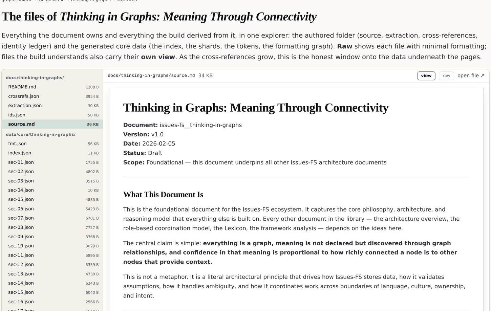

# 10 · Two kinds of address

*After this chapter you will be able to tell a content address from an identity address,
you will know why a cross-reference built on character offsets breaks the first time
somebody fixes a typo, and you will have a working algorithm for keeping identity stable
across edits.*

---

This is the shortest chapter in the book and the one whose absence causes the most damage.

Everything in part four rests on being able to point at something. Point at a sentence,
a section, a concept, a word. And the moment a document is edited, every naive way of
pointing breaks.

The founder put the problem plainly in a memo of 26 August 2026:

> "you are already doing linkage based on word count and number count. I think, and even
> character count, which is very fragile, which basically means that every time there's a
> little change in a document, everything breaks and you you can't really refactor, and
> it's really sort of fragile. Where you really should having a sort of expat, sort of, or
> even ID base, sort of cross-reference, right? … if I want to point something on a
> particular part of the document, I should have a reference ID. I shouldn't be saying you
> know this is start set character 256 and ends on character 259."

Anybody who has maintained annotations over a changing corpus recognises this. You store
offsets, somebody fixes a typo in paragraph two, and every annotation after it is now
pointing at the wrong place. Silently. There is no error, just wrong answers.

## Two addresses, two jobs

The resolution is not to pick a better identifier. It is to notice that there are **two
different questions** being asked, and they need two different answers.

```
  CONTENT ADDRESS                        IDENTITY ADDRESS
  "what is this exactly?"                "which thing is this?"

  a hash of the content                  a minted, opaque, short id
  CHANGES when the content changes       SURVIVES when the content changes

  FNV-1a 64-bit of the case-folded       tig:b42
  word; a phrase hashes the joined
  word hashes

  used by: the engine, deduplication,    used by: cross-references,
  "is this the same text?",              provenance, "what did this claim
  verification against frozen bytes      rest on?", review threads

  the same word tokenises identically    the same paragraph keeps its id
  in EVERY document with no registry     through an edit, a rename and a move
```

*Figure 10.1 · The two addresses, and what each is for. Confusing them is the source of
most identifier pain in document systems.*

The distinction is recorded in the estate's own brief as a design note rather than
discovered later: *the hash is a CONTENT address (changes when the spelling changes); the
ledger uid is an IDENTITY address (survives change). The engine uses hashes; provenance
still lands on uids.*

Both are needed. A system with only content addresses cannot say "this is the same
paragraph, revised". A system with only identity addresses cannot say "this text has not
been tampered with". Together they answer both.

## Structural locators, and why they are not the identity either

There is a third kind of pointer that looks like it solves the problem and does not: the
**structural locator**.

The estate's core graph gives every level a deterministic structural path:
`sec:What This Document Is`, `blk:What This Document Is/1`, and below those `sen:` and
`wrd:` for sentences and word instances. No randomness anywhere; the same document always
produces the same locators.

Those are excellent addresses and terrible identities. Rename a heading and every locator
underneath it changes, even though nothing about the content moved. A cross-reference
holding a locator would break on a rename, which is a smaller version of breaking on a
typo.

So the locator is kept, because it is human-readable and it is how you navigate, and a
separate identity is minted beside it. **The locator is free to move. The identity is not.**

## Match, then mint

The algorithm that keeps identity stable is worth reading in full, because it is short and
it is the part everyone gets wrong.

On every build, for every node in document order, the ledger tries three matches in
sequence:

```
  1 · SAME LOCATOR
      the node is where it was. edits in place update the recorded
      content hash and keep the identity.

  2 · SAME CONTENT HASH
      the node MOVED. identity follows the content, not the position.
      a paragraph dragged to a different section keeps its id.

  3 · FUZZY SIMILARITY  (locator or text head, ratio >= 0.75)
      the node was renamed AND edited. the closest surviving
      candidate above the threshold claims the identity.

  otherwise: MINT A NEW ONE
      tig:b187, and the counter only ever goes up.

  and whatever the document no longer has is RETIRED, never deleted,
  so identity history survives.
```

*Figure 10.2 · The match-then-mint pass from `admin/build/gen_coregraph.py`. The order
matters: position first because it is cheapest and most common, content second because it
is exact, similarity last because it is a guess.*

Three properties of that algorithm are load-bearing.

**It is deterministic.** Same document plus same ledger always yields the same output. This
is not left to good intentions: a build gate runs the pass a second time over its own
output and fails if anything changes. An identity system that is not idempotent will drift,
and you will find out months later when two references disagree.

**Retirement, not deletion.** A node the document no longer has is marked retired and
kept. That is chapter five's supersede rule applied to identity itself. A retired
identifier can still be resolved, so a reference written last year still resolves to
*something*, and that something can say "I was removed on this date" rather than returning
nothing.

**The fuzzy pass is a guess and is marked as one.** A similarity threshold of 0.75 will
occasionally claim the wrong identity. There is no way to avoid that in the general case
(a paragraph rewritten from scratch in the same place is genuinely ambiguous) and the
honest response is to make the rule visible rather than to pretend precision. This book
would rather state the threshold than hide it inside a heuristic.

## The ledger, in numbers

For the pilot document the ledger holds **225 identities: 1 document, 38 sections and 186
blocks**, all currently live, none retired, because the source is frozen and has not yet
been edited. Each row carries the identity, the level, the current structural locator, a
twelve-character content hash of the node's text, the first eighty characters as a
human-readable head, and a status.

The frozen source is why the retired count is zero, and it is worth saying so rather than
presenting an untested mechanism as a proven one. The machinery for carrying identity
across edits exists, is gated and is deterministic. It has not yet had to survive a real
revision of a real document, because the pilot's source is deliberately immutable.



*Figure 10.3 · The identity ledger at
graphs.sgit.ai/v2/universe/thinking-in-graphs.files.html, site version v0.5.11, in its own
data-driven view. Every row is one identity: the minted uid, its level, the structural
locator it currently sits at, the content hash of its text, and its status. The locator is
free to move; the uid is not.*

## The same idea, three scales up

The two-address distinction is not local to documents. It shows up at every scale in this
estate, which is a small piece of evidence for the fractal claim of chapter six.

**Words.** A token's identity is the content hash of its spelling. There is no registry,
no vocabulary file and no training corpus, so the same word tokenises identically in every
document, forever. Change the spelling and you have a different token, which is correct:
"graph" and "graphs" are different tokens, and chapter eleven shows the engine treating
the difference between them as evidence rather than noise.

**Documents.** The frozen source is identified by its SHA-256, recorded once and verified
on every build. That is a content address doing exactly its job: proving the bytes an
anchor was verified against are the bytes that shipped.

**Vaults.** The estate's storage layer is a content-addressed object graph: the identifier
of an object is the SHA-256 of its *ciphertext*, with multi-parent commits, a tree per
directory, and a real merge base computed by breadth-first search over all parents. A
commit history is a directed acyclic graph, and it is the one graph in this family that has
been running for months rather than being argued for.

<div class="warn">

**A correction this estate carries rather than repeats.** A skill file in the source
repository states that object identifiers are the "SHA-256 of plaintext". The code hashes
the **ciphertext**. The difference matters to anybody reasoning about what the object store
leaks, so the claim is not republished here, and the correction is recorded rather than
made silently.

</div>

## What to do on Monday

The transferable version of this chapter, for a system that is not this one.

1. **Never let a cross-reference hold a position.** Not a character offset, not a line
   number, not a paragraph index. Positions are for navigating, not for pointing.
2. **Mint an opaque identity and keep it forever.** Short, meaningless, and never reused.
   Meaningless is a feature: an identifier that encodes something will eventually encode
   something false.
3. **Keep the content hash beside the identity.** It is how you detect that a thing
   changed, and it is how identity follows content when a thing moves.
4. **Retire, do not delete.** A resolvable reference to a removed thing is worth far more
   than a broken one.
5. **Make the assignment idempotent, and gate it.** Run your own identity pass twice over
   its own output in the build. If the second run changes anything, you have a drift bug
   that will surface at the worst possible time.

<div class="note">

**Where the live estate demonstrates this.** The identity ledger is
`v2/universe/docs/thinking-in-graphs/ids.json`, 50 KB, readable raw or as a live-and-retired
table in the file explorer at
`graphs.sgit.ai/v2/universe/thinking-in-graphs.files.html#docs/thinking-in-graphs/ids.json`.
The match-then-mint pass and its gate are in `admin/build/gen_coregraph.py`. The
content-addressed commit graph under all of it is the sgit vault layer, described at
`graphs.sgit.ai/v1/shipped/`.

</div>
