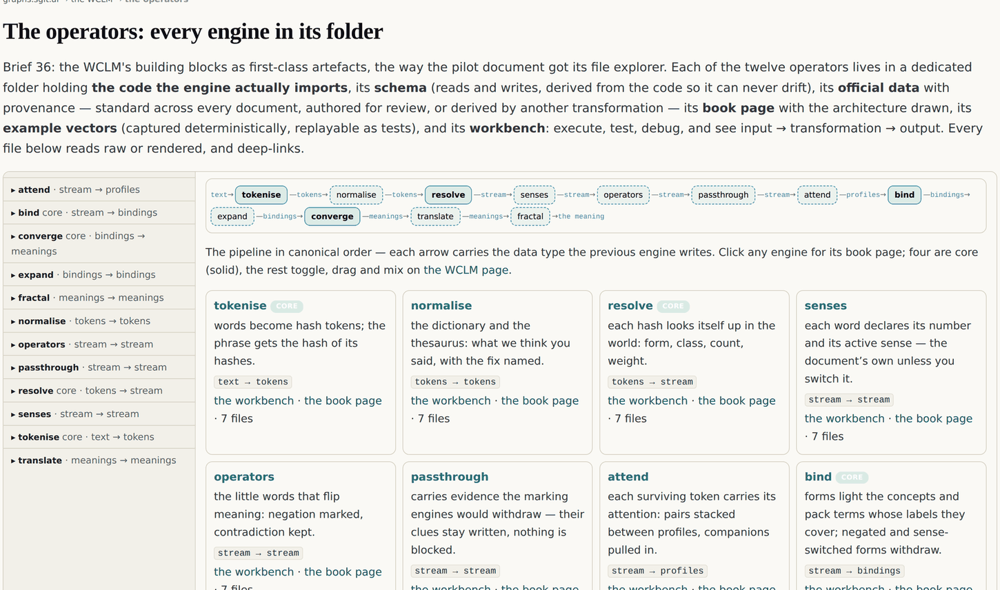
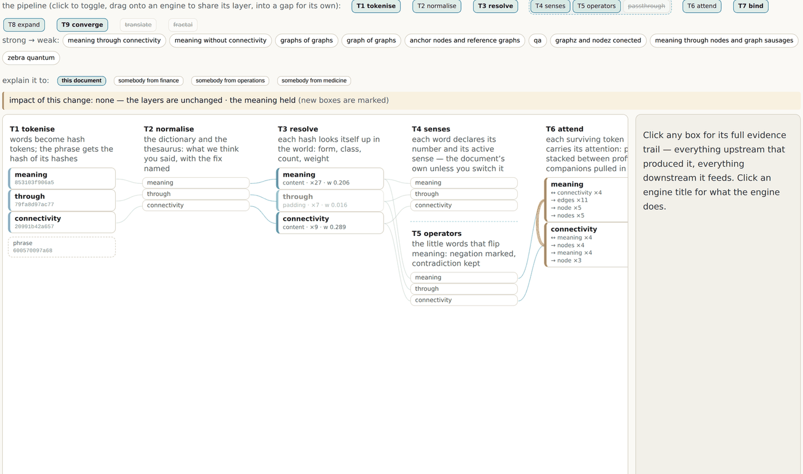

# 11 · Meaning, computed

*After this chapter you will know what a language engine looks like when nothing is
learned and everything is named, why its determinism is the point rather than a
limitation, and exactly what it can and cannot do.*

---

The first edition of this argument ended one step short. It said meaning stops being
something you assert and becomes something you can compute, and then had nothing that
computed it. This chapter is that step.

It starts, as most of this estate does, with a voice memo. This one, of 26 August 2026,
introduces itself as *"a bit of a crazy experiment"* and asks for a separate folder,
separate code and a separate page so that it can be brought back deliberately if it earns
it. Its central intuition is about what a large language model actually does:

> "I don't think predicting of the next word is doing a disservice because the models are
> not predicting the next word based on random. The models have already created a very rich
> graph, a very rich mental representation of what something is, so that we, you know, so
> that then they they know sort of from there what what is most likely to come next."

And then the ask:

> "instead of as defining the layers of the LLM or the neural network to be random, let's
> create our own layers, and each layer has a very specific role, and is deterministic that
> role and the inputs and the outputs of those layers."

Followed by the name, coined in the same memo: not a large language model but *"a words
content language model"*. The **WCLM**.

## What it is, in one paragraph

An engine in the shape of a transformer where **nothing is learned and everything is
named**. Words become content-hash tokens. Tokens are resolved against a compiled world
built from the graphs of chapter nine. Layers of small, pure, typed operators pass typed
data forward. The query is not "what word comes next" but **"what does this mean"**, and
the answer is a concept with its statement, the quoted sentence in the source that carries
it, the arithmetic that scored it, and a clickable trail back through every layer that
produced it.

Same prompt, same world, same picture, every time.

## Tokens are content hashes

The first design decision is the founder's own, taken literally:

> "maybe the way to do it is the the the actual ID is actually the hash of the word. Maybe
> that's how we do it, right? And then you actually have the hash of the combined words, so
> you start to operate on top of hashes."

So a token's identity is **FNV-1a 64-bit over code points, twelve hexadecimal characters,
case-folded**, and a phrase is the hash of its joined word hashes. That is stated in the
world file itself, where it can be read and argued with.

Three consequences, and the third is the one that matters.

**No registry.** There is no vocabulary file, no learned tokenizer, no merge table. A word
hashes to the same token everywhere, in every document, forever.

**No compression.** A learned tokenizer exists to bound the size of the vocabulary. This
engine has no such need, and the memo says so directly: *"instead of breaking into tokens,
which makes sense because they want to, you know, the idea is to try to limit the amount of
the universe, right? Of of the possible words, but in this case we don't have that."* The
pilot document has 951 distinct forms. There is nothing to compress away.

**Cross-document identity for free.** Because the token is a content address (chapter
ten), two documents that use the same word are already joined at that word, with no
registry to maintain and no alignment step. That is the property that makes the whole thing
scale to a corpus rather than a document.

## Six types move the whole pipeline

The second design decision arrived as a typed note during a build, and it is the one that
turned an experiment into an architecture:

> "I think for this many to many function workflows to work (and to have multiple engines
> on the same layer) you need to add an abstraction layer that defines what is the input and
> the output (aka schema) for each of those engines … the good news is that we don't have
> that many types of data and schemas"

The good news held. **Six types move the entire pipeline.**

| Type | What it carries |
|---|---|
| `text` | the prompt, as typed |
| `tokens` | hashed words |
| `stream` | tokens resolved against the world, carrying every clue mark |
| `profiles` | attention |
| `bindings` | candidate meanings |
| `meanings` | the ranked answer |

Every operator declares what types it reads and writes. Which makes compatibility
**structural** rather than conventional: an operator placed where its input type has not
been written is skipped, with the type named in the reason, and **any operator writing
`bindings` can stand in for the one that normally writes them.** That is what makes the
blocks genuinely swappable rather than nominally modular.

## Twelve operators, each a folder

| Operator | Core | Reads → writes | What it does |
|---|---|---|---|
| `tokenise` | ● | text → tokens | words become hash tokens; the phrase gets the hash of its hashes |
| `normalise` | | tokens → tokens | the dictionary and the thesaurus: what we think you said, with the fix named |
| `resolve` | ● | tokens → stream | each hash looks itself up in the world: form, class, count, weight |
| `senses` | | stream → stream | each word declares its number and its active sense |
| `operators` | | stream → stream | the little words that flip meaning: negation marked, contradiction kept |
| `passthrough` | | stream → stream | carries evidence the marking engines would withdraw |
| `attend` | | stream → profiles | each surviving token carries its attention: pairs stacked, companions pulled in |
| `bind` | ● | stream → bindings | forms light the concepts and pack terms whose labels they cover |
| `expand` | | bindings → bindings | each bound meaning assembles its neighbourhood |
| `converge` | ● | bindings → meanings | evidence is summed; the meaning, its provenance, its blast radius and its contradictions come out |
| `translate` | | meanings → meanings | analogies for an audience: the answer restated in the listener's own concept |
| `fractal` | | meanings → meanings | a full WCLM inside an operator: one zoom down |

Four are core and fixed. The rest toggle, reorder and stack. A **layer is a slot that can
hold several operators**, which arrived as another typed note: *"we need to support multiple
'engines/transformations' in one layer (since each of those engines is able to bring clues
needed for the next layer). This can get interesting since one of those engines could be
just' passthough from the previous layer, or block all from previous later and only use the
new engines in that layer"*.

So `passthrough` is itself an operator. Include it in a layer and the previous layer's
evidence flows on beside the new clues; leave it out and the layer's operators replace the
stream. The difference is visible on the page and changes the answer.



*Figure 11.2 · The operator explorer at graphs.sgit.ai/v2/wclm/operators/, site version
v0.5.11. The pipeline in canonical order along the top, each arrow carrying the data type
the previous operator writes; a card per operator below with its role, its typed contract,
and links to its workbench and its book page. Four operators are drawn solid: those are the
core, and the rest toggle.*



*Figure 11.1 · The engine at graphs.sgit.ai/v2/wclm/, site version v0.5.11, answering
"meaning through connectivity". Layers as columns, wires between adjacent layers only.
Tokenise shows each word with its hash. Resolve shows class, count and weight: "meaning"
is content, appears 27 times, weight 0.206; "through" is padding, 7 times, weight 0.016.
Attend shows the co-occurrence pulls. Every box is clickable.*

## Every weight is a stated formula

This is the part that makes it a different kind of object from the thing it resembles.

> "for that you need to transform … you want to start assigning some weights to this, but
> … you want to be able to programmatically calculate a lot of this stuff"

and the sentence that decides what kind of system this is:

> "when I want to train the model. In this case, I'm going to train the model using graph
> inputs and tweaks on the graph inputs, and connectivity and meaning, which is the whole
> point of what I do, versus randomly or you know moving numbers around"

Every weight in the engine is therefore a formula over graphs that were already computed,
written into the world file where it can be read and edited. The three that matter:

```
  TOKEN WEIGHT
      w = classWeight[class] / log2(2 + count)

      classWeight = { content 1.0 · code 1.0 · verb 0.7
                      number 0.3 · padding 0.05 }

      a rare content word weighs more than a common one; padding
      is not removed, it is weighed at 0.05 and stays visible.

  BIND
      bind = 0.5 · (direct / |label forms|)
           + 0.5 · (direct / |prompt content forms|)
           + 0.1 per neighbour pulled in

      half "how much of the concept's label did you say",
      half "how much of what you said was this concept".

  CONVERGE
      total = 2 · bind + 0.1 · blastRadius
```

*Figure 11.3 · The engine's three formulas, from `v2/wclm/data/world.json` and the
operator pages. Every constant is visible and editable.*

<div class="claim">

**Training this model means editing its graph inputs.** Never fitting numbers. The inputs
are the extraction, the meaning packs, the senses register and the analogies register, and
every one of them is a file a human reviews.

</div>

And the loop has already run. The `bind` operator's own page records the moment, and it is
the best single piece of evidence in this chapter that the design is real rather than
aspirational:

> "the second half exists because of a real training moment: the one-word 'connectivity'
> once outranked the exact concept, and the founder's fix was editing this formula, not
> fitting a number."

A ranking bug was found. The fix was a change to a stated formula, in a file, in a commit,
visible in a diff, with a reason recorded. Anybody can now disagree with that fix by
disagreeing with the formula, which is exactly the property chapter five asks for from a
node type and chapter four asks for from a bridge.

The engine also labels which of its own numbers are which. Counts and coverage are marked
**evidence**; the halves and the multipliers are marked **opinion**. Figure 12.1 in the next
chapter shows that labelling in place. A system that tells you which of its numbers were
measured and which were chosen is doing something almost nothing else does.

## The query flips

The last design decision is the one that makes the whole thing useful rather than merely
interesting:

> "instead of going from predicting the next word, we can be what is the definition of
> something? You know, like if we have a phrase or a word, you know, what what is the
> meaning of it?"

So the query is **meaning-of**, not next-word. Give it a phrase and the answer is: the
concept it binds to, that concept's statement, the anchored quote from the frozen source,
the examples and claims reachable from it, the blast radius, the arithmetic, and the paths
that got there.

Three worked runs, from the engine's own example set:

| Prompt | What comes back |
|---|---|
| `meaning through connectivity` | the exact concept, beating its one-word members on specificity: statement, anchored quote, blast radius 5, total 2.5 with the arithmetic shown |
| `qa` | `part-of → development`, from the first meaning pack. The founder's own instruction, honoured: *"QA is not a random word; it's part of development"* |
| `zebra quantum` | nothing, honestly. Two words the world does not know, said so rather than approximated |

That third row is the one to dwell on. An engine that returns nothing when it knows
nothing is unusual, and it is only possible because the engine has no generative fallback
to reach for. There is no plausible answer available to it. This is the chapter one rule
(a named absence beats a hidden one) built into an architecture rather than into a
guideline.

## Words have many meanings, and the effect is computed

Chapter one showed the sense switch as a demonstration of the five Reviews. Here is what is
mechanically happening.

The senses register (chapter four) holds three to five industry senses per word, the
document's own always first. Switch a prompt word away from the document's sense and three
things happen, in this order:

1. The word **withdraws** from binding against this universe's concepts.
2. The chosen sense's own definition binds instead.
3. The answer says out loud **which of this universe's claims lean on that word and no
   longer apply**, computed from the concept labels rather than authored by anybody.

Run it on "graphs of graphs" with `graph` switched to *a chart of data* and the engine
reports: the meaning moved, and nothing survives into attention. The fractal element does
not apply to a chart, and the machine says so without being told.

Number is evidence too. "graphs" carries the chip *plural of graph, more than one
involved*, read from the stem families the core graph already computed. Which is the
founder's instruction, honoured: *"graph of graphs is very different than graph of graph or
graphs of graphs. Right? all of those are different."* They produce visibly different runs,
with different hashes, different tokens and different bindings.

## Little words count

One more operator earns its paragraph, because it fixed an embarrassment.

Early on, the prompt "meaning without connectivity" answered exactly like "meaning through
connectivity", because *without* was classified as padding and weighed at 0.05. The founder
found it. The `operators` engine (the little words that flip meaning) now reads *without*,
*not*, *no* and *never* as negation, withdraws the negated evidence from binding, keeps it
visible with a marker rather than deleting it, and **checks the result against the world**.

So the answer to "meaning without connectivity" now carries a warning: the prompt negates
connectivity while this universe asserts meaning through connectivity. **The query
contradicts the world, said out loud.**

That is a small feature with a large implication, and it is the seed of something the
corpus wants next: asking a document whether it agrees with you. From a memo of 26 August
2026:

> "Ask a paragraph. Ask this to say, "Hey, here's where I'm going, or here's the graph of
> where I'm going. How does that graph compare, and what's the answers, and what, and does
> it work? Does he agree? Doesn't it doesn't agree, or does he provide evidence?"

That needs a second extracted document and does not exist yet. The single-document seed of
it does.

## What this is not

<div class="warn">

**Read this section before quoting anything else from this chapter.**

**It is not a language model.** It generates nothing. It has no parameters, no training
run, no gradient, no sampling. It borrows the transformer's *shape* (layers, attention,
tokens) on purpose, as a way of making an argument legible to people who know that shape,
and it shares none of the machinery.

**It is one document's world.** The compiled world holds 951 tokens, 114 stem families,
400 co-occurrence edges, 57 concepts and 53 edges, drawn from one 4,221-word document plus
a 35-term meaning pack, a 4-word senses register and a 16-entry analogies register. That
is not a corpus. Everything here is a method demonstrated at one scale.

**Its heuristics are honest heuristics.** Verb classification is a curated word list, not a
part-of-speech tagger, and is marked as such. Sentence splitting is a rule with guards, and
is marked as such. The polysemy score is statistical spread, not sense resolution.

**It is an experiment, in the estate's own register.** It is listed in the methods register
with status `experiment`, in its own folder, with its own code, exactly as the memo asked,
so that it can be brought back deliberately or not at all.

</div>

What it *does* demonstrate is narrow and real: an engine can answer "what does this mean"
over a graph, deterministically, with every number traceable to either a measured count or
a stated opinion, and with training reduced to editing reviewable files. Whether that
scales to a corpus is an open question. Whether it is possible at all is no longer one.

<div class="note">

**Where the live estate demonstrates this.** The engine is at `graphs.sgit.ai/v2/wclm/`,
with seven example prompts from strong to weak connectivity including the deliberately
failing ones. Every operator has its own folder, code, schema, provenance-marked data,
example vectors and workbench at `graphs.sgit.ai/v2/wclm/operators/`. The compiled world,
with its formulas written into it, is `v2/wclm/data/world.json`.

</div>
