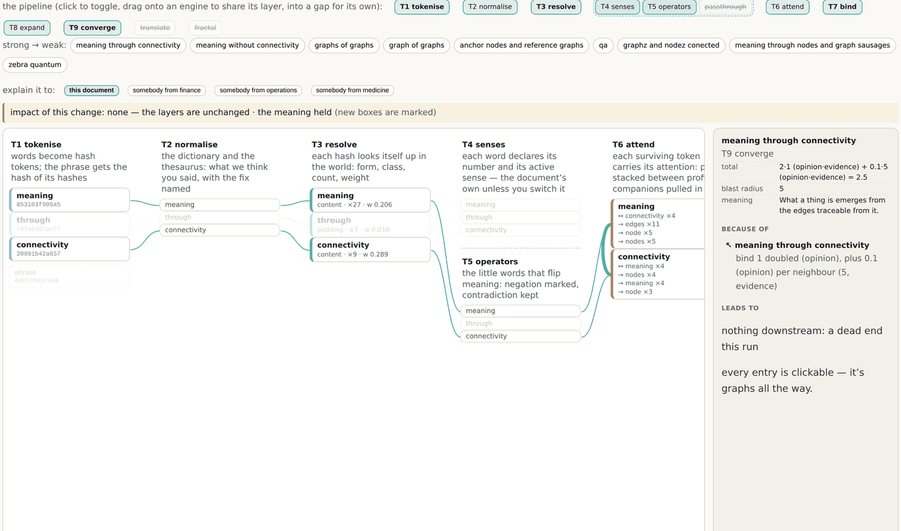

# 12 · Every box explains itself

*After this chapter you will understand why an explanation that is a path is a different
kind of object from an explanation that is a narration, and you will have four properties
to demand of any system that claims to explain itself.*

---

An explanation you cannot check is a story.

That sentence is the whole chapter, and the rest of it is about what has to be true of a
system for its explanations to be checkable. This estate got there by a route worth
retelling, because it started with somebody clicking on a box and being disappointed.

## The memo, and the point taken literally

After trying the engine of chapter eleven, the founder recorded a memo whose ask was
short: the point of a deterministic transformer is that **every item can say why it is
there**. So make every item say it.

What shipped, the same day, is that every chip at every layer is clickable. Clicking
selects it, lights its wires, dims everything else, and opens an explanation pane
containing three things:

- **the record**, with its formula;
- **because of**: everything upstream that produced it, with the reason carried on each
  wire;
- **leads to**: everything downstream it feeds.

And every entry in both lists is itself clickable, so the *why* can be walked in either
direction, indefinitely. It is graphs all the way, which is the point.



*Figure 12.1 · The engine at graphs.sgit.ai/v2/wclm/, site version v0.5.11, with the
winning meaning selected. Right: the record. `total 2·1 (opinion·evidence) + 0.1·5
(opinion·evidence) = 2.5`, `blast radius 5`, and the concept's statement. Below it, BECAUSE
OF carries the reason on the wire: "bind 1 doubled (opinion), plus 0.1 (opinion) per
neighbour (5, evidence)". Everything that played no part is faded. Note the word "opinion"
beside every chosen constant and "evidence" beside every measured count.*

## Four properties, and none of them is optional

Read figure 12.1 carefully and you can extract the four things that make it an explanation
rather than a description. Each one is a demand you can make of any system.

### 1 · Determinism, or there is nothing to explain

If the same input can produce a different output, then any account of why it produced
*this* output is at best a description of one run. It cannot be checked by re-running,
because re-running is not a check.

Every operator in the engine is a pure function of its declared inputs. Same prompt, same
world, same picture, every time. That restriction is what buys everything else in this
chapter, and it is the reason chapter eleven insists on it before anything else.

### 2 · The explanation is the path, not a narration

There is a family of systems that produce explanations by asking a model to say why it did
something. That produces a plausible account. It does not produce a checkable one, because
the account is generated after the fact by the same process that produced the answer, and
nothing constrains it to be true.

Here the explanation is not generated at all. **It was already there.** The trail from the
answer back to the tokens is the actual computation, rendered. The only work the page does
is draw it.

Which means the explanation cannot be wrong about the computation. It can be *unhelpful*,
if the computation is badly designed. That is a much better failure mode.

### 3 · Adjacency, or the picture is lying

This one is easy to miss and it is the sharpest engineering lesson in the chapter.

A narrated review of an early build caught wires jumping layers: `tokenise` connecting
straight to `attend`, `attend` straight to `converge`. The drawing was showing a real
data dependency, and it was still a lie, because the page claims an architecture in which
each layer reads only the layer before it. A wire that skips a layer says the architecture
is not what the page says it is.

The engine and the renderer were rebuilt so that **every layer reads only the layer before
it**, and evidence a layer merely carries appears as an explicit pass-through chip, so the
wire has somewhere adjacent to land.

And then the property was machine-checked. At the release that introduced the analogies
work, **551 wires across the pipeline shapes were re-proved with zero adjacency
violations.** Not reviewed. Proved, on every build.

<div class="claim">

If a system's diagram of itself is not enforced by a test, it is a drawing of what somebody
believed at the time. The estate's own rule, arrived at the hard way: a visualisation that
can drift from the thing it visualises will drift.

</div>

### 4 · Opinion and evidence are labelled separately

Look again at figure 12.1: `total 2·1 (opinion·evidence) + 0.1·5 (opinion·evidence) = 2.5`.

Every formula surface in the engine labels its parts. **Counts and coverage are evidence.
The halves, the multipliers and the bonuses are opinion.** So a reader can see exactly which
numbers were measured and which were chosen, without reading the code.

This is the smallest feature in the chapter and possibly the most useful one to steal. Every
scoring system you have ever seen mixes measured quantities with chosen constants and
presents the result as a single number. Splitting them costs one label per term and turns
"I do not trust this score" into "I disagree with this constant", which is an argument that
can be settled.

## The detective's move

The interaction that follows from all four is worth naming because it changes how the page
is used.

Clicking a box does not light its neighbours. It computes the **transitive closure over the
wires, in both directions**, and fades everything that played no part. So clicking the
winning meaning is the detective's move: the full evidence trail back to the tokens,
nothing else lit.

It is the flip of chapter three, applied to a computation instead of a corpus. Go wide (the
whole run is on screen), find the few (the answer), then re-root at those and walk out
again.

## Impact is measured, not guessed

One more property, which arrived from a gesture rather than a specification. Comparing two
screenshots, the founder said that adding a word had "made a massive difference". The
system now says how much.

Every run is diffed against the previous one by a pure function, and a banner reports the
movement layer by layer. From the run in figure 1.1, verbatim from the page:

```
  impact of this change:
    senses +1/−1 · bind +1/−1 · expand +1/−1 · converge +1/−1
    the meaning moved: graphs of graphs → graph as a chart of data
```

and from a different run, changing the prompt rather than a sense:

```
  impact of this change:
    tokenise +3/−3 · resolve +3/−3 · senses +1/−0 · attend +0/−2
    bind +1/−9 · expand +1/−9 · converge +1/−9
    the meaning moved: meaning through connectivity → graphs of graphs
```

New boxes carry a badge. The reader can see not only that something changed but where in
the pipeline the change entered and how far it propagated. That is the propagation
question of chapter five (which conclusions were resting on this?) asked of a computation
rather than of a corpus, and answered arithmetically.

## The same treatment, one zoom down: the code

The last move in this chapter is the one that shows the discipline is not special-cased to
the engine's output.

The operators are small JavaScript files. Small does not mean readable: the founder's
message was precise about the problem, *"I know JS very well, but at the moment since I
don't have the context you have, those scripts (although small) are still hard to read and
understand what is going on"*, and precise about the ask, invoking Bret Victor by name and
asking for architecture, flowcharts and explanations in a right-hand pane.

What shipped applies chapters six and nine to source code. Each operator carries an
**anatomy**: the code sliced into contiguous segments, each a node with a kind, an
explanation, its variables with their roles, what it reads and writes, and `feeds` edges to
the segments it drives. The rendered view is a flowchart of the segments on top, the code
below grouped into its titled segments, and the explanation pane on the right. **One
identifier drives all three views**: click a flow box, a code block or a hop, and the same
segment lights everywhere.

Three properties carried over unchanged from the document pipeline, which is the evidence
that the method generalised rather than being reinvented:

**Authored, not parsed.** No parser pretends to understand intent. The agent proposes the
segmentation and the explanations; the human corrects them.

**Anchored.** Each segment is anchored by the exact text of its first line, and the build
resolves those heads to line ranges that must tile the file completely.

**Gated.** When the code changes, the build fails until the anatomy is re-anchored. Which
is exactly the reminder wanted, and the reason this is not another architecture diagram
that was true in March.

## And the frame this was built in

The estate names what these operator pages are for, and the naming is worth carrying away
as a working practice.

They are **the lab**. Small code, small data, fast rounds: try ways to see, run, visualise
and debug in a small problem space, keep what works, then promote the winners into the main
surface. The record even names the current promotion candidates, and it names something
rarer: *"Experiments that fail stay in the folders as recorded attempts, that is what a
lab's notebook is for."*

A place where failed experiments are kept rather than deleted is the same rule as
supersede-never-delete, applied to a team's own work. It is also, not coincidentally, the
rule that makes the next chapter possible.

<div class="note">

**Where the live estate demonstrates this.** Click any box on the engine at
`graphs.sgit.ai/v2/wclm/` and walk the trail upstream and back. The adjacency proof and the
opinion-and-evidence labelling are described row by row in the release history at
`graphs.sgit.ai/admin/versions.html`. The code anatomies are at
`graphs.sgit.ai/v2/wclm/operators/`, one per operator, with the drift gate that keeps them
honest.

</div>
