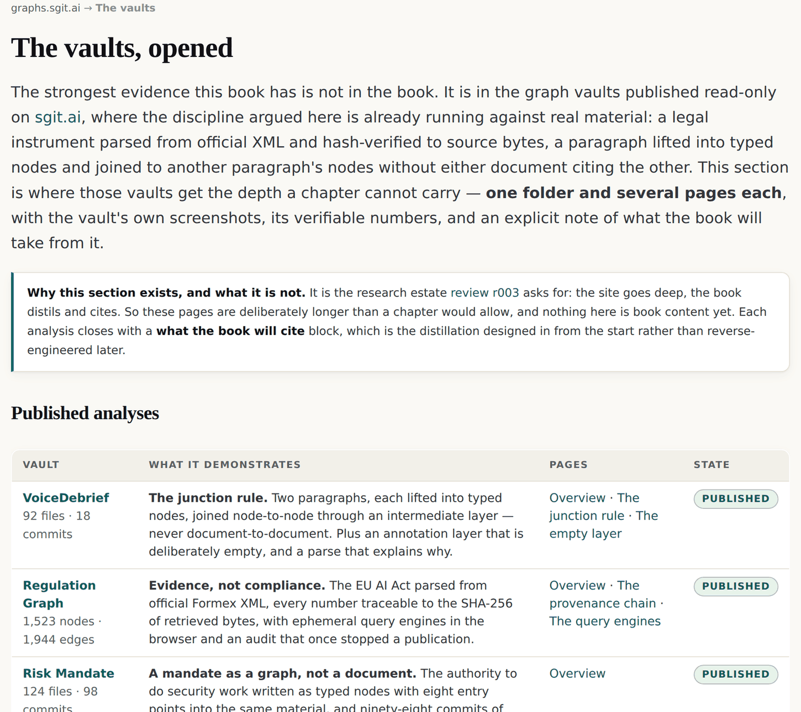
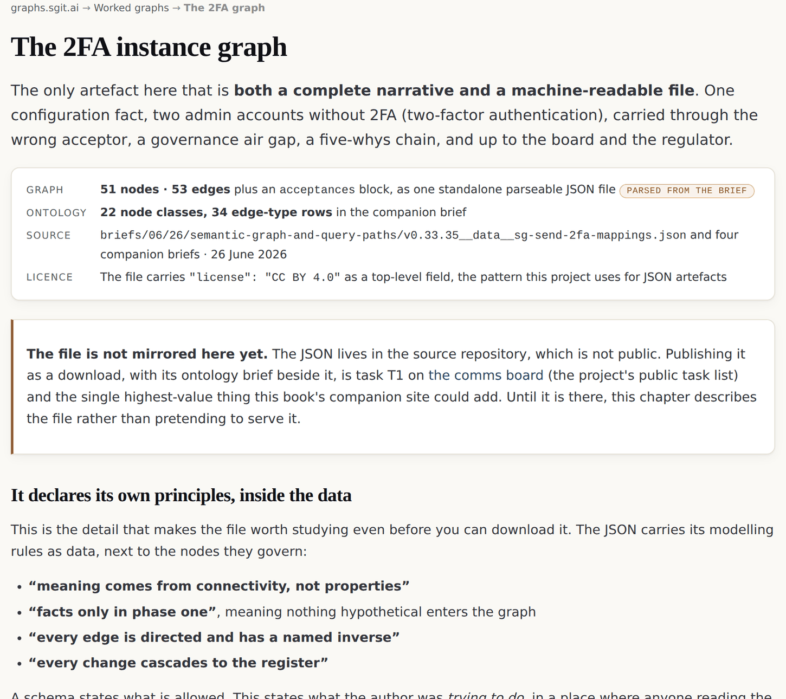

# 13 · The fractal in production

*After this chapter you will have seen the grammar of this book applied to real problems
with countable results, and you will know which of those results you can check yourself
and which you are being asked to take from a design document.*

---

Everything so far has been argument plus one estate's own machinery. This chapter is the
other kind of evidence: graphs somebody built to answer a question that mattered to them,
with numbers.

<div class="note">

**How to read the numbers in this chapter.** Some artefacts are **live and public**: you
can open them and count for yourself. The rest are **parsed from their design documents**:
the graph is real and complete in the brief, but nothing has been deployed. The two are
never mixed, and every number below says which it is.

</div>

## Twenty vaults, published with their read keys

The parent project publishes vaults whose read keys it has deliberately released. As
fetched on 26 August 2026, the published list carries **twenty vaults**, each with its
file count, size, commit count and shape. A read key is a capability handed out on
purpose and it cannot become write access; every vault is audited before its key appears,
and findings are published on the vault's page rather than filed away.

Six of them are graph work in the sense this book means:

| Vault | Shape | Contents |
|---|---|---|
| **Regulation Graph** | reference data: regulation as an evidence graph | 207 files · 14.9 MB · 2 commits · 11 app views |
| **Agentic Browser Isolation** | structured analysis: a living risk graph | 104 files · 2.4 MB · 4 commits · 17 app entries |
| **Risk Graph Explorer** | application, public by design | 33 files · 428 KB · 7 commits · 1 app entry |
| **Standards Atlas — GDPR** | a standard as a semantic graph | 116 files · 6.3 MB · writes scoped to `feedback/` |
| **VoiceDebrief** | structured analysis: four apps, one vault | 92 files · 1.2 MB · 18 commits |
| **Risk Mandate** | application: a software project in a vault | 124 files · 1.9 MB · 98 commits · 8 app entries |

*Figure 13.1 · Six of the twenty published vaults, quoted from sgit.ai/demos/vaults/ as
fetched on 26 August 2026. Every row is live and countable.*



*Figure 13.2 · How this book's companion site teaches from those vaults, at
graphs.sgit.ai/v1/vaults/, site version v0.5.11. Each vault gets a chapter that explains
what it does and links to the running thing, rather than a rebuilt copy of it.*

The three that this book teaches from most often carry these numbers.

**The EU AI Act regulation graph.** 1,523 nodes and 1,944 edges: 113 articles, 500
paragraphs, 417 points, 180 recitals, 13 annexes, 68 definitions. Eleven views, including
an article graph, a SQLite interface, an RDF/Turtle export and a lab with an interactive
graph console. Parsed deterministically from the official Formex XML, with every element
hash-verified to its source bytes.

That last clause is the one to notice. It is chapter nine's anchor discipline, applied to
a law by somebody who had never read chapter nine, because both come from the same rule:
if you cannot point at the bytes, you are asserting.

**The Risk Graph Explorer.** 18 facts, 37 risks and 14 provisions in its "Exposed" preset,
with seven views recomputed simultaneously. Amber is exposure, green is assurance, and
**ghosted edges are unanswered**. It requests `permissions: {}`, meaning no network and no
storage, entirely client-side, which you can verify in a browser's network panel in about
ten seconds.

**Agentic browser isolation.** 17 entry points, five stakeholder altitudes from IT to the
board, acceptance-gated escalation **with no deny button**, and `fs.write: []`.

## The question a graph answers that a slide cannot

The browser-isolation vault has a design brief behind it whose graph is 59 nodes and 75
edges, parsed from the brief. It answers one question: should an agent that browses and
acts run inside the user's own browser, with their live signed-in sessions, or in an
isolated one with a scoped identity?

Everybody can argue that in adjectives. Safer. More convenient. Enterprise-grade. Nobody
wins those arguments and nothing is checkable afterwards.

The graph replaces the adjective with a node type. `AuthorizationClosure` is the transitive
union of everything an identity can reach by following grants, including grants reached
*through* other grants. Compute it for both options and subtract.

<div class="claim">

"What isolation changes" stops being a claim and becomes a closure difference: these assets
are reachable in option A and not in option B. A buyer can check it against their own
estate.

</div>

Two details from that graph are worth stealing whole.

**Seven owners, and the escalation has no escalator.** The owners climb the whole
organisation: IT, then the chief information security officer, then the chief financial
officer, the chief operating officer and the data protection officer, then the chief
executive, then the board. The escalation between altitudes is **a property of the edges,
not of a workflow rule**. Nobody escalates anything. A risk arrives at the chief financial
officer because the path from it leads there and nobody below has accepted it.

**Three of the thirteen risks are created by the mitigation itself.** A slide comparing two
options never lists the harms of the option it recommends, because a slide has a direction.
A graph does not: a risk node arising from a control node is the same shape as any other
risk node, so it gets drawn, gets an owner, and needs accepting.

Honesty here is not a discipline you have to remember. It is what the structure produces
unless you go out of your way to suppress it.

## One configuration fact, carried to the board

The 2FA instance graph is the only artefact in the corpus that is **both a complete
narrative and a machine-readable file**: 51 nodes and 53 edges plus an acceptances block,
as one standalone parseable JSON file, with 22 node classes and 34 edge-type rows in its
companion brief. Parsed from the brief, not deployed.

It starts from one fact: two administrator accounts without two-factor authentication. It
ends at the board and the regulator.

```
[2FA not enforced] -backed_by->     [config export]
        │
        └─ -gives_rise_to-> [credential stuffing]
                            -impairs-> [customer data]
                            -gives_rise_to-> [regulatory exposure]
                            -accepted_by-> [the wrong person]
```

*Figure 13.3 · The chain, walked as a sentence. The finding is the last hop.*



*Figure 13.4 · The 2FA instance graph as published at graphs.sgit.ai/v1/examples/2fa.html,
site version v0.5.11, with its node classes, its six interval nodes and the modelling
principles the file declares inside its own data.*

**The finding is the last hop.** The risk *was* accepted, by somebody without the authority
to accept it. A register records that an acceptance exists. The graph records who, and lets
you ask whether that person's authority reaches this impact.

Three more things this file does that are worth copying.

**It declares its own principles, inside the data.** Four lines of modelling rules sit next
to the nodes they govern: *"meaning comes from connectivity, not properties"*, *"facts only
in phase one"*, *"every edge is directed and has a named inverse"*, *"every change cascades
to the register"*. A schema states what is allowed. This states what the author was trying
to do, in the place where anybody reading the data will see it, and it costs four lines.

**There is no deny button.** Six `Interval` nodes: 1 hour, 4 hours, 2 days, 2 weeks, 1
month, 6 months. A real risk is never denied. It is **accepted for an interval**, by a named
person, after which it returns.

| | Deny | Accept for an interval |
|---|---|---|
| What it feels like | An argument you have to win | A decision you can make today |
| What it records | Nothing; the risk stays open and unowned | Who accepted it, at what altitude, until when |
| What happens next | It is re-raised by whoever cares most, eventually | It returns on a date, automatically, to the same person |
| Failure mode | Risks accumulate in a register nobody reads | Somebody has to keep choosing an interval, which is visible |

**It shows a governance air gap.** One risk is not connected to the register at all. Not
denied, not accepted: unconnected. Chapter seven's air gap, in a real instance.

## The output is the five questions nobody could answer

The Article 26(5) exercise takes one EU AI Act provision and one concrete deployment (a
creditworthiness agent), and carries it from a running system to a board decision and back
down. Its inventory: 1 reality, 1 twin, 8 facts (one deliberately unevidenced), 7 pieces of
evidence (one deliberately absent), 5 provisions, 3 vulnerabilities, 5 risks, 4 stakeholder
altitudes, 3 decisions (and a fourth deliberately absent), **9 questions of which 5 are
unanswered**, and 2 projects (one unfunded). The organisation is invented and every invented
element is marked as invented; the Act provisions are verified against five external
sources.

The brief calls those five unanswered questions *"the actual output of the exercise"*.

And it produces the single sharpest table in the corpus. Four quadrants: accepted or not,
against acceptable or not.

| | Acceptable | Not acceptable |
|---|---|---|
| **Accepted** | Fine. This is what governance is supposed to produce. | A known bad decision, on the record, with a name on it. Rare and survivable. |
| **Not accepted** | *empty* | *empty* |

**The bottom row is empty, and the emptiness is the finding.** There is no mechanism by
which a risk gets to be *not accepted*. Nothing is denied; things simply are not accepted,
silently, by nobody, forever. You cannot see that in a risk register, because a register has
rows and an absent row looks like nothing at all.

The line from the source, on what the graph shows that a register cannot:

> R3 reaches the CFO because **nobody accepted it** — not because anybody raised it.

## Two more, briefly

**Browser extensions and the read-content closure.** "Allow this extension to read the
content of the pages you visit" quietly grants the authorization closure of every site you
are currently logged into. The demonstration is that the graph is queryable in both
directions: walk *out* from the extension to the cloud console, the email and the customer
database it reaches, or walk *back in* from "how could my email be attacked?" to the
extensions that expose it. Two different tables. One graph. Designed, not deployed.

**The issue tracker's own configuration.** 12 node types, 10 verb and inverse edge types
with domain and range constraints, **71 nodes and 141 edges** across 107 issue files, edges
stored bidirectionally. Live repository data, not a design. It is the cheapest credibility
in this book and the most instructive artefact in it, for two reasons: it shows that domain
and range constraints on a verb pair are enough structure to be useful, and it ships the
banned generic edge, which is what a rule looks like when nothing enforces it.

## Nineteen sites, and what a network demonstrates

Chapter two introduced the network as early evidence. Here is what it does and does not
show.

As fetched on 26 August 2026, the sgit.ai network lists **nineteen sites, eighteen live**.
They share a design and a discipline (sourced claims, a stated status, honest edges) and
they publish their arguments *before* the things they describe exist, so the commitments
stay checkable afterwards. Several of them are chapters of this book relocated into another
domain's vocabulary: `standards.sgit.ai` is chapter five's anchoring rule as a citation
scheme; `risks.sgit.ai` is the acceptance-interval mechanic with personal liability
attached and **a stated zero lines of code implementing any of it**; `newsroom.sgit.ai` is
chapter eight's projection claim applied to journalism, costed at £8.40 for a worked story,
and marked *not built*.

**What that demonstrates:** the grammar travels. Nineteen independent arguments, no shared
schema, connected by named links, each owning its own vocabulary. That is chapter four
running at the scale of a publishing estate rather than a data model.

**What it does not demonstrate:** that any of it is in production somewhere else. These are
this family's own sites. A grammar that travels between projects run by the same people is
weaker evidence than a grammar that travels between strangers, and this book will not
inflate it.

## Spreadsheets of spreadsheets

The last item in this chapter is not an artefact. It is a sentence, and it belongs here
because it is the fastest way to make the whole argument land with somebody who has never
drawn a graph.

Ask a person from finance what graphs of graphs means and you will lose them. Tell them it
is **spreadsheets of spreadsheets** and you will not, because finance genuinely nests
workbooks inside workbooks inside consolidation packs, and everyone in that room has lived
it. The audit working-paper hierarchy is the fractal principle: every working paper opens
into schedules with their own working papers, the same review structure at every zoom.

The estate turned that into a register (chapter four) so the machine can do it too. But the
sentence works without any machine, and it is the one to carry into a meeting.

<div class="note">

**Where the live estate demonstrates this.** The published vault list, with a file count,
a size and a commit count per row, is at `sgit.ai/demos/vaults/index.html`. The three
graph vaults this book teaches from are at `sgit.ai/demos/vaults/regulation-graph/`,
`/risk-graph-explorer/` and `/agentic-browser-isolation/`. The worked examples with their
node and edge counts are at `graphs.sgit.ai/v1/examples/`. The network index is at
`sgit.ai/network/index.html`.

</div>
