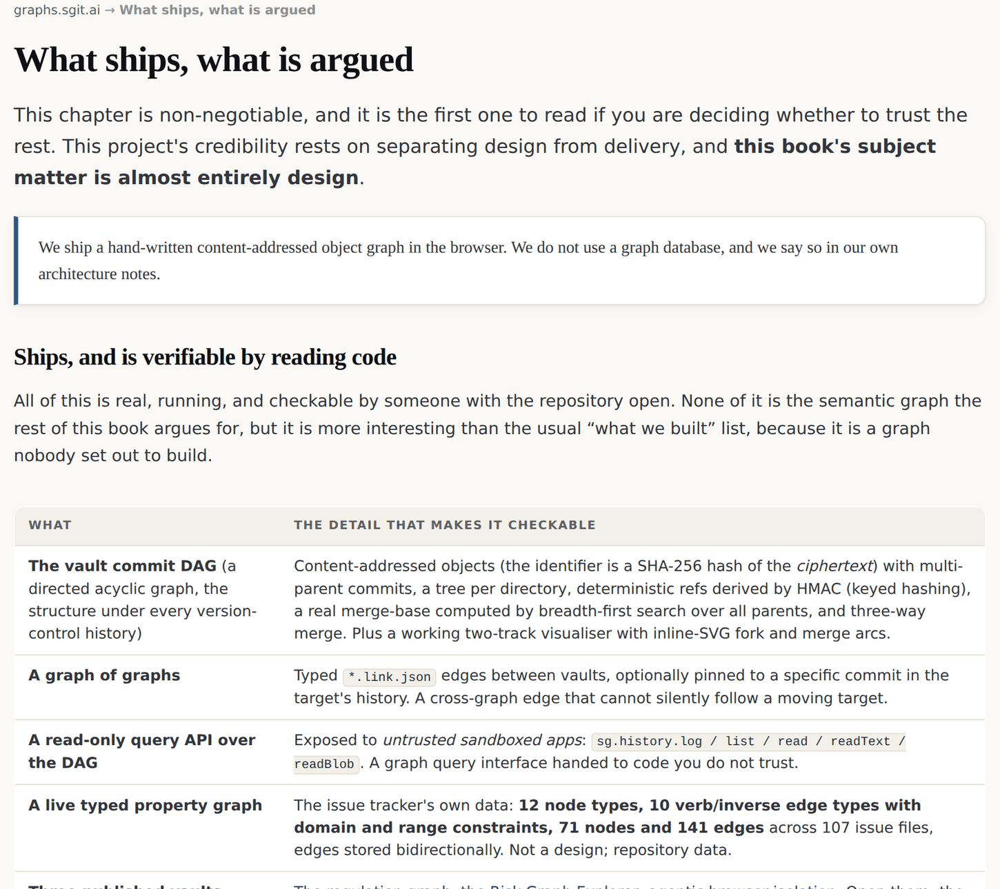

# 14 · What ships, what is argued

*After this chapter you will know exactly which claims in this book are backed by running
code you can read, which are backed by a design document, and which are backed by nothing
at all. Read it before you cite anything else in here.*

---

This chapter is non-negotiable, and it is the first one to read if you are deciding
whether to trust the rest. This project's credibility rests on separating design from
delivery.

The first edition of this argument carried a chapter with this title and this job. Its
headline sentence was blunt: *we ship a hand-written content-addressed object graph in the
browser. We do not use a graph database, and we say so in our own architecture notes.*

That sentence is still true. What has changed since is worth being precise about, because
the honest summary of the last six months is **the machinery around the argument got real
while the semantic layer stayed a design**.

## Ships, and is verifiable by reading code

Everything in this section is running and checkable by somebody with the repository open
or a browser pointed at the estate.

### Carried over from the first edition

| What | The detail that makes it checkable |
|---|---|
| **The vault commit graph** | Content-addressed objects (the identifier is a SHA-256 hash of the *ciphertext*), multi-parent commits, a tree per directory, deterministic refs derived by keyed hashing, a real merge base computed by breadth-first search over all parents, and three-way merge. |
| **A graph of graphs** | Typed `*.link.json` edges between vaults, optionally pinned to a specific commit in the target's history. A cross-graph edge that cannot silently follow a moving target. |
| **A read-only query interface over that graph**, exposed to *untrusted sandboxed apps* | `sg.history.log / list / read / readText / readBlob`. A graph query surface handed to code you do not trust. |
| **A live typed property graph** | The issue tracker's own data: 12 node types, 10 verb and inverse edge types with domain and range constraints, **71 nodes and 141 edges** across 107 issue files, edges stored bidirectionally. Not a design; repository data. |
| **Published vaults** | Three in the first edition. **Twenty** on the published list as fetched on 26 August 2026, each with its file count, size and commit count. |

### New since the first edition

| What | The detail that makes it checkable |
|---|---|
| **The extraction pipeline, on one document** | 57 nodes across five families, 8 asserted edges, **72 anchors and 73 verified spans**, each quote found verbatim inside its named section and resolved to byte offsets, re-verified on every release against a source that still hashes to its recorded SHA-256. An extraction citing words that are not there fails the build. |
| **Coverage as a build property** | Every prose-bearing section either yields an anchored item or is declared empty with a reason. Both a silent gap and a stale declaration fail the build. |
| **The core graph** | 39 sections, 186 blocks, 342 sentences, 4,221 word instances, 143 markup spans and 951 distinct word forms, with structural deterministic identifiers at every level. |
| **The two-way transform** | The build rebuilds the source markdown from the formatting graph and **fails unless it is byte-identical**, and re-derives the semantic shards from the formatting graph alone, so the two graphs cannot disagree. Seven gates in one generator. |
| **The identity ledger** | 225 identities (1 document, 38 sections, 186 blocks), minted once and carried across edits by a three-pass match-then-mint, retired rather than deleted, with a gate that runs the assignment twice over its own output and fails if anything changes. |
| **The verbs register** | Every asserted verb with its declared unique inverse. The build fails on an unregistered verb, on two verbs sharing an inverse, and on an undeclared self-inverse. |
| **The WCLM** | Twelve operators in twelve folders, six data types, every weight a formula written into the world file, 39 recorded example vectors replayed on every build, and the wire adjacency property machine-checked (551 wires, zero layer jumps at the release that proved it). |
| **The code anatomies** | One per operator, anchored to the exact text of each segment's first line, with line ranges that must tile the file completely and a gate that fails the release when code and anatomy drift. |
| **The unit suite** | `node admin/tests/universe.test.mjs` reports **84 passed, 0 failed** at site version v0.5.11. It was run while writing this chapter. |
| **The release history as a record** | Every release row narrates what happened, and the build fails if the version table has no row for the current version or lists any version twice. |

The best description of the shipped layer remains one the project applied to itself:
*"what we've built is not fundamentally an encryption system. It is a
**content-addressed, portable, storage-agnostic version control protocol**."* A commit
history is a graph, and it is the one graph here that has been running for months.

*Figure 14.1 · The first edition's version of this chapter, still published at
graphs.sgit.ai/v1/shipped/, site version v0.5.11. It is reproduced here rather than
paraphrased because the point of the page is that it exists at all: a project that
publishes what it has not built is making a checkable commitment.*

## Argued, and published as argument

Nearly everything else. The node type formulas, the grounding ladder, ontologies of
ontologies, the semantic risk ontology, a graph at every boundary, twins as endpoints, the
path query language, decompilation: all of it is **proposed**. It is published because
publishing a design before it is built is how it gets checked, and because several of these
ideas have been applied by hand to real problems even though no system implements them.

Where an idea has been applied by hand, this book says so and marks the numbers as parsed
from a design document rather than live.

## Does not exist anywhere

Searched for, and absent. If you read something in this book that seems to imply otherwise,
the book is wrong.

- **Any graph database at all.** MGraph-DB is named repeatedly in the corpus and deferred
  every time: *"there is even a graph database, MGraph-DB, we could use, but for now let's
  keep it simple."* File-based won.
- **Browser SPARQL or Cypher**, the query languages of the RDF and property-graph worlds.
- **RDF or JSON-LD serialisation in the code.** The live regulation graph exports
  RDF/Turtle as a published artefact; there is no RDF layer in the codebase.
- **The semantic risk ontology as a schema file.** It exists as prose in briefs.
- **The path-query language.** Seventeen queries across five tiers are written down.
  Nothing executes them.
- **Commit signing.** `commit_v2.signature` is written on every commit and only ever set to
  `null`.

## And what part four does not yet have

This is the section the first edition could not write because part four did not exist. It
is the most important list in this chapter for a reader deciding how much weight to put on
chapters nine to twelve.

- **Twenty of twenty-one source documents are unextracted.** One has been through the
  pipeline. The method is written down; the corpus is not processed.
- **Layer 2 does not exist.** The bridge layer, cross-document edges authored with a note,
  cannot start until there are at least two extracted documents. Every claim in this book
  about how divergence between documents is preserved describes a design, not a running
  thing.
- **Layer 3 does not exist.** The book's own universe, connecting down into layers 1 and 2
  as evidence, is planned and unbuilt. This book anchors directly to the corpus instead,
  which is what the commission instructed.
- **Ask-a-document is not built.** Bringing a graph to a document and hearing agree,
  disagree or provide evidence needs a second extracted document. The single-document seed
  of it (negation checked against the world, the contradiction said out loud) does run.
- **No layer uses a language model.** The design for an operator that hands its graph to a
  model and takes a graph back is recorded, with the argument for why the typed contract
  makes it safe (both graphs are kept as evidence). It is not built, and when it is, it
  will run at generation time and never in a published page.
- **The identity ledger has never survived an edit.** The pilot's source is frozen, so all
  225 identities are live and none has been retired. The machinery for carrying identity
  across a revision is written, gated and deterministic, and untested against a real
  revision.
- **Nobody has reviewed the extraction end to end.** It ships with a printed review pack
  whose contract says items you do not mention are taken as agreed. That contract has not
  yet been exercised by a full pass.

## Four corrections this book carries rather than repeats

A book arguing that corrections must propagate had better propagate its own.

**1 · Object identifiers are a hash of the ciphertext, not the plaintext.** A skill file in
the source repository states "SHA-256 of plaintext". The code hashes the ciphertext. The
difference matters to anybody reasoning about what the object store leaks. Stated correctly
here; the source file still carries the error.

**2 · The banned edge is in the shipped configuration.** The project's ontology brief forbids
a generic association edge. Its own `link-types.json` ships one as a self-inverse pair, and
a single edge instance uses it. Narrated in chapter three rather than quietly fixed, because
it is a better teaching moment than the rule is.

**3 · Several inverse edge names in chapter three are proposed by this book**, not quoted
from the corpus. They are marked in the table. If this book becomes the place people cite
for that vocabulary, the distinction between quoted and proposed has to survive, or we will
have done the thing we are warning about.

**4 · The first edition's definition of "fractal" was a stretched reading of its own
source.** It defined fractal as one grammar at every level, which is uniformity. The
foundational document licenses local vocabulary and override, which is composition. Caught
by the usage ledger on the day that ledger first ran, corrected in the lexicon, with the
superseded definition kept visible. Chapter six carries the consequence, and reports its own
test failing rather than restating the correction as a pass.

## Two things we would like to ship and have not

**The personal risk question graph.** Six questions, each answer typed as fact, opinion,
hypothesis or evidence, and you watch your own risk graph build itself. Browser storage
only, no backend, no account, no language model required. It is the best interactive demo
in the material, it is a task on the public board, and it is not built. Saying so is
cheaper than implying it exists.

**A second extracted document.** Everything queued behind layer 2 waits on it, and the
honest reason it has not happened is that the estate kept building instruments instead.
That is a real judgment call with a real cost, and it is recorded here rather than in a
retrospective nobody reads.

## Why this chapter exists at all

Because without it the book over-claims, and an over-claiming book about provenance
discipline is self-refuting.

The graph work described here is mostly a design published in advance so that it can be
checked against whatever eventually ships. That is a weaker claim than most publications
make, and it is the one that is true.

**Where the live estate demonstrates this.** The first edition's version of this chapter is
at `graphs.sgit.ai/v1/shipped/`. The release history, one narrated row per release, is at
`graphs.sgit.ai/admin/versions.html` for the current era, with the previous eras kept whole
at `versions-v0.4.html` and `versions-earlier.html`. The unit suite is
`admin/tests/universe.test.mjs` and the release gate is `admin/build/validate.js`.

