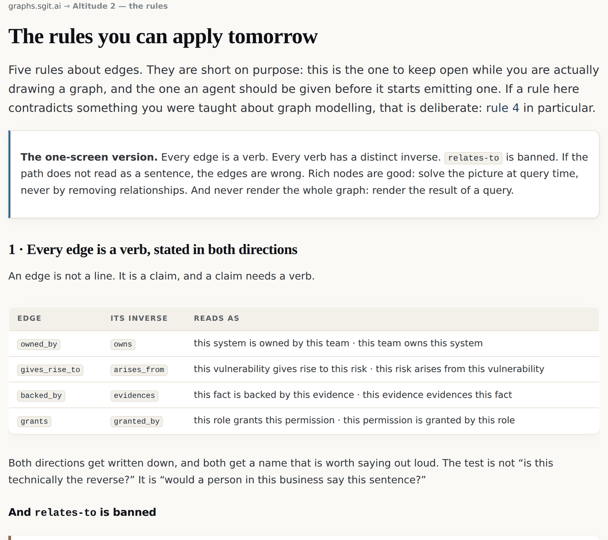

# 15 · Your first graph, tomorrow

*After this chapter you will have a concrete plan for an afternoon, a week and a month,
and a short list of the mistakes that will otherwise cost you the first two of those.*

---

Everything in this book is worth nothing to you unless you draw something. So this chapter
is instructions.

You need no software you do not already have. A text editor and a version control system
are enough for the afternoon. You will not need a graph database, and if somebody tells you
otherwise in the first month, they are solving a different problem from yours.

## Before you start: pick the right question

The most common way this fails is picking a subject instead of a question.

"Let's map our architecture" is a subject. It has no stopping point, no test for
correctness and no audience, so it becomes a diagram nobody reads. Pick instead a question
somebody is currently answering badly, by hand, repeatedly.

Good first questions have three properties: somebody actually asks them, the current answer
requires a person to remember something, and the answer changes when facts change.

| A good first question | Why it works |
|---|---|
| "If this service goes down, who has to be told?" | The answer lives in three people's heads and is wrong twice a year. |
| "What does this third-party integration actually reach?" | Everybody assumes a smaller answer than the true one. |
| "Which of our controls does this obligation rely on?" | Currently a spreadsheet that goes stale between audits. |
| "What breaks if we deprecate this?" | The current method is asking on a group chat. |

Write the question down. It is the acceptance test for everything that follows, and you
will be tempted to widen it by Wednesday.

## The afternoon

**One.** Write your question at the top of a file.

**Two.** List the things the question touches. Not types: actual things, by name. The
payments service. Priya. The data protection officer. Article 26(5). The staging database.
Aim for fifteen to forty. If you have four, the question is too small. If you have three
hundred, you picked a subject.

**Three.** Write the edges as sentences, in full, in English, one per line. Not `svc-a →
team-b`. Write:

```
  the payments service is owned by the platform team
  the platform team has stakeholder the head of engineering
  the head of engineering reports to the chief technology officer
  the payments service reads the customer database
  the customer database contains personal data
```

Sentences first, always. You are not being slow; you are being forced to name the verb,
and naming the verb is the whole discipline.

**Four.** Turn each sentence into a verb and its inverse. `owned_by ⇄ owns`.
`has_stakeholder ⇄ stakeholder_in`. `reads ⇄ read_by`. `contains ⇄ contained_in`. Write both
names down even though you will only store one direction. If the inverse is just the same
sentence backwards, you have one relationship where you thought you had two: go back and
find the direction with lower fan-out.

**Five.** Read your paths aloud. Start at any node and walk three or four hops. If the
sentence does not survive being said out loud in front of somebody from the business, the
edges are wrong. Fix them now, while it is five minutes of work.

**Six.** Ask your question of the graph, by hand, tracing with a finger. This is the moment
the afternoon either pays off or does not. If tracing produces an answer that somebody
would have got wrong from memory, you have something. If it produces nothing, look at
which hop was missing: that is your first real finding.

**Seven.** Write down what you could not answer. Not in your head. As nodes, with names.

By the end of the afternoon you should have a text file of forty-odd lines, an answer, and
a list of things nobody knows. That is a complete first graph and it is more than most
organisations have.

## The first week

Five moves, in order of how much they pay back.

**Give everything an identity.** Short, opaque, minted once, never reused. Not the name,
because names change. Not the position in the file, because positions move. Chapter ten is
the whole argument; the one-line version is that a reference which holds a position will
break silently the first time somebody fixes a typo.

**Put it in version control.** Not because you need history yet, but because the diff is the
review surface. A change to a graph should be reviewable the way a change to code is, and
this is what makes the artefact and the reasoning behind it live together.

**Add the absences you have been carrying.** Every "we don't know who owns that" becomes a
node. Every "the data comes from a spreadsheet somebody updates on Thursdays" becomes an
air gap with an owner and a frequency. This is the step people skip, and it is the step
that makes the graph worth funding, because now the missing dots have names.

**Point at two or three anchors.** A published standard. A named regulation. A library at a
pinned version. Your own chart of accounts. Do not adopt them; point at them, with a verb
that says how strongly. `similar_to`, not `is_a`.

**Write down one node type formula.** Just one. Pick the classification your team argues
about most and express it as a required pattern of paths: *a thing is a Fact only if it has
a downward edge to evidence*. Then run it over what you have and see what fails. The
failures are the point.

## The first month

Three things to build, and one to resist.

**Build a second graph, from a different angle, on the same subject.** The comparison is
where the finding is. Two graphs of the same system that disagree have told you something
neither could tell you alone, and chapter four is why you should keep both rather than
merging them.

**Build one projection.** Take your graph and render a document from it: the register your
audit wants, the on-call sheet, the one-page summary for the board. The test of chapter
eight is whether you can throw the rendered document away and regenerate it. If you cannot,
the graph is not yet the truth and the document still is.

**Start measuring the absences.** How many nodes terminate at something real? How many
risks are connected to the register? How many obligations reach a control? Those ratios are
your coverage, and they are honest in a way a progress bar is not.

**Resist buying a graph database.** Not because they are bad. Because the thing that will
kill your project in month one is not query performance; it is that the edges are wrong,
and a database will not tell you that. Buy one when a query you actually need is too slow,
and not before.

## Ten rules on one page

```
   1 · every edge is a verb, and both directions get a name
   2 · no generic association edge, ever, not even temporarily
   3 · if the path does not read as a sentence in the reader's own
       language, the edges are wrong
   4 · rich nodes are good: solve the picture at query time, never by
       deleting relationships
   5 · never render the whole graph; render the result of a query
   6 · point at anchors, do not become them
   7 · do not merge two vocabularies; keep both and declare bridges
   8 · a type is a required path-pattern, not a label somebody applied
   9 · supersede, never delete, and weight by independence not by count
  10 · draw the absences: an unanswered question is a node
```

*Figure 15.1 · The rules of this book on one page. If you copy one thing out of it, copy
this.*



*Figure 15.2 · The same rules as the companion site publishes them, at
graphs.sgit.ai/v1/grammar/, site version v0.5.11. The one-screen version in the box at the
top is the form to keep open while you are drawing.*

## Six ways this goes wrong

Each of these has happened, more than once, and each is cheap to avoid if you are watching
for it.

**You draw the whole thing and show it to somebody.** They see a hairball, conclude the
approach is unserious, and you do not get a second meeting. Never show the whole graph.
Show one node with its neighbours, or the result of a question.

**You reach for a generic edge because you are in a hurry.** It survives, because nothing
forces the decision. Six months later it is in forty places and every query is worse. This
estate ships one in its own configuration and names it in public rather than quietly fixing
it, because the temptation is universal.

**You start adding validation rules.** Somebody's data does not fit, so you add a
constraint, so they work around it, so their data is now conforming and false. Add an edge
instead.

**You model hypotheticals.** A risk that has not happened, a system that might exist, an
integration somebody proposed. The graph fills up with a brainstorm and stops being a
record of reality. Facts only.

**You put the meaning in a property.** `criticality: "high"` is a judgment somebody made,
sitting in a field, unattributed and unversioned. Make it a path: what makes it high, and
who says so. A property may hold a timestamp; it may not hold the answer to "what kind of
thing is this?"

**You aim for completeness.** The graph will be deep where the work is and absent
everywhere else. That is not a defect to apologise for; it is the property that makes the
project finite. A graph that had to be complete before it was useful would never be either.

## What to do with an agent

Most readers of this book will hand some of this to a language model, so here is the
version to hand it.

**Give it the vocabulary before the task.** The edge set in the reference card at the back
of this book is written to be pasted into a session. An agent asked to "build a graph" with
no vocabulary will invent one, and it will invent a generic association edge within about
five nodes.

**Ask for a proposal, not a commitment.** The model proposes a graph; you validate it. That
is the boundary of chapter seven, applied at the smallest possible scale. In practice it
means: have the agent emit the graph as data, then check it against your own rules before
anything consumes it.

**Make it anchor.** Every node it emits should carry the sentence it came from, verbatim.
Then check the quotes exist. Chapter nine's rule is the single highest-value thing you can
adopt from this book when working with a model: **a citation that is not in the source
should fail mechanically, and never reach a human reviewer.**

**Make it emit absences.** When it cannot determine something, it should emit a node saying
so rather than a plausible value. Ask for this explicitly and it will do it; do not ask,
and it will fill the gap.

## The one-paragraph version, for the colleague who will not read the book

A node connected to nothing means nothing. What a thing is emerges from the edges you can
trace from it, and how much you can rely on that meaning depends on how richly and how
independently it is connected. So write your relationships as verbs with named inverses,
never merge two vocabularies (keep both and bridge them, because the disagreement is
usually the finding), express your classifications as required paths rather than as labels
somebody applied, never delete a superseded claim, and draw what you do not know as nodes
with names. Do that and meaning stops being something you assert and becomes something you
can compute, check, version and argue with.

That is the whole book. Everything else is detail, evidence and honesty about what does not
work yet.

<div class="note">

**Where the live estate demonstrates this.** The rules are at
`graphs.sgit.ai/v1/grammar/` with the vocabulary at `edge-set.html`. Worked graphs with
real numbers are at `graphs.sgit.ai/v1/examples/`, and the three public vaults you can open
and count are at `sgit.ai/demos/vaults/`. If you build something and it disagrees with this
book, the estate's comms board is at `graphs.sgit.ai/admin/comms.html`, and a correction
that changes a claim gets a row in the release history rather than a silent edit.

</div>
